---
## Front matter
title: "Лабораторная работа №1"
subtitle: "Установка и конфигурация операционной системы на виртуальную машину"
author: "Чемоданова Ангелина Александровна"

## Generic otions
lang: ru-RU
toc-title: "Содержание"

## Bibliography
bibliography: bib/cite.bib
csl: pandoc/csl/gost-r-7-0-5-2008-numeric.csl

## Pdf output format
toc: true # Table of contents
toc-depth: 2
lof: true # List of figures
lot: false # List of tables
fontsize: 12pt
linestretch: 1.5
papersize: a4
documentclass: scrreprt
## I18n polyglossia
polyglossia-lang:
  name: russian
  options:
	- spelling=modern
	- babelshorthands=true
polyglossia-otherlangs:
  name: english
## I18n babel
babel-lang: russian
babel-otherlangs: english
## Fonts
mainfont: PT Serif
romanfont: PT Serif
sansfont: PT Sans
monofont: PT Mono
mainfontoptions: Ligatures=TeX
romanfontoptions: Ligatures=TeX
sansfontoptions: Ligatures=TeX,Scale=MatchLowercase
monofontoptions: Scale=MatchLowercase,Scale=0.9
## Biblatex
biblatex: true
biblio-style: "gost-numeric"
biblatexoptions:
  - parentracker=true
  - backend=biber
  - hyperref=auto
  - language=auto
  - autolang=other*
  - citestyle=gost-numeric
## Pandoc-crossref LaTeX customization
figureTitle: "Рис."
tableTitle: "Таблица"
listingTitle: "Листинг"
lofTitle: "Список иллюстраций"
lotTitle: "Список таблиц"
lolTitle: "Листинги"
## Misc options
indent: true
header-includes:
  - \usepackage{indentfirst}
  - \usepackage{float} # keep figures where there are in the text
  - \floatplacement{figure}{H} # keep figures where there are in the text
---

# Цель работы

Целью данной работы является приобретение практических навыков установки операционной системы на виртуальную машину, настройки минимально необходимых для дальнейшей работы сервисов.

# Задание

Установить и настроить операционную систему на виртуальную машину.

# Теоретическое введение

Операционная система, сокр. ОС — программное обеспечение, управляющее аппаратным обеспечением, предоставляющее абстрактный программный интерфейс для взаимодействия с ним и занимающееся распределением предоставляемых ресурсов, в том числе между прикладными программами.

VirtualBox — программный продукт виртуализации для операционных систем Windows, Linux, FreeBSD, macOS, Solaris/OpenSolaris, ReactOS, DOS и других.

Fedora Workstation — это отточенная, легкая в использовании операционная система для переносных и настольных компьютеров с полным набором инструментов для разработчиков и производителей всех видов. 

# Выполнение лабораторной работы

1. Запускаем VirtualBox и создаем новую виртуальную машину. Указываем имя виртуальной машины (логин в дисплейном классе), тип операционной системы — Linux, Fedora. (рис. [-@fig:001]).

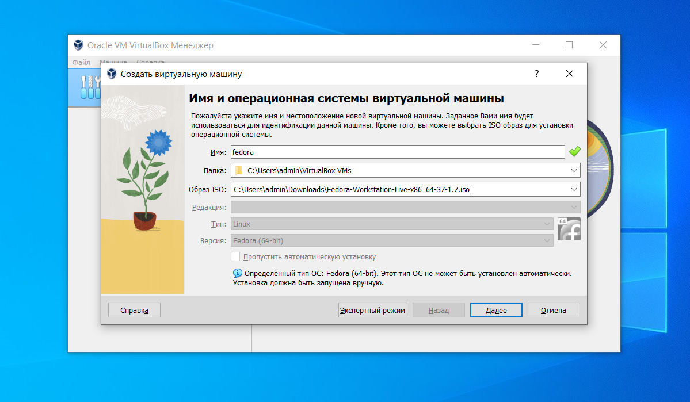{#fig:001 width=70%}

Указываем размер основной памяти виртуальной машины — от 2048 МБ. (рис. [-@fig:002]).

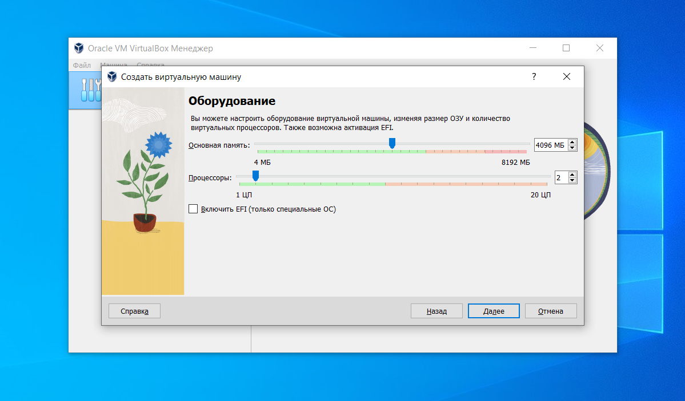{#fig:002 width=70%}

Затем выбираем "Создать новый виртуальный жесткий диск". Задаем размер диска — 80 ГБ (или больше). рис. [-@fig:003]).

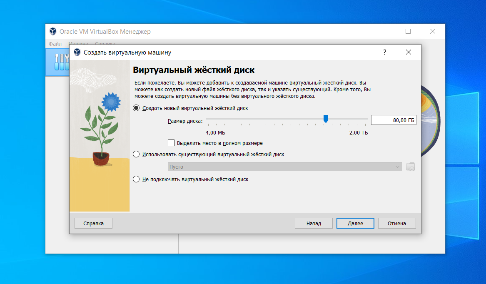{#fig:003 width=70%}

Подытоживаем конфигурацию виртуальной машины и нажимаем "Готово". рис. [-@fig:004]).

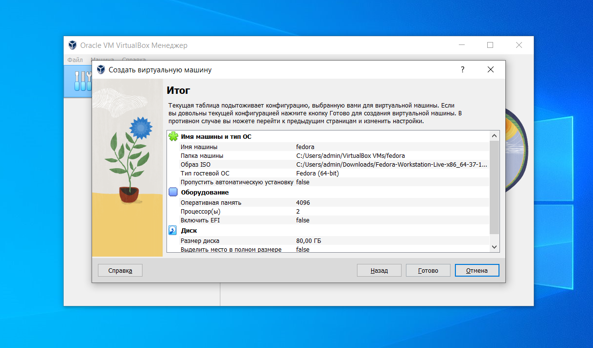{#fig:004 width=70%}

Теперь мы можем запустить нашу настроенную виртуальную машину. рис. [-@fig:005]).

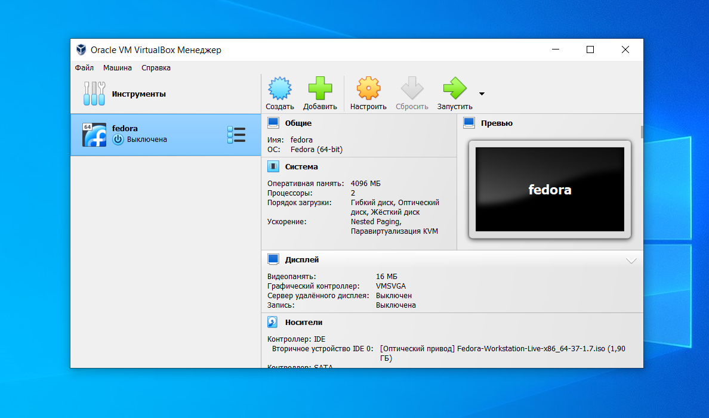{#fig:005 width=70%}

2. Запускаем виртуальную машину. рис. [-@fig:006]).

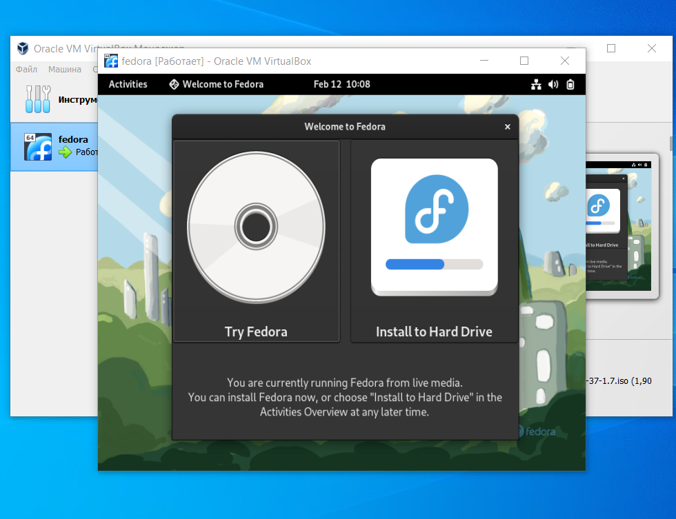{#fig:006 width=70%}

Выбираем язык. рис. [-@fig:007]).

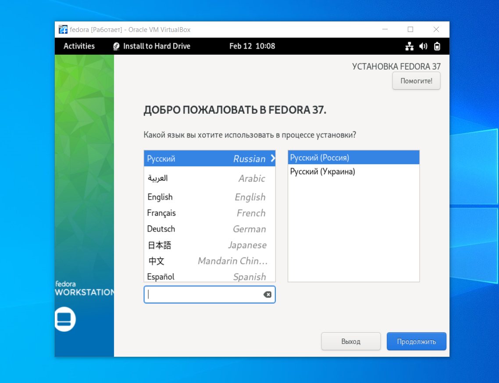{#fig:007 width=70%}

Настраиваем дату, время и место установки. [-@fig:008]).

{#fig:008 width=70%}

После окончания установки заполняем информацию о пользователе.  [-@fig:009]).

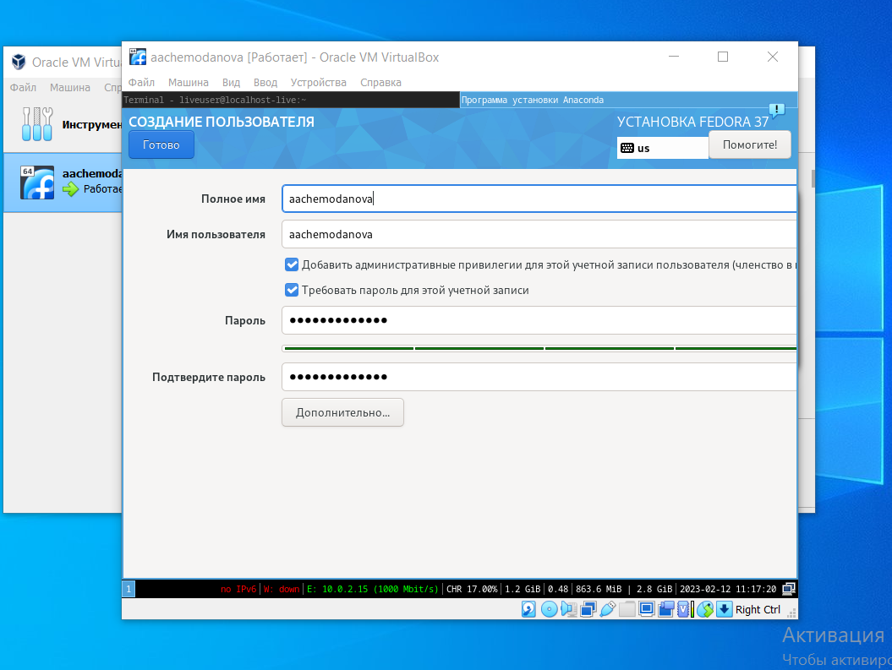{#fig:009 width=70%}

Изымаем диск из привода.  [-@fig:010]).

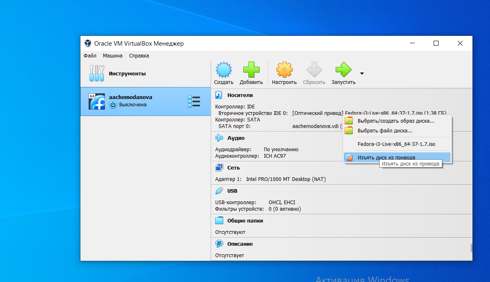{#fig:010 width=70%}

Запускаем Федору и заполняем информацию "О вас".  [-@fig:011]).

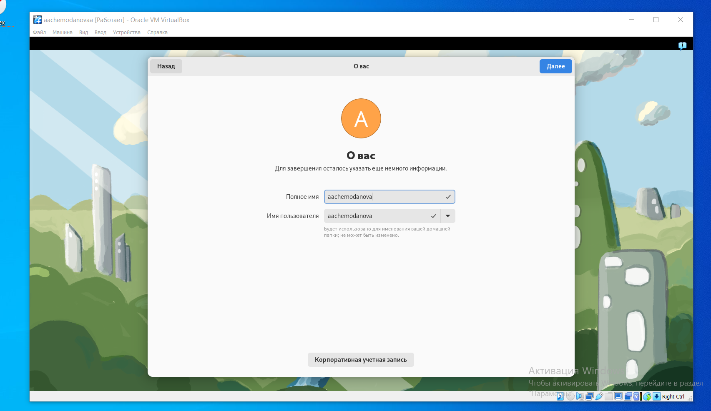{#fig:011 width=70%}

Устанавливаем пароль. [-@fig:012]).

{#fig:012 width=70%}

# Выводы

В результате выполнения работы мы приобрели практические навыки установки операционной системы на виртуальную машину, а также настройки минимально необходимых для дальнейшей работы сервисов.

# Домашнее задание

Нам требуется получить следующую информацию: версия ядра Linux (Linux version), частота процессора (Detected Mhz processor), модель процессора (CPU0), объём доступной оперативной памяти (Memory available), тип обнаруженного гипервизора (Hypervisor detected), тип файловой системы корневого раздела, последовательность монтирования файловых систем.
Для этого мы используем поиск с помощью dmesg | grep -i "то, что ищем". [-@fig:013]).

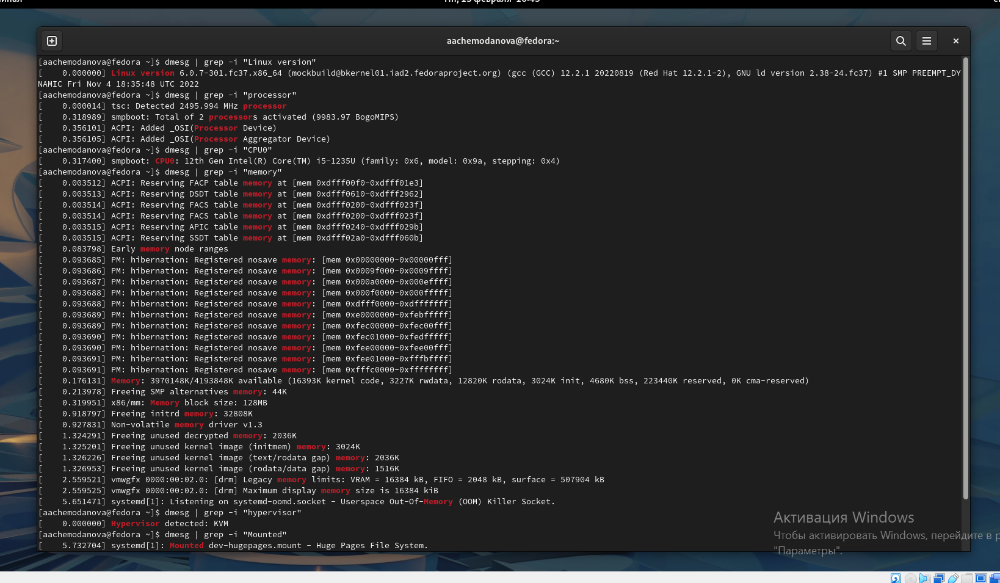{#fig:013 width=70%} 

Тип файловой системы корневого раздела. [-@fig:014]).

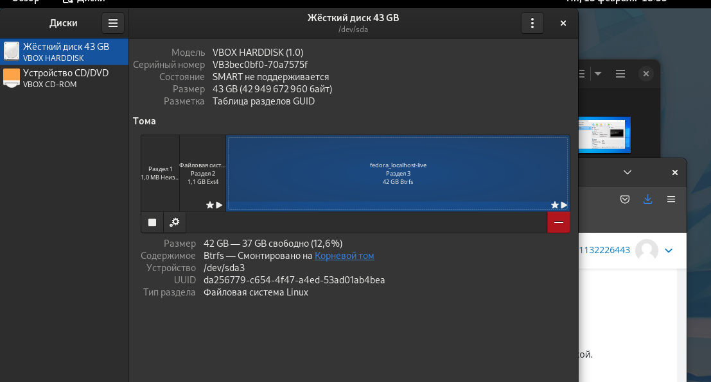{#fig:014 width=70%} 

Еще запрашиваемая информация.  [-@fig:015]).

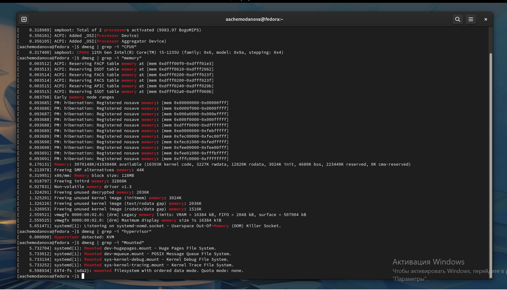{#fig:015 width=70%}

# Контрольные вопросы

1. Учетная запись пользователя содержит необходимые для идентификации пользователя при подключении к системе, а также информацию для авторизации и учёта:
Системное имя (user name). Оно может содержать только латинские буквы и знаки “ _ “. Также оно должно быть уникальным.
Идентификатор пользователя (UID) Уникальный идентификатор пользователя в системе, целое положительное число.
Идентификатор группы (CID). Группа, к которой относится пользователь. Она, как минимум, одна – группа по умолчанию.
Полное имя (full name). Может присутствовать имя, фамилия, отчество.
Домашний каталог (home directory). Каталог, в который попадает пользователь после входа в систему и в котором хранятся его данные.
Начальная оболочка (login shell). Командная оболочка, которая запускается при входе в систему.

2. Команды терминала:
<команда> —help – для получения справки по команде;
cd – для перемещения по файловой системе;
ls – для просмотра содержимого каталога;
du <имя каталога>– для определения объёма каталога;
mkdir/rmdir– для создания / удаления каталогов
touch/rm - для создания / удаления файлов;
chmod– для задания определённых прав на файл / каталог;
history– для просмотра истории команд.

3. Файловая система – это порядок, определяющий способ организации и хранения и именования данных на различных носителях информации. Имеет классификацию:
Примеры:
FAT32 – файловая система, представляющая собой пространство, разделенное на три части: одна область для служебных структур, форма указателей в виде таблиц и зона для хранения самих файлов.
ext3/ext4 – журналируемая файловая система, используется в основном в ОС с ядром Linux. Максимальный размер файла в последней версии увеличен до 16 Гб, а скорость работы значительно увеличилась.

4. С помощью команды df, введя ее в терминале. Это утилита, которая показывает список всех файловых систем по именам устройств, сообщает их размер и данные о памяти. Также можно посмотреть тип файловой системы вручную в свойствах папок.

5. Чтобы удалить зависший процесс, вначале мы должны узнать, какой у него id. Для этого можно использовать команду ps. После в терминале необходимо ввести команду kill <id процесса>. Либо можно воспользоваться командой killall, и это «убьет» все процессы, которые есть в данный момент. Это удобно тем, что нам не нужно знать id процесса. 

