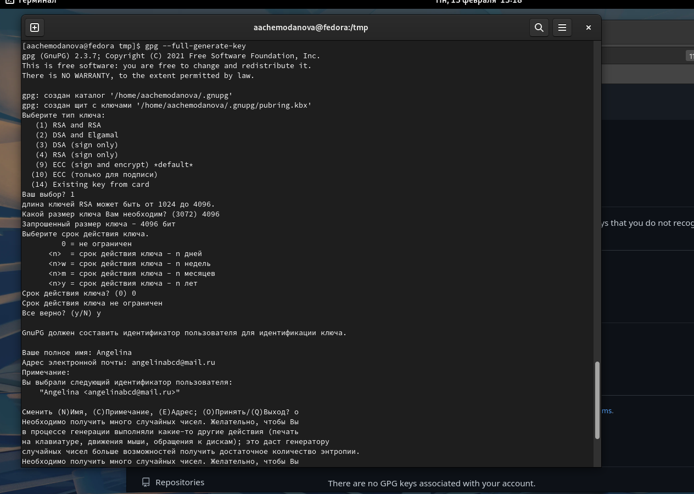
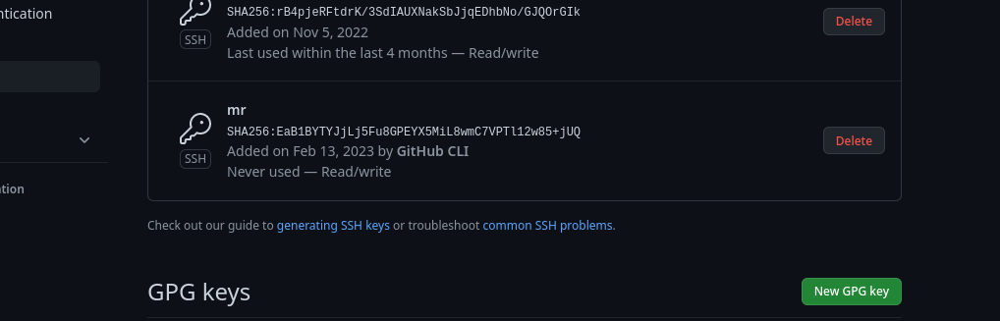

---
## Front matter
lang: ru-RU
title: "Лабораторная работа №2"
subtitle: "Первоначальная настройка git"
author:
  - Чемоданова А.А.

## Formatting pdf
toc: false
toc-title: Содержание
slide_level: 2
aspectratio: 169
section-titles: true
theme: metropolis
header-includes:
 - \metroset{progressbar=frametitle,sectionpage=progressbar,numbering=fraction}
 - '\makeatletter'
 - '\beamer@ignorenonframefalse'
 - '\makeatother'
---

## Цели

1. Изучить идеологию и применение средств контроля версий.
2. Освоить умения по работе с git.

## Задачи

1. Создать базовую конфигурацию для работы с git.
2. Создать ключ SSH.
3. Создать ключ PGP.
4. Настроить подписи git.
5. Зарегистрироваться на Github.
6. Создать локальный каталог для выполнения заданий по предмету.

## Выполнение работы

Для начала регистрируемся на гитхабе. 

{#fig:001 width=70%}

## Выполнение работы

Затем необходимо установить git-flow и gh.  

{#fig:002 width=50%}

## Выполнение работы

Устанавливаем gh.

{#fig:003 width=50%}

## Выполнение работы

Перейдем к первичной настройке параметров git. 

{#fig:004 width=50%}

## Выполнение работы

Создаем ключи ssh по алгориттму rsa с ключем размером 4096 бит и по алгоритму ed25519.

{#fig:005 width=50%}

## Выполнение работы

{#fig:006 width=50%}

## Выполнение работы

Создаем ключ gpg и добавим его на гитхаб. 

{#fig:007 width=50%}

## Выполнение работы

{#fig:008 width=50%}

## Выполнение работы

Настроем автоматическую подпись коммитов git.

{#fig:009 width=50%}

## Выполнение работы

Настроем gh, подтвердим авторизацию и добавим ssh-ключа на гитхаб. 

{#fig:010 width=50%}

## Выполнение работы

{#fig:011 width=50%}

## Выполнение работы

Создаем репозиторий курса на основе шаблона и настраиваем каталог курса.

{#fig:012 width=50%}

## Выполнение работы

{#fig:013 width=50%}

## Выполнение работы

{#fig:014 width=50%}

## Вывод

Мы изучили идеологию и применение средств контроля версий, а также освоили умения по работе с git.

