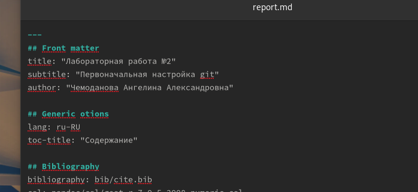
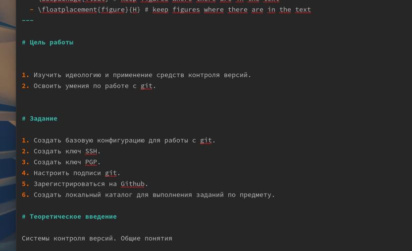
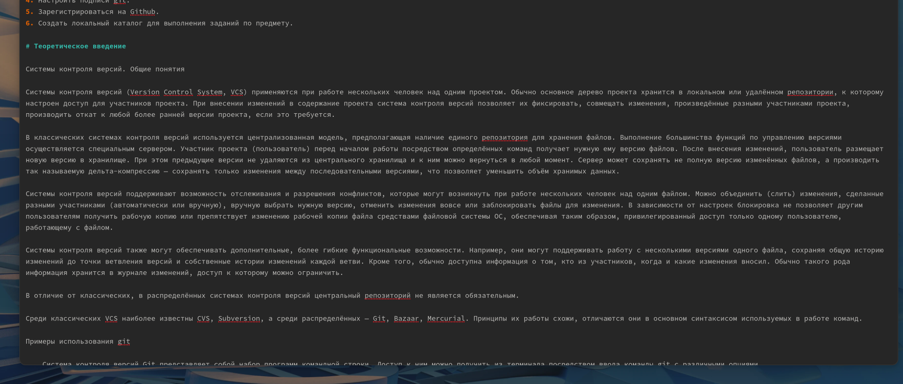
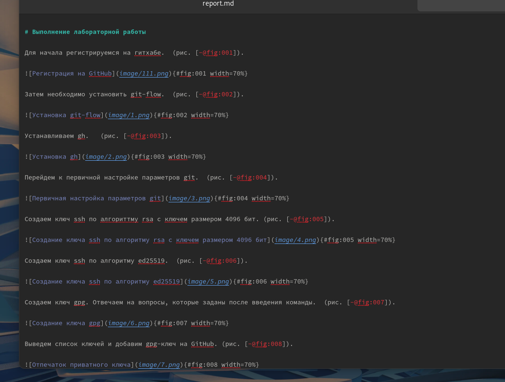
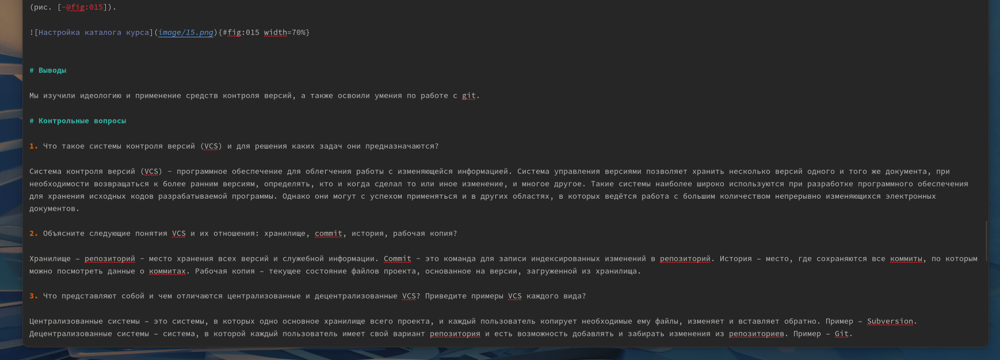

---
## Front matter
lang: ru-RU
title: "Лабораторная работа №3"
subtitle: "Markdown"
author:
  - Чемоданова А.А.

## Formatting pdf
toc: false
toc-title: Содержание
slide_level: 2
aspectratio: 169
section-titles: true
theme: metropolis
header-includes:
 - \metroset{progressbar=frametitle,sectionpage=progressbar,numbering=fraction}
 - '\makeatletter'
 - '\beamer@ignorenonframefalse'
 - '\makeatother'
---

## Цель работы

Научиться оформлять отчёты с помощью легковесного языка разметки Markdown.

## Задачи

1. Сделайте отчёт по предыдущей лабораторной работе в формате Markdown.
2. В качестве отчёта просьба предоставить отчёты в 3 форматах: pdf, docx и md (в архиве,
поскольку он должен содержать скриншоты, Makefile и т.д)

## Выполнение работы

Для начала я открыла файл "report.md" в папке нужной мне лабораторной работы. В этом файле расположен шаблон отчеты. Его заполнение я начала с титульного листа, изменила заголовок, подзаголовок и автора.

{#fig:001 width=70%}

## Выполнение работы

Затем я приступила к изменению цели работы и заданий, которые необходимо было выполнить. 

{#fig:002 width=70%}

## Выполнение работы

Необходимо заполнить теоретическое введение по выполняемой лабораторной работе. 

{#fig:003 width=70%}

## Выполнение работы

Затем необходимо подробно описать процесс выполнения лабораторной работы, прикрепляя скрины. 

{#fig:004 width=50%}

## Выполнение работы

По окончанию формирования отчета необходимо сделать выводы и ответить на контрольные вопросы. 

{#fig:005 width=70%}

## Вывод

Мы научились оформлять отчёты с помощью легковесного языка разметки Markdown.

