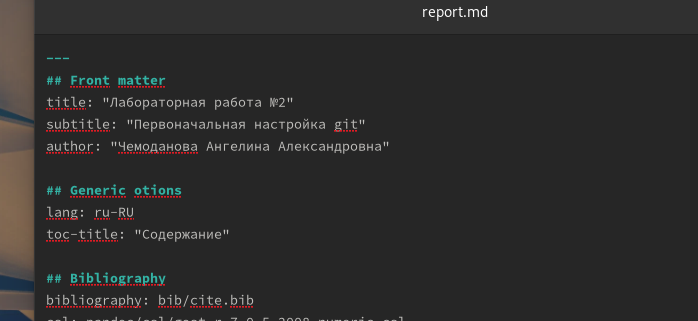
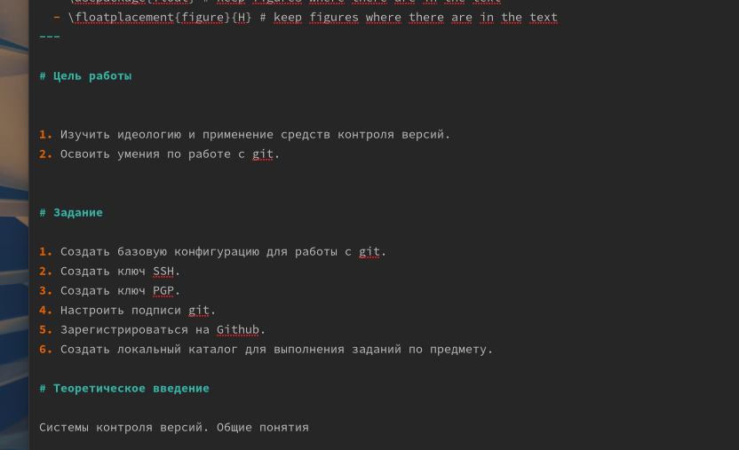
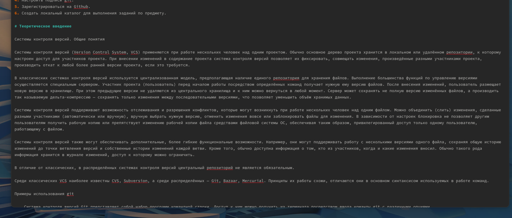
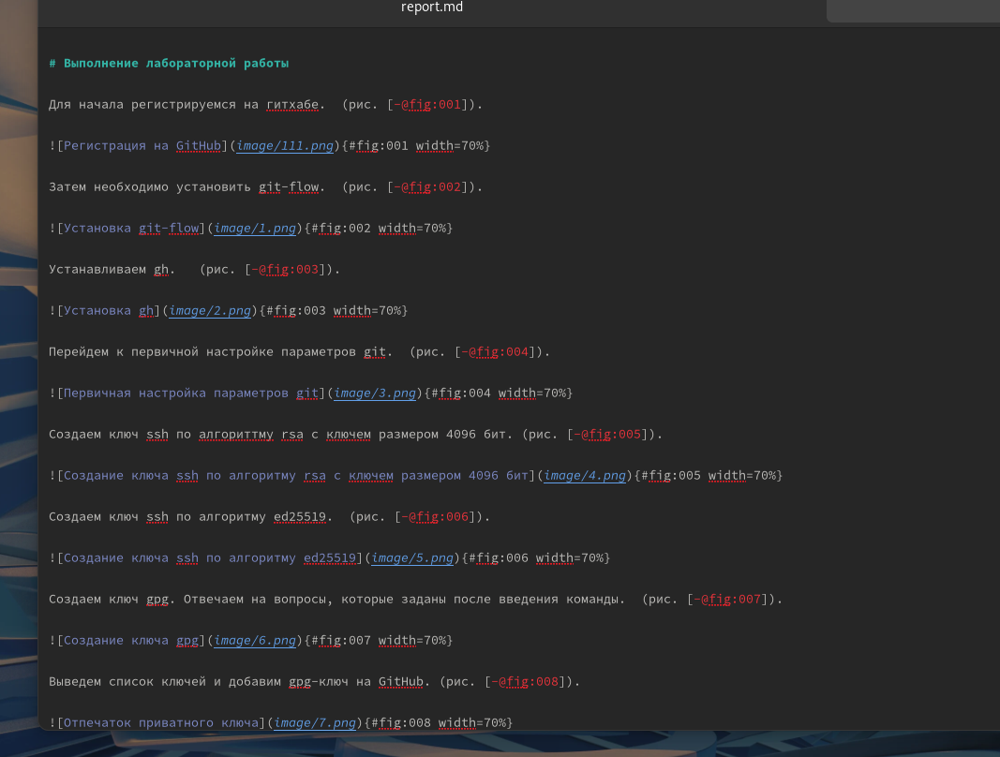
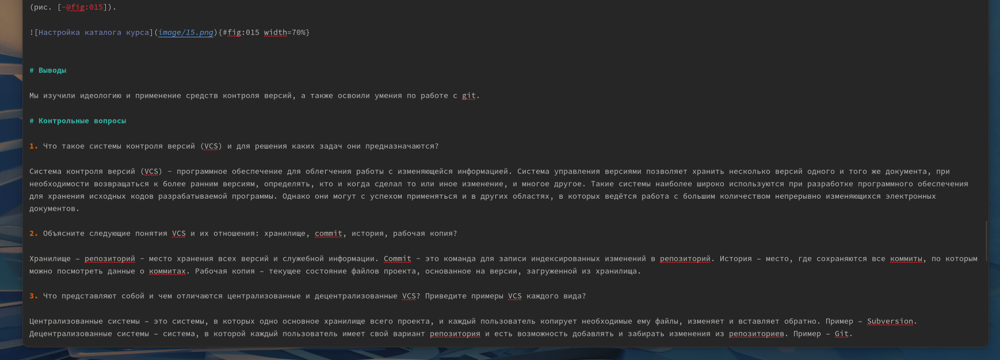

---
## Front matter
title: "Лабораторная работа №3"
subtitle: "Markdown"
author: "Чемоданова А.А."

## Generic otions
lang: ru-RU
toc-title: "Содержание"

## Bibliography
bibliography: bib/cite.bib
csl: pandoc/csl/gost-r-7-0-5-2008-numeric.csl

## Pdf output format
toc: true # Table of contents
toc-depth: 2
lof: true # List of figures
lot: true # List of tables
fontsize: 12pt
linestretch: 1.5
papersize: a4
documentclass: scrreprt
## I18n polyglossia
polyglossia-lang:
  name: russian
  options:
	- spelling=modern
	- babelshorthands=true
polyglossia-otherlangs:
  name: english
## I18n babel
babel-lang: russian
babel-otherlangs: english
## Fonts
mainfont: PT Serif
romanfont: PT Serif
sansfont: PT Sans
monofont: PT Mono
mainfontoptions: Ligatures=TeX
romanfontoptions: Ligatures=TeX
sansfontoptions: Ligatures=TeX,Scale=MatchLowercase
monofontoptions: Scale=MatchLowercase,Scale=0.9
## Biblatex
biblatex: true
biblio-style: "gost-numeric"
biblatexoptions:
  - parentracker=true
  - backend=biber
  - hyperref=auto
  - language=auto
  - autolang=other*
  - citestyle=gost-numeric
## Pandoc-crossref LaTeX customization
figureTitle: "Рис."
tableTitle: "Таблица"
listingTitle: "Листинг"
lofTitle: "Список иллюстраций"
lotTitle: "Список таблиц"
lolTitle: "Листинги"
## Misc options
indent: true
header-includes:
  - \usepackage{indentfirst}
  - \usepackage{float} # keep figures where there are in the text
  - \floatplacement{figure}{H} # keep figures where there are in the text
---

# Цель работы

Научиться оформлять отчёты с помощью легковесного языка разметки Markdown.

# Задание

1. Сделайте отчёт по предыдущей лабораторной работе в формате Markdown.
2. В качестве отчёта просьба предоставить отчёты в 3 форматах: pdf, docx и md (в архиве,
поскольку он должен содержать скриншоты, Makefile и т.д)

# Теоретическое введение

Базовые сведения о Markdown
Чтобы создать заголовок, используйте знак ( # ), например:
 # This is heading 1
 ## This is heading 2
 ### This is heading 3
 #### This is heading 4
Чтобы задать для текста полужирное начертание, заключите его в двойные звездочки:
 This text is **bold**.
Чтобы задать для текста курсивное начертание, заключите его в одинарные звездочки:
 This text is *italic*.

Неупорядоченный (маркированный) список можно отформатировать с помощью звездочек или тире:

- List item 1
- List item 2
- List item 3

Чтобы вложить один список в другой, добавьте отступ для элементов дочернего списка:

- List item 1
 - List item A
 - List item B
- List item 2

Упорядоченный список можно отформатировать с помощью соответствующих цифр:
1. First instruction
1. Second instruction
1. Third instruction
Чтобы вложить один список в другой, добавьте отступ для элементов дочернего списка:
1. First instruction
 1. Sub-instruction
 1. Sub-instruction
1. Second instruction
Синтаксис Markdown для встроенной ссылки состоит из части [link text] , представ-
ляющей текст гиперссылки, и части (file-name.md) – URL-адреса или имени файла,
на который дается ссылка:
 [link text](file-name.md)
Markdown поддерживает как встраивание фрагментов кода в предложение, так и их
размещение между предложениями в виде отдельных огражденных блоков. Огражденные
блоки кода — это простой способ выделить синтаксис для фрагментов кода. Общий
формат огражденных блоков кода:
 ``` language
 your code goes in here
 ```
Верхние и нижние индексы:
записывается как
H~2~O
записывается как
2^10^
Внутритекстовые формулы делаются аналогично формулам LaTeX. Например, формула
sin2(x) + cos2(x) = 1 запишется как

$\sin^2 (x) + \cos^2 (x) = 1$


# Выполнение лабораторной работы

Для начала я открыла файл "report.md" в папке нужной мне лабораторной работы. В этом файле расположен шаблон отчеты. Его заполнение я начала с титульного листа, изменила заголовок, подзаголовок и автора. (рис. @fig:001).

{#fig:001 width=70%}

Затем я приступила к изменению цели работы и заданий, которые необходимо было выполнить. (рис. @fig:002).

{#fig:002 width=70%}

Необходимо заполнить теоретическое введение по выполняемой лабораторной работе. (рис. @fig:003).

{#fig:003 width=70%}

Затем необходимо подробно описать процесс выполнения лабораторной работы, прикрепляя скрины. (рис. @fig:004).

{#fig:004 width=70%}

По окончанию формирования отчета необходимо сделать выводы и ответить на контрольные вопросы. (рис. @fig:005).

{#fig:005 width=70%}


# Выводы

Мы научились оформлять отчёты с помощью легковесного языка разметки Markdown.

