---
## Front matter
lang: ru-RU
title: "Лабораторная работа №4"
subtitle: "Основы интерфейса взаимодействия пользователя с системой Unix на уровне командной строки"
author:
  - Чемоданова А.А.

## Formatting pdf
toc: false
toc-title: Содержание
slide_level: 2
aspectratio: 169
section-titles: true
theme: metropolis
header-includes:
 - \metroset{progressbar=frametitle,sectionpage=progressbar,numbering=fraction}
 - '\makeatletter'
 - '\beamer@ignorenonframefalse'
 - '\makeatother'
---

## Цель работы

Приобретение практических навыков взаимодействия пользователя с системой посредством командной строки.

## Задачи

1. Определите полное имя вашего домашнего каталога. Далее относительно этого каталога будут выполняться последующие упражнения.
2. Выполните следующие действия:
2.1. Перейдите в каталог /tmp.
2.2. Выведите на экран содержимое каталога /tmp. Для этого используйте команду ls
с различными опциями. Поясните разницу в выводимой на экран информации.
2.3. Определите, есть ли в каталоге /var/spool подкаталог с именем cron?
2.4. Перейдите в Ваш домашний каталог и выведите на экран его содержимое. Определите, кто является владельцем файлов и подкаталогов?
3. Выполните следующие действия:
3.1. В домашнем каталоге создайте новый каталог с именем newdir.
3.2. В каталоге ~/newdir создайте новый каталог с именем morefun.
3.3. В домашнем каталоге создайте одной командой три новых каталога с именами letters, memos, misk. Затем удалите эти каталоги одной командой.

## Задачи
3.4. Попробуйте удалить ранее созданный каталог ~/newdir командой rm. Проверьте, был ли каталог удалён.
3.5. Удалите каталог ~/newdir/morefun из домашнего каталога. Проверьте, был ли каталог удалён.
4. С помощью команды man определите, какую опцию команды ls нужно использовать для просмотра содержимое не только указанного каталога, но и подкаталогов, входящих в него.
5. С помощью команды man определите набор опций команды ls, позволяющий отсортировать по времени последнего изменения выводимый список содержимого каталога с развёрнутым описанием файлов.
6. Используйте команду man для просмотра описания следующих команд: cd, pwd, mkdir, rmdir, rm. Поясните основные опции этих команд.
7. Используя информацию, полученную при помощи команды history, выполните модификацию и исполнение нескольких команд из буфера команд

## Выполнение работы

Для начала нам необходимо определить полное имя нашего домашнего каталога. Запускаем терминал, изначально мы находимся в домашнем каталоге, для того чтобы узнать имя домашнего каталога, вводим команду pwd. 

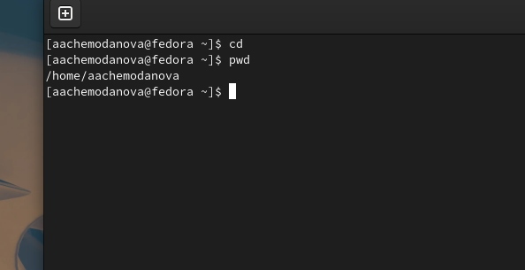{#fig:001 width=40%}

## Выполнение работы

Теперь перейдем в каталог /pwd. Затем при помощи команды ls и ее опций вывести содержимое данного каталога. Команда ls просто выводит содержимое каталога. ls -a выводит содержимое каталога со скрытыми папками, а  ls -l подробную информацию о файлах и каталогах.

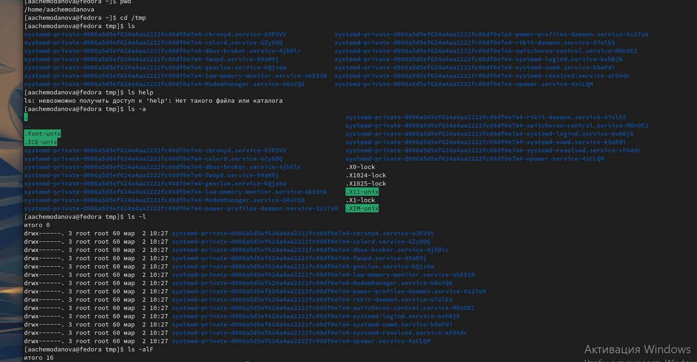{#fig:002 width=40%}

## Выполнение работы

Команда ls -alF выводит расширенную информацию о каталоге с подробной информацией о каждом каталоге и файле, даже скрытые.

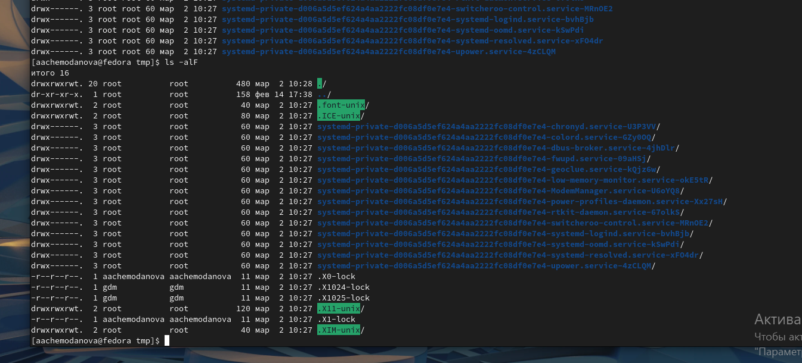{#fig:003 width=40%}

## Выполнение работы

Необходимо посмотреть есть ли в каталоге /var/spool подкаталог с именем cron. Для этого необходимо перейти в этот каталог и при помощи ls, ls -a проверить наличие этого подкаталога, у меня его не нашлось. Также нам нужно посмотреть содержимое домашнего каталога и определить, кто является владельцем файлов и каталогов. В моем случаем, им являюсь я(было выведено мое имя пользователя). 

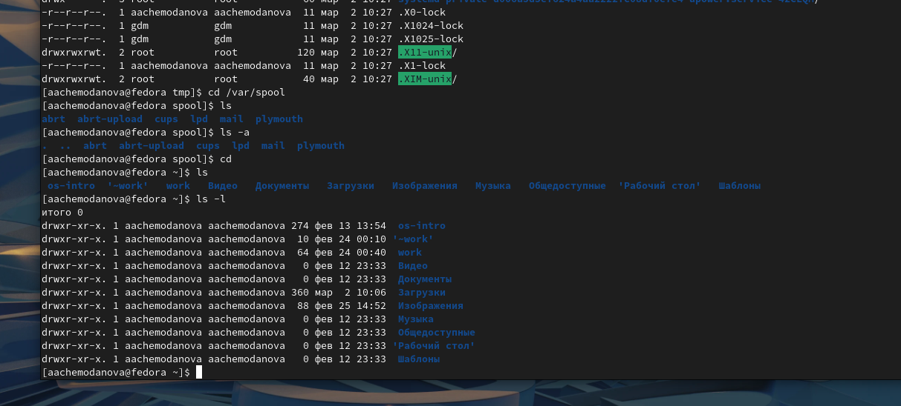{#fig:004 width=40%}

## Выполнение работы

В домашнем каталоге необходимо создать каталог с именем newdir и создать в этом каталоге подкаталог morefun.  

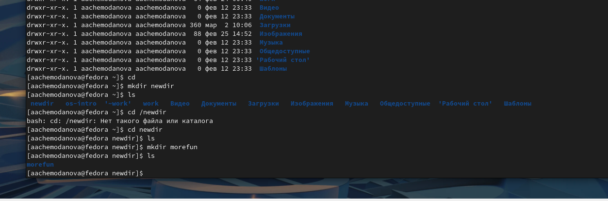{#fig:005 width=40%}

## Выполнение работы

Теперь в домашнем каталоге создадим одной командой три новых каталога /letters/memos/misk. 

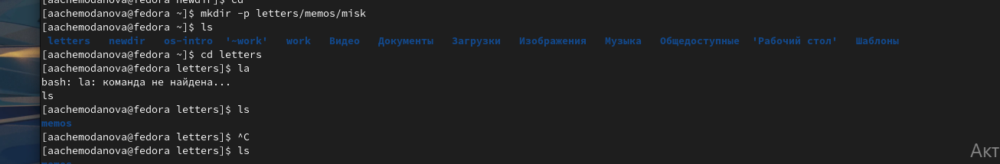{#fig:006 width=40%}

## Выполнение работы

Удалим созданные каталоги одной командой, а также попробуем удалить созданный каталог newdir командой rm, у нас это не получится, потому что внутри него есть подкаталог, для того чтобы удалить его воспользуемся командой rm -r. 

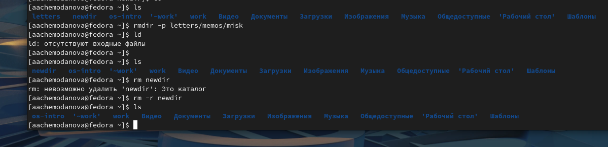{#fig:007 width=40%}

## Выполнение работы

Нам необходимо узнать какая опция команды ls позволяет просмотреть содержимое подкаталогов каталога. Это опция ls -R. 

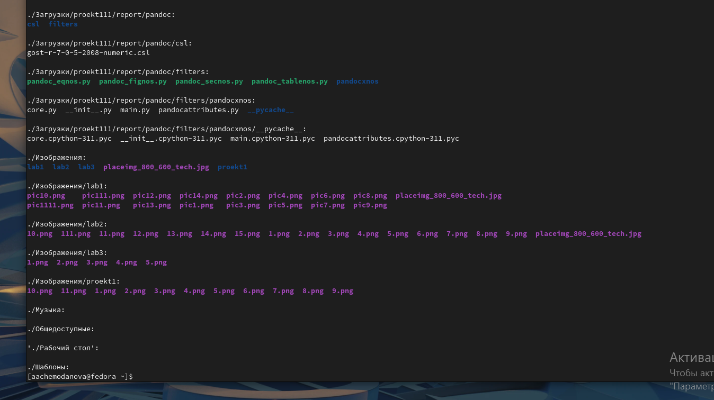{#fig:008 width=40%}

## Выполнение работы

Для того чтобы отсортировать по времени последнего изменения выводимый список содержимого каталога с развёрнутым описанием файлов необходимо использовать команду ls -c -lt. 

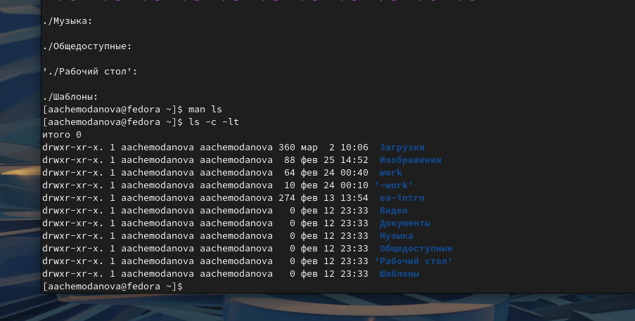{#fig:009 width=40%}

## Выполнение работы

Посмотрим описание следующих команд: cd, pwd, mkdir, rmdir, rm. Команды cd автоматически переносит в домашний каталог, а, например, cd .. позволяет вернуться в родительский каталог.

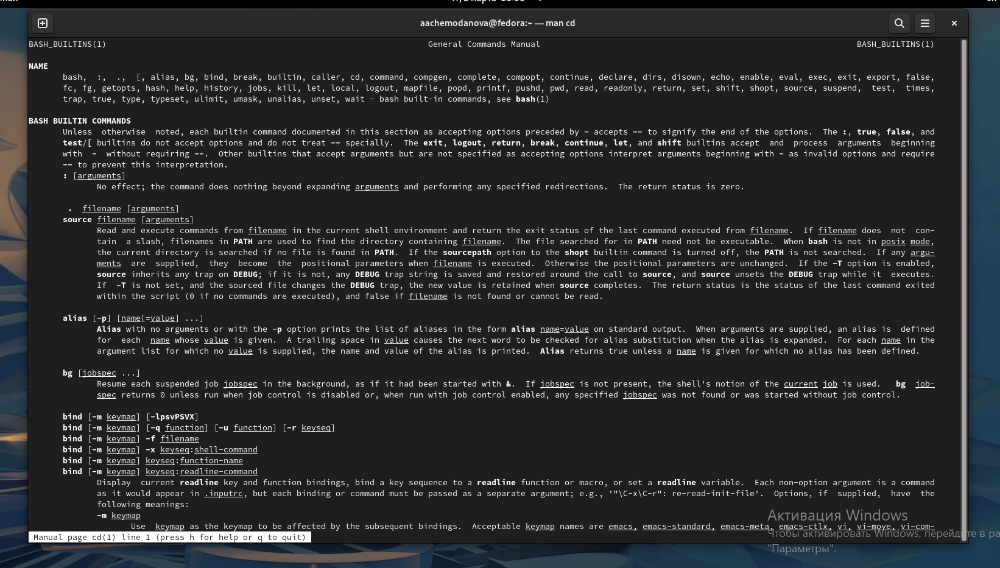{#fig:010 width=40%}

## Выполнение работы

Опция -L команды pwd позволяет брать директорию из окружающей среды, даже если она содержит символические ссылки, а опция -Р отбрасывает эти символические ссылки. 

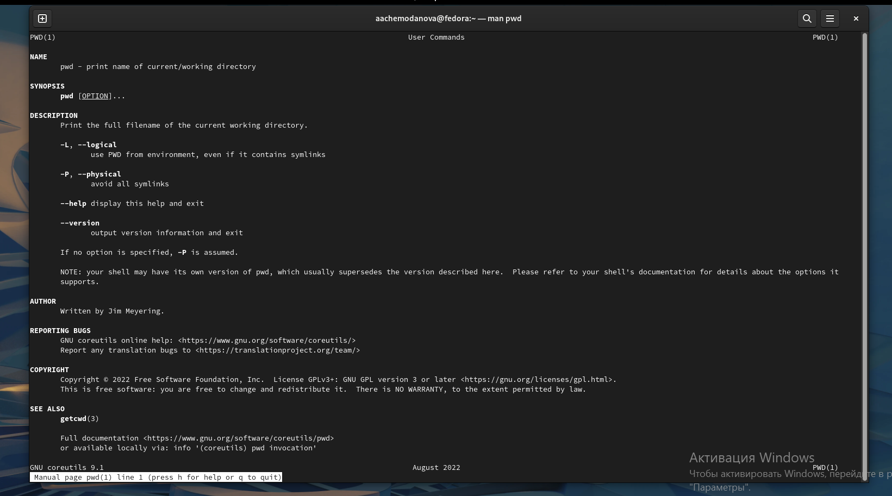{#fig:011 width=40%}

## Выполнение работы

Опция -m команды mkdir позволяет установить атрибуты доступа. Опция -р позволяет создать несколько каталогов одной командой. 

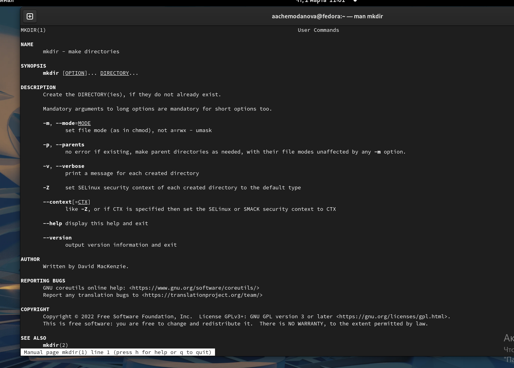{#fig:0012 width=40%}

## Выполнение работы

Опция -р команды rmdir позволяет удалить сразу несколько каталогов.

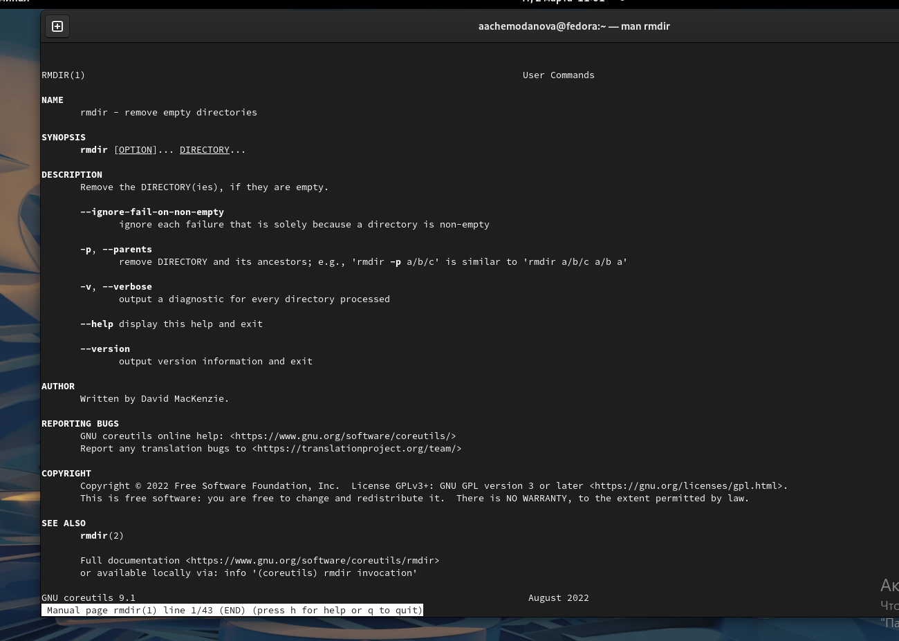{#fig:013 width=40%}

## Выполнение работы

Команда rm имеет опцию -i, которая запрашивает подтверждение перед удалением, а -r позволяет удалить каталог, даже если в нем есть файлы. 

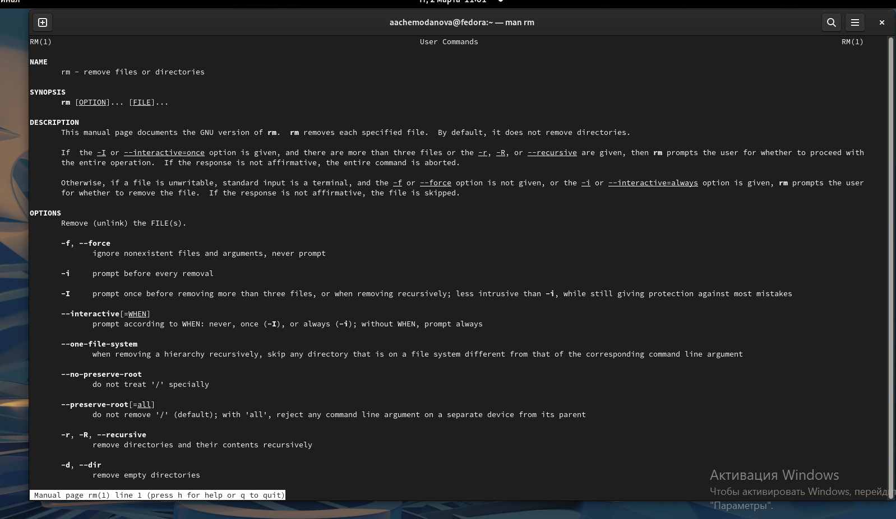{#fig:014 width=40%}

## Выполнение работы

Воспользуемся командой history, чтобы получить информацию о всех выполненных командах. 

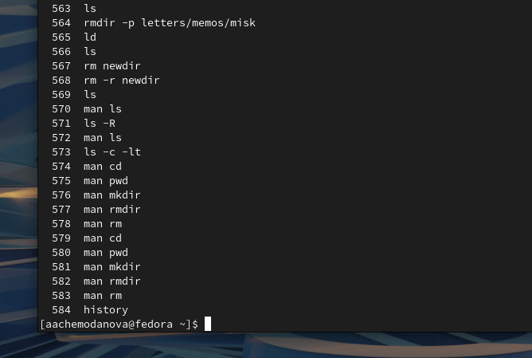{#fig:015 width=40%}

## Выполнение работы

Теперь выполним модификацию и исполним несколько команд из буфера обмена. 

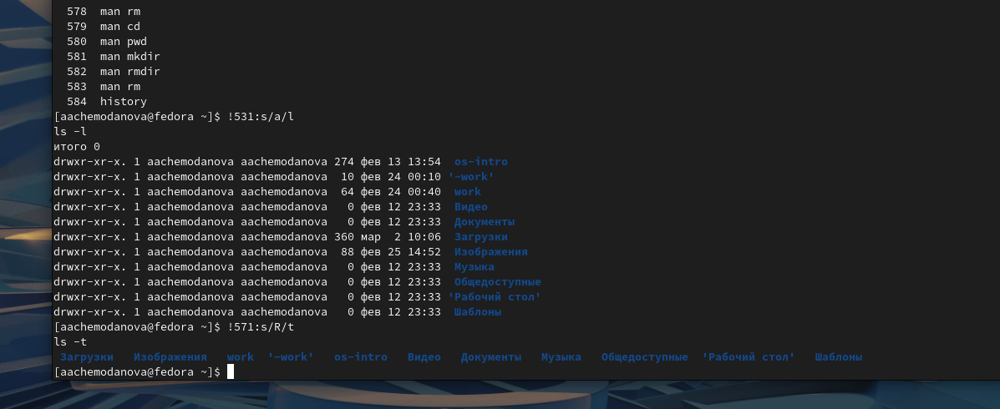{#fig:016 width=40%}

## Выводы

Мы приобрели практические навыки взаимодействия пользователя с системой посредством командной строки.
