---
## Front matter
title: "Лабораторная работа №4"
subtitle: "Основы интерфейса взаимодействия пользователя с системой Unix на уровне командной строки"
author: "Чемоданова Ангелина Александровна"

## Generic otions
lang: ru-RU
toc-title: "Содержание"

## Bibliography
bibliography: bib/cite.bib
csl: pandoc/csl/gost-r-7-0-5-2008-numeric.csl

## Pdf output format
toc: true # Table of contents
toc-depth: 2
lof: true # List of figures
lot: true # List of tables
fontsize: 12pt
linestretch: 1.5
papersize: a4
documentclass: scrreprt
## I18n polyglossia
polyglossia-lang:
  name: russian
  options:
	- spelling=modern
	- babelshorthands=true
polyglossia-otherlangs:
  name: english
## I18n babel
babel-lang: russian
babel-otherlangs: english
## Fonts
mainfont: PT Serif
romanfont: PT Serif
sansfont: PT Sans
monofont: PT Mono
mainfontoptions: Ligatures=TeX
romanfontoptions: Ligatures=TeX
sansfontoptions: Ligatures=TeX,Scale=MatchLowercase
monofontoptions: Scale=MatchLowercase,Scale=0.9
## Biblatex
biblatex: true
biblio-style: "gost-numeric"
biblatexoptions:
  - parentracker=true
  - backend=biber
  - hyperref=auto
  - language=auto
  - autolang=other*
  - citestyle=gost-numeric
## Pandoc-crossref LaTeX customization
figureTitle: "Рис."
tableTitle: "Таблица"
listingTitle: "Листинг"
lofTitle: "Список иллюстраций"
lotTitle: "Список таблиц"
lolTitle: "Листинги"
## Misc options
indent: true
header-includes:
  - \usepackage{indentfirst}
  - \usepackage{float} # keep figures where there are in the text
  - \floatplacement{figure}{H} # keep figures where there are in the text
---

# Цель работы

Приобретение практических навыков взаимодействия пользователя с системой посредством командной строки.

# Задание

1. Определите полное имя вашего домашнего каталога. Далее относительно этого каталога будут выполняться последующие упражнения.
2. Выполните следующие действия:
2.1. Перейдите в каталог /tmp.
2.2. Выведите на экран содержимое каталога /tmp. Для этого используйте команду ls
с различными опциями. Поясните разницу в выводимой на экран информации.
2.3. Определите, есть ли в каталоге /var/spool подкаталог с именем cron?
2.4. Перейдите в Ваш домашний каталог и выведите на экран его содержимое. Определите, кто является владельцем файлов и подкаталогов?
3. Выполните следующие действия:
3.1. В домашнем каталоге создайте новый каталог с именем newdir.
3.2. В каталоге ~/newdir создайте новый каталог с именем morefun.
3.3. В домашнем каталоге создайте одной командой три новых каталога с именами letters, memos, misk. Затем удалите эти каталоги одной командой.
3.4. Попробуйте удалить ранее созданный каталог ~/newdir командой rm. Проверьте, был ли каталог удалён.
3.5. Удалите каталог ~/newdir/morefun из домашнего каталога. Проверьте, был ли каталог удалён.
4. С помощью команды man определите, какую опцию команды ls нужно использовать для просмотра содержимое не только указанного каталога, но и подкаталогов, входящих в него.
5. С помощью команды man определите набор опций команды ls, позволяющий отсортировать по времени последнего изменения выводимый список содержимого каталога с развёрнутым описанием файлов.
6. Используйте команду man для просмотра описания следующих команд: cd, pwd, mkdir, rmdir, rm. Поясните основные опции этих команд.
7. Используя информацию, полученную при помощи команды history, выполните модификацию и исполнение нескольких команд из буфера команд

# Теоретическое введение

В операционной системе типа Linux взаимодействие пользователя с системой обычно осуществляется с помощью командной строки посредством построчного ввода команд. При этом обычно используется командные интерпретаторы языка shell: /bin/sh; /bin/csh; /bin/ksh.
Формат команды. Командой в операционной системе называется записанный по специальным правилам текст (возможно с аргументами), представляющий собой указание на выполнение какой-либо функций (или действий) в операционной системе. Обычно первым словом идёт имя команды, остальной текст — аргументы или опции,
конкретизирующие действие. Общий формат команд можно представить следующим образом: <имя_команды><разделитель><аргументы>

# Выполнение лабораторной работы

Для начала нам необходимо определить полное имя нашего домашнего каталога. Запускаем терминал, изначально мы находимся в домашнем каталоге, для того чтобы узнать имя домашнего каталога, вводим команду pwd. (рис. @fig:001).

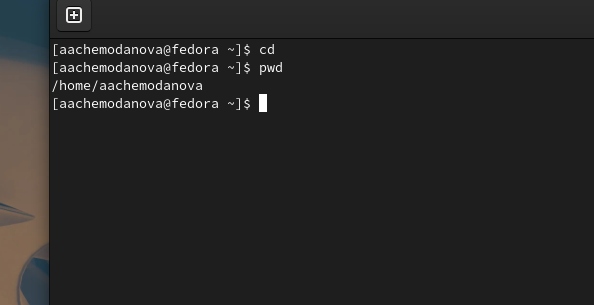{#fig:001 width=70%}

Теперь перейдем в каталог /pwd. Затем при помощи команды ls и ее опций вывести содержимое данного каталога. Команда ls просто выводит содержимое каталога. ls -a выводит содержимое каталога со скрытыми папками, а  ls -l подробную информацию о файлах и каталогах. (рис. @fig:002).

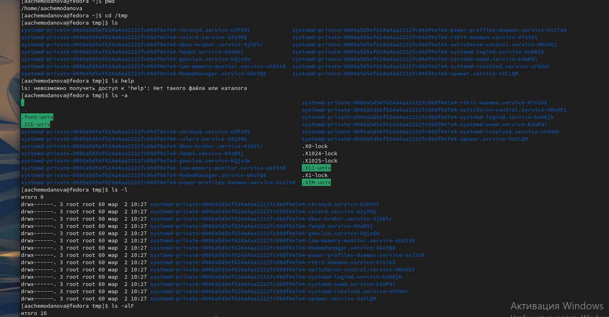{#fig:002 width=70%}

Команда ls -alF выводит расширенную информацию о каталоге с подробной информацией о каждом каталоге и файле, даже скрытые. (рис. @fig:003).

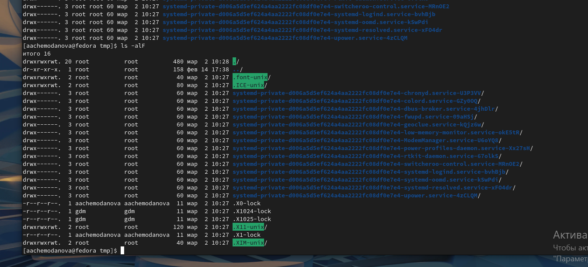{#fig:003 width=70%}

Необходимо посмотреть есть ли в каталоге /var/spool подкаталог с именем cron. Для этого необходимо перейти в этот каталог и при помощи ls, ls -a проверить наличие этого подкаталога, у меня его не нашлось. Также нам нужно посмотреть содержимое домашнего каталога и определить, кто является владельцем файлов и каталогов. В моем случаем, им являюсь я(было выведено мое имя пользователя). (рис. @fig:004).

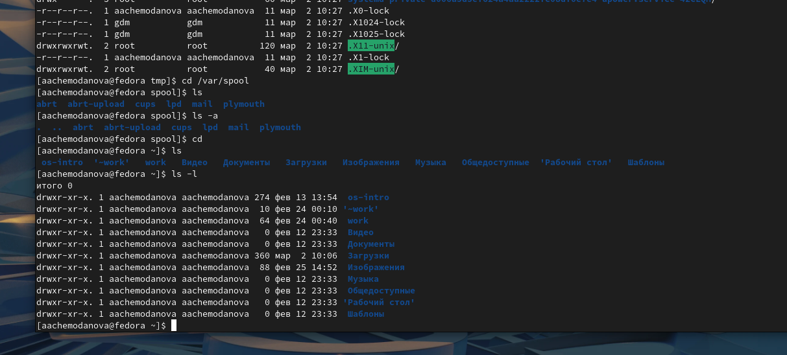{#fig:004 width=70%}

В домашнем каталоге необходимо создать каталог с именем newdir и создать в этом каталоге подкаталог morefun.   (рис. @fig:005).

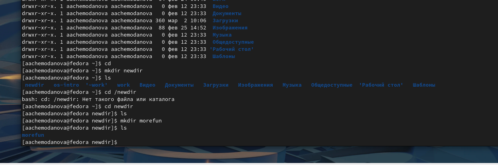{#fig:005 width=70%}

Теперь в домашнем каталоге создадим одной командой три новых каталога /letters/memos/misk.  (рис. @fig:006).

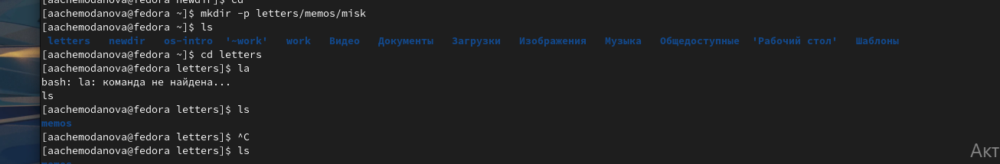{#fig:006 width=70%}

Удалим созданные каталоги одной командой, а также попробуем удалить созданный каталог newdir командой rm, у нас это не получится, потому что внутри него есть подкаталог, для того чтобы удалить его воспользуемся командой rm -r.  (рис. @fig:007).

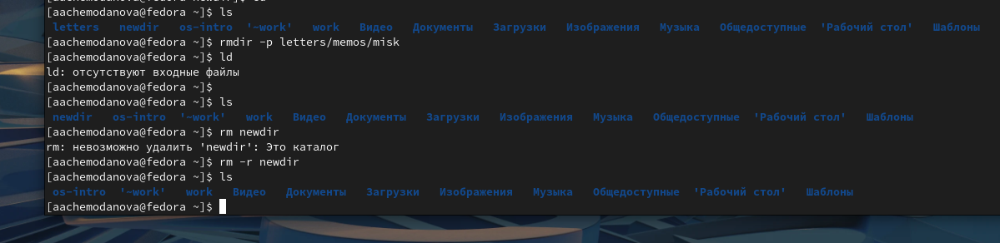{#fig:007 width=70%}

Нам необходимо узнать какая опция команды ls позволяет просмотреть содержимое подкаталогов каталога. Это опция ls -R. (рис. @fig:008).

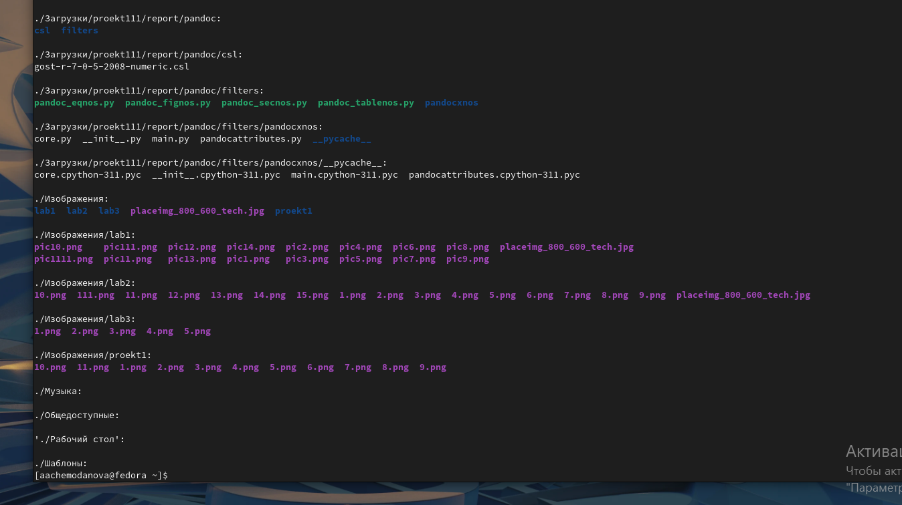{#fig:008 width=70%}

Для того чтобы отсортировать по времени последнего изменения выводимый список содержимого каталога с развёрнутым описанием файлов необходимо использовать команду ls -c -lt. (рис. @fig:009).

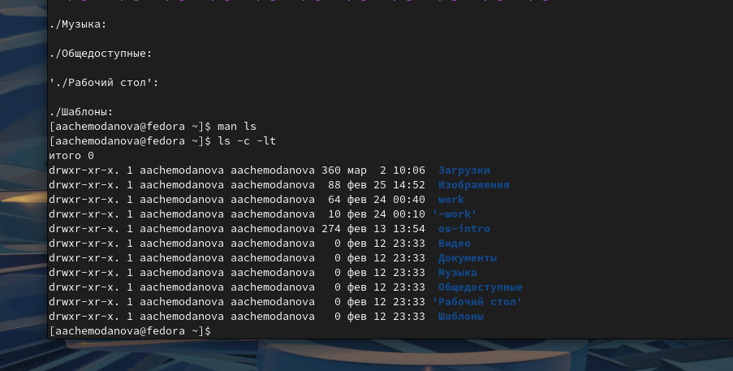{#fig:009 width=70%}

Посмотрим описание следующих команд: cd, pwd, mkdir, rmdir, rm. Команды cd автоматически переносит в домашний каталог, а, например, cd .. позволяет вернуться в родительский каталог. (рис. @fig:010).

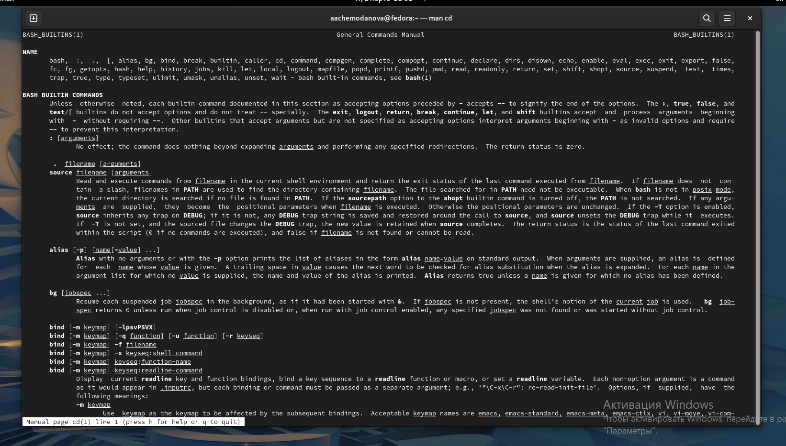{#fig:010 width=70%}

Опция -L команды pwd позволяет брать директорию из окружающей среды, даже если она содержит символические ссылки, а опция -Р отбрасывает эти символические ссылки.  (рис. @fig:011).

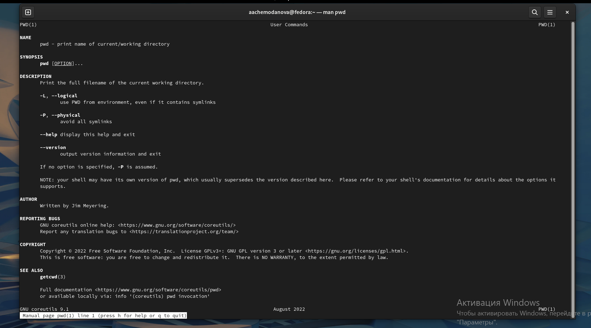{#fig:011 width=70%}

Опция -m команды mkdir позволяет установить атрибуты доступа. Опция -р позволяет создать несколько каталогов одной командой.  (рис. @fig:012).

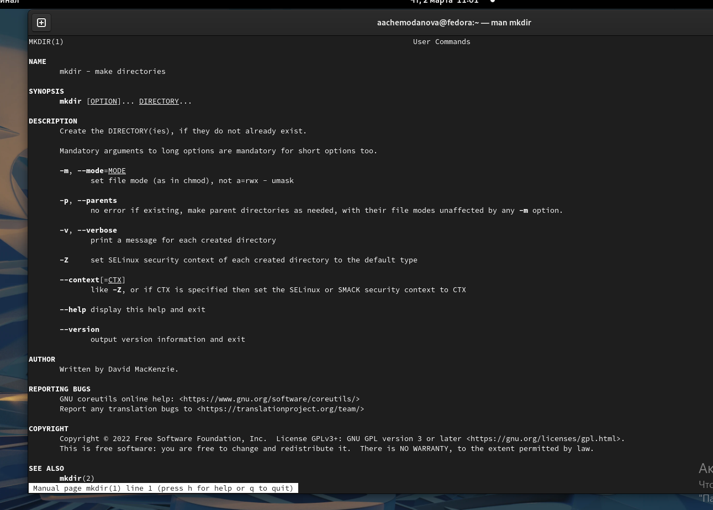{#fig:012 width=70%}

Опция -р команды rmdir позволяет удалить сразу несколько каталогов. (рис. @fig:013).

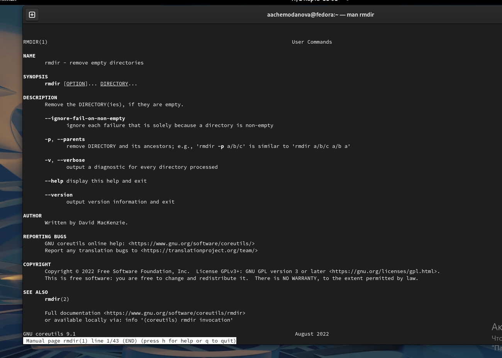{#fig:013 width=70%}

Команда rm имеет опцию -i, которая запрашивает подтверждение перед удалением, а -r позволяет удалить каталог, даже если в нем есть файлы.  (рис. @fig:014).

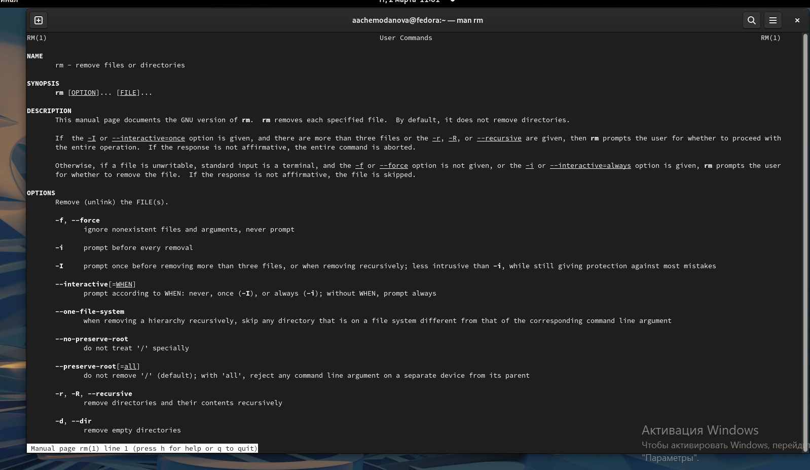{#fig:014 width=70%}

Воспользуемся командой history, чтобы получить информацию о всех выполненных командах.  (рис. @fig:015).

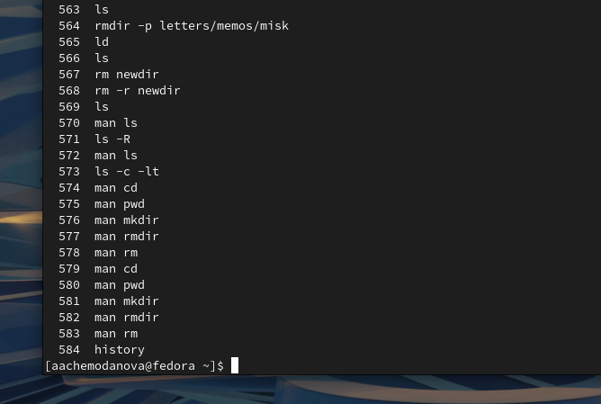{#fig:015 width=70%}

Теперь выполним модификацию и исполним несколько команд из буфера обмена. (рис. @fig:016).

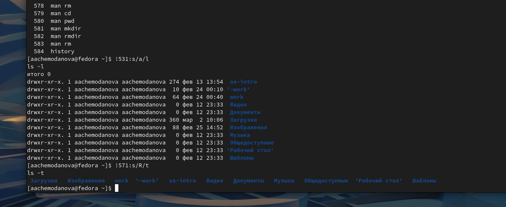{#fig:016 width=70%}

# Выводы

Мы приобрели практические навыки взаимодействия пользователя с системой посредством командной строки.

# Контрольные вопросы

1. Что такое командная строка?
Командная строка - это программа, которая запускает в компьютере какие-то процессы после ввода в нее соответствующих комнад.

2. При помощи какой команды можно определить абсолютный путь текущего каталога? Приведите пример.
Определить абсолютный путь текущего каталога можно с помощью команды pwd. Пример был представлен в лабороторной работе:

***pwd ~***

/home/aachemodanova

3. При помощи какой команды и каких опций можно определить только тип файлов и их имена в текущем каталоге? Приведите примеры.
Тип файлов можно определить с помощью команды ls и ее опций -l и -alF. Пример можно увидеть при выполнении лабораторной работы (Рис.4 и Рис.5)

4. Каким образом отобразить информацию о скрытых файлах? Приведите примеры.
Отобразить информацию о скрытых файлах можно с помощью команды ls -a. Примером служит Рис.3 из лабороторной работы.

5. При помощи каких команд можно удалить файл и каталог? Можно ли это сделать одной и той же командой? Приведите примеры.
Файл и каталог можно удалить при помощи команд rm и rmdir. Да, это можно сделать при помощи одной команды (команда rm), но есть некоторые тонкости. Например, если каталог имеет внутри файлы мы не можем удалить его командой rmdir, так как она применяется только для пустых каталогов. Наполненный каталог нужно удалять командой rm с опцией -r. Примеры содержит выполненная лабораторная работа (Рис.12)

6. Каким образом можно вывести информацию о последних выполненных пользователем командах?
Это можно вывести с помощью команды history.

7. Как воспользоваться историей команд для их модифицированного выполнения? Приведите примеры.
Для того чтобы модифицировать команды из истории мы должны воспользоваться командой !<номер_команды>:s/<что_меняем>/<на_что_меняем>. Пример:

511 ls -a

!311:s/a/l

ls -l

8. Приведите примеры запуска нескольких команд в одной строке.
Пример:

cd; ls -a

9. Дайте определение и приведите примера символов экранирования.
Символ экранизирования - символ, который позволяет использовать специальные символы (типа «.», «/», «*») без вреда для кода. Символом экранизирования является обратный слэш.

10. Охарактеризуйте вывод информации на экран после выполнения команды ls с опцией l.
Такая команда позволяет увидеть пользователю подробную информацию о каталоге и каждом подкаталоге(файле), находящимся внутри. При этом о каждом файле и каталоге будет выведена следующая информация:

– тип файла

– право доступа

– число ссылок

– владелец

– размер

– дата последней ревизии

– имя файла или каталога

11. Что такое относительный путь к файлу? Приведите примеры использования относительного и абсолютного пути при выполнении какой-либо команды.
Относительный путь к файлу - это путь относительно текущей папки. То есть компьютер показывает нам путь до нужного каталога, исходя из того, в каком из них мы сейчас находимся.

Абсолютный путь к файлу - это путь от корневой пакпи, то есть полный путь к папке, независящий от того каталога, в котором мы сейчас находимся.

Пример:

В подкаталоге my каталога tmp, который находится в корневой папке, создан file1. Мы находимся в tmp.

Относительный путь: tmp/my/file1

Абсолютный путь: /tmp/my/file1

12. Как получить информацию об интересующей вас команде?
Информацию можно получить с помощью команды man.

13. Какая клавиша или комбинация клавиш служит для автоматического дополнения вводимых команд?
Клавиша Tab. 
