---
## Front matter
lang: ru-RU
title: "Лабораторная работа №5"
subtitle:  "Анализ файловой системы Linux. Команды для работы с файлами и каталогами"
author:
  - Чемоданова А.А.

## Formatting pdf
toc: false
toc-title: Содержание
slide_level: 2
aspectratio: 169
section-titles: true
theme: metropolis
header-includes:
 - \metroset{progressbar=frametitle,sectionpage=progressbar,numbering=fraction}
 - '\makeatletter'
 - '\beamer@ignorenonframefalse'
 - '\makeatother'
---

## Цель работы

Ознакомление с файловой системой Linux, её структурой, именами и содержанием каталогов. Приобретение практических навыков по применению команд для работы с файлами и каталогами, по управлению процессами (и работами), по проверке использования диска и обслуживанию файловой системы.

## Задачи

1. Выполните все примеры, приведённые в первой части описания лабораторной работы.
2. Выполните следующие действия, зафиксировав в отчёте по лабораторной работе используемые при этом команды и результаты их выполнения:
2.1. Скопируйте файл /usr/include/sys/io.h в домашний каталог и назовите его equipment. Если файла io.h нет, то используйте любой другой файл в каталоге /usr/include/sys/ вместо него.
2.2. В домашнем каталоге создайте директорию ~/ski.plases.
2.3. Переместите файл equipment в каталог ~/ski.plases.
2.4. Переименуйте файл ~/ski.plases/equipment в ~/ski.plases/equiplist.
2.5. Создайте в домашнем каталоге файл abc1 и скопируйте его в каталог ~/ski.plases, назовите его equiplist2.
2.6. Создайте каталог с именем equipment в каталоге ~/ski.plases.
2.7. Переместите файлы ~/ski.plases/equiplist и equiplist2 в каталог ~/ski.plases/equipment.
2.8. Создайте и переместите каталог ~/newdir в каталог ~/ski.plases и назовите его plans.

## Задачи

3. Определите опции команды chmod, необходимые для того, чтобы присвоить перечисленным ниже файлам выделенные права доступа, считая, что в начале таких прав нет:
drwxr--r-- ... australia
drwx--x--x ... play
-r-xr--r-- ... my_os
-rw-rw-r-- ... feathers
4. Проделайте приведённые ниже упражнения, записывая в отчёт по лабораторной работе используемые при этом команды:
4.1. Просмотрите содержимое файла /etc/password.
4.2. Скопируйте файл ~/feathers в файл ~/file.old.
4.3. Переместите файл ~/file.old в каталог ~/play.
4.4. Скопируйте каталог ~/play в каталог ~/fun.
4.5. Переместите каталог ~/fun в каталог ~/play и назовите его games.
4.6. Лишите владельца файла ~/feathers права на чтение.
4.7. Что произойдёт, если вы попытаетесь просмотреть файл ~/feathers командой cat?
4.8. Что произойдёт, если вы попытаетесь скопировать файл ~/feathers?
4.9. Дайте владельцу файла ~/feathers право на чтение.
4.10. Лишите владельца каталога ~/play права на выполнение.
4.11. Перейдите в каталог ~/play. Что произошло?
4.12. Дайте владельцу каталога ~/play право на выполнение.
5. Прочитайте man по командам mount, fsck, mkfs, kill и кратко их охарактеризуйте, приведя примеры.

## Выполнение работы

Выполним все примеры, приведенные в первой части описания лабораторной работы. 

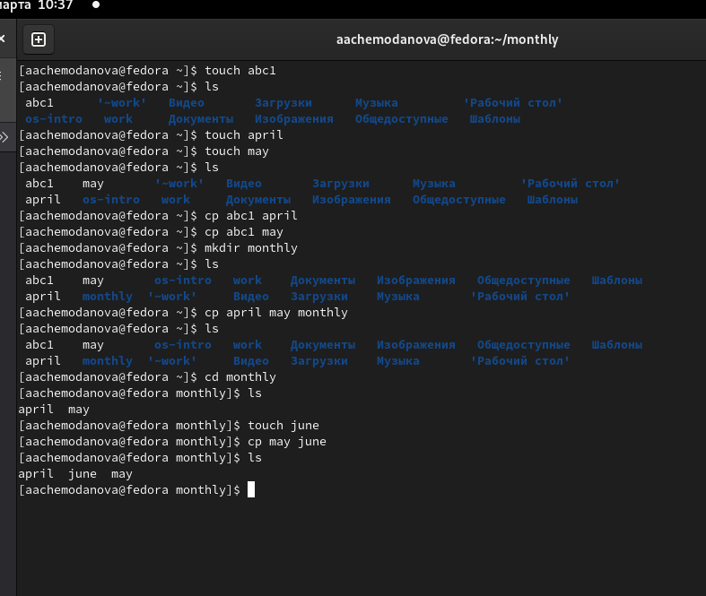{#fig:001 width=40%}

## Выполнение работы

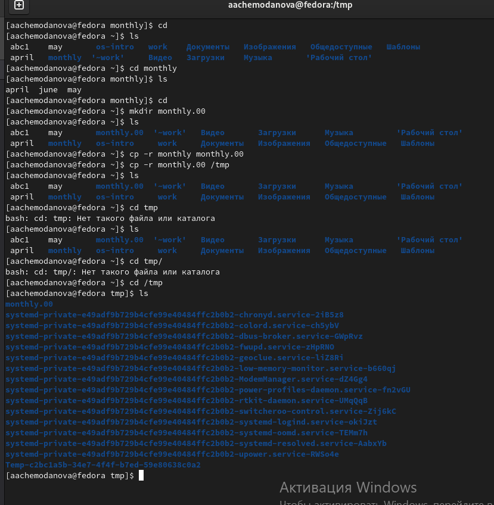{#fig:002 width=40%}

## Выполнение работы

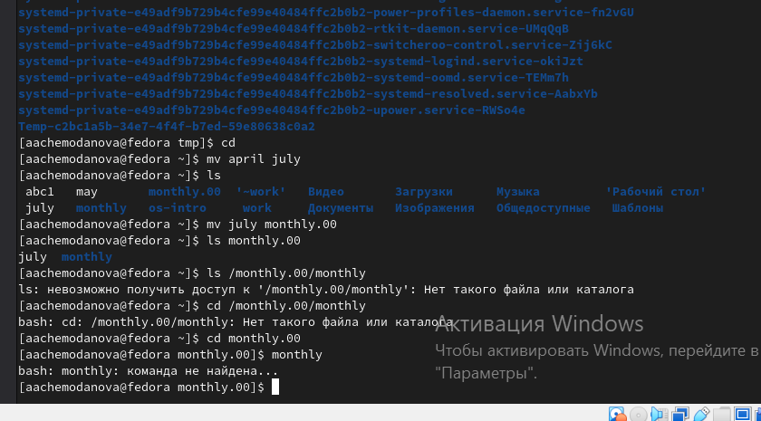{#fig:003 width=40%}

## Выполнение работы

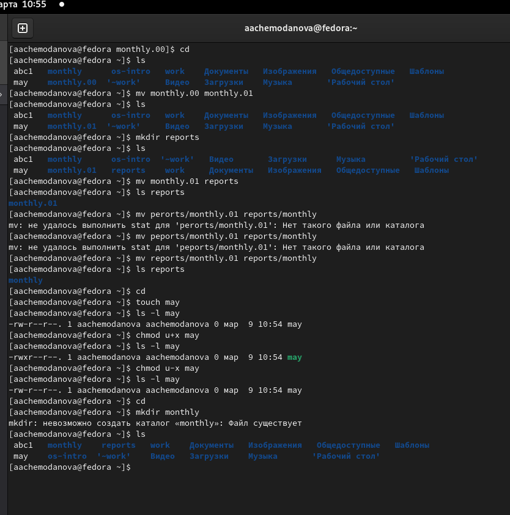{#fig:004 width=40%}

## Выполнение работы

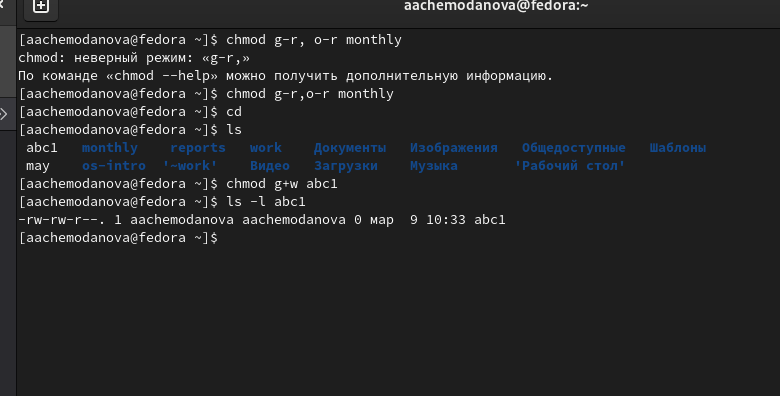{#fig:005 width=40%}

## Выполнение работы

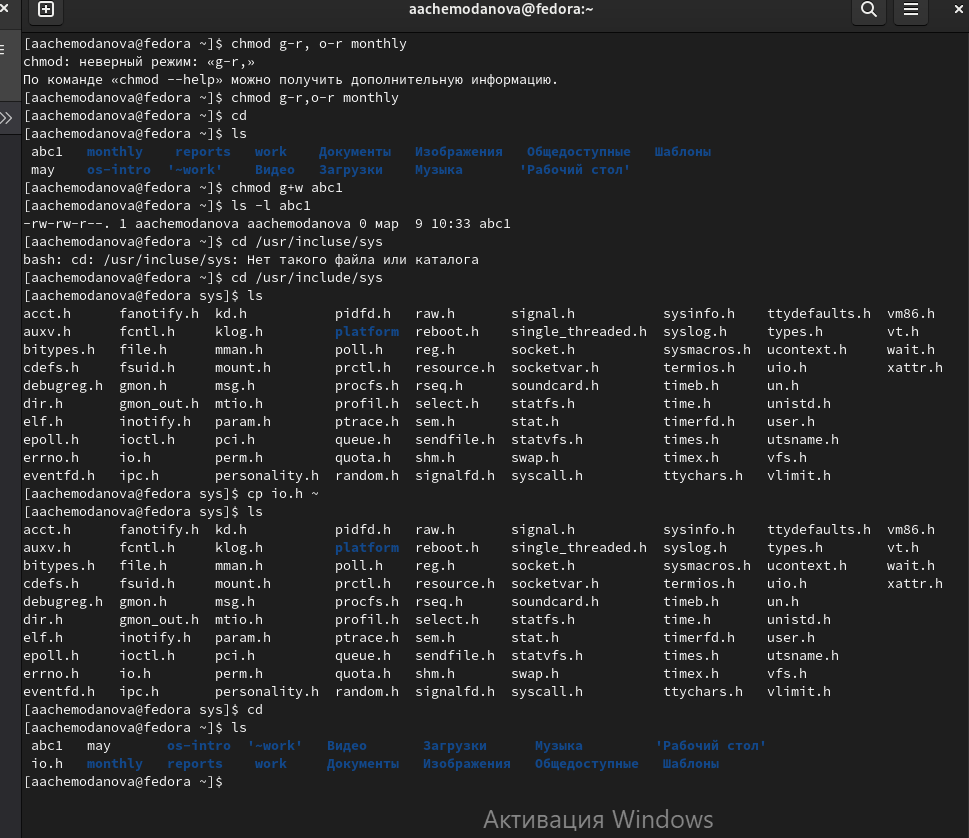{#fig:006 width=40%}

## Выполнение работы

Скопируем файл /usr/include/sys/io.h в домашний каталог при помощи команды cp io.h ~.

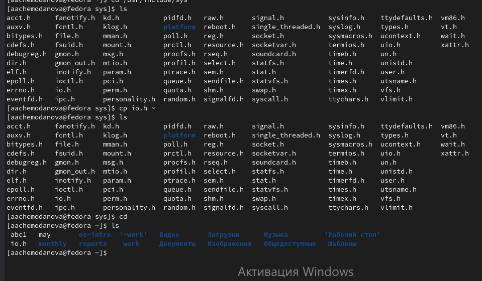{#fig:007 width=40%}

## Выполнение работы

И назовем его equipment при помощи mv io.h equipment. В домашнем каталоге создадим директорию ~/ski.plases при помощи mkdir. Переместим файл equipment в каталог ~/ski.plases при помощи mv. Переименуем файл ~/ski.plases/equipment в ~/ski.plases/equiplist при помощи mv. Создадиим в домашнем каталоге файл abc1 и скопируйте его в каталог ~/ski.plases при помощи mv, назовите его equiplist2 при помощи mv. Создадим каталог с именем equipment в каталоге ~/ski.plases при помощи mkdir. Переместим файлы ~/ski.plases/equiplist и equiplist2 в каталог ~/ski.plases/equipment при помощи mv. Создадим при помощи mkdir и переместим каталог ~/newdir в каталог ~/ski.plases при помощи mv и назовем его plans при помощи mv.

## Выполнение работы

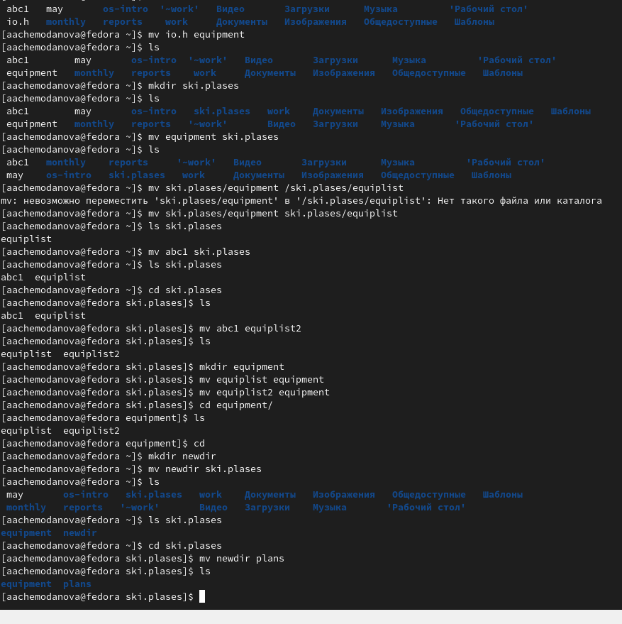{#fig:008 width=40%}

## Выполнение работы

Теперь присвоим определенным файлам выделенные права доступа. 

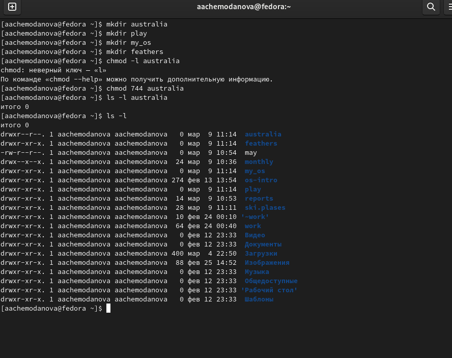{#fig:009 width=40%}

## Выполнение работы

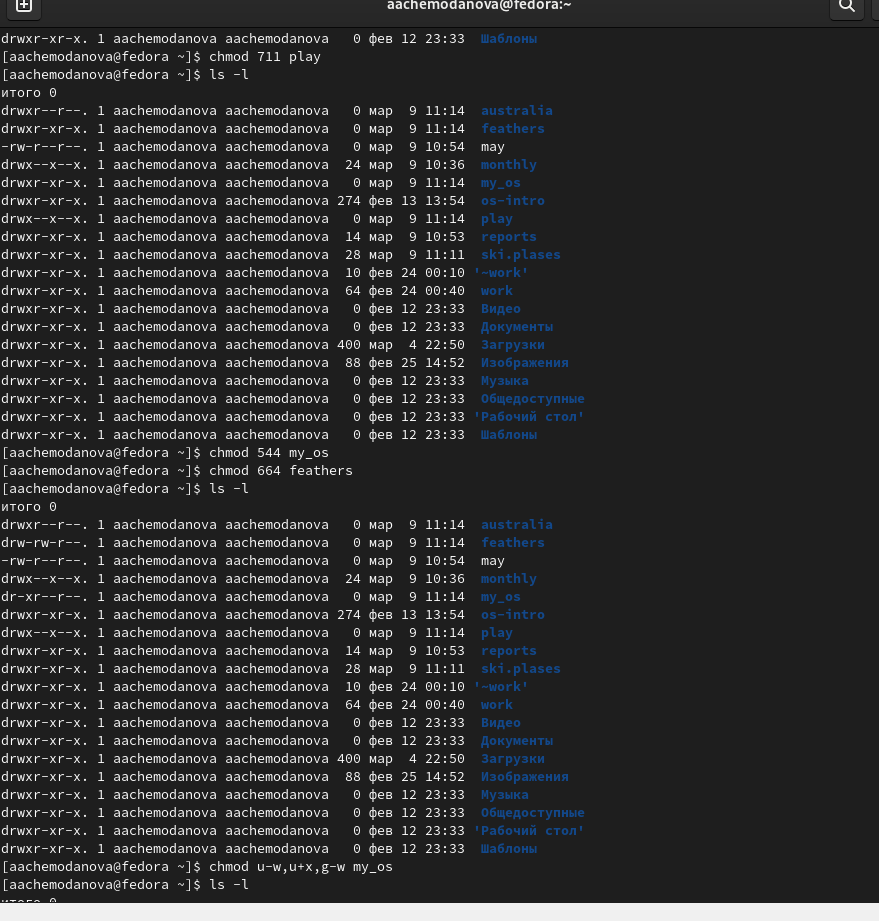{#fig:010 width=40%}

## Выполнение работы

Просмотрим содержимое файла /etc/password при помощи команды cat, но у меня не нашлось такого файла.

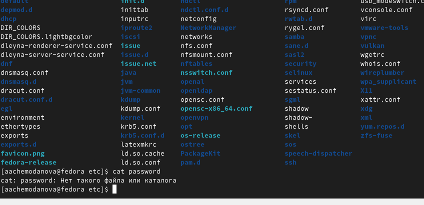{#fig:011 width=40%}

## Выполнение работы

Скопируем файл ~/feathers в файл ~/file.old при помощи cp. Переместим файл ~/file.old в каталог ~/play при помощи mv. Скопируем каталог ~/play в каталог ~/fun cp -r. Переместим каталог ~/fun в каталог ~/play mv и назовем его games mv.

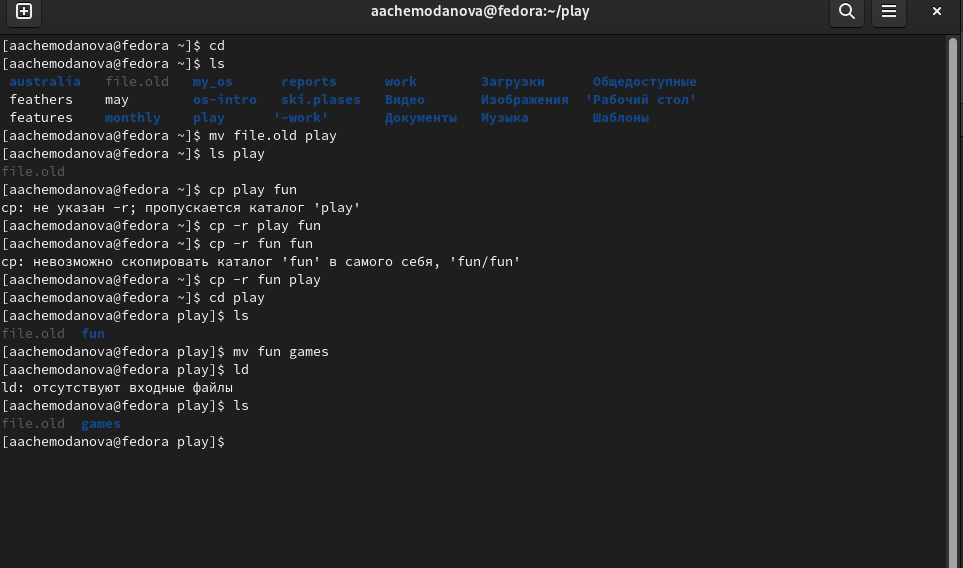{#fig:012 width=40%}

## Выполнение работы

Лишим владельца файла ~/feathers права на чтение при помощи chmod u-r.

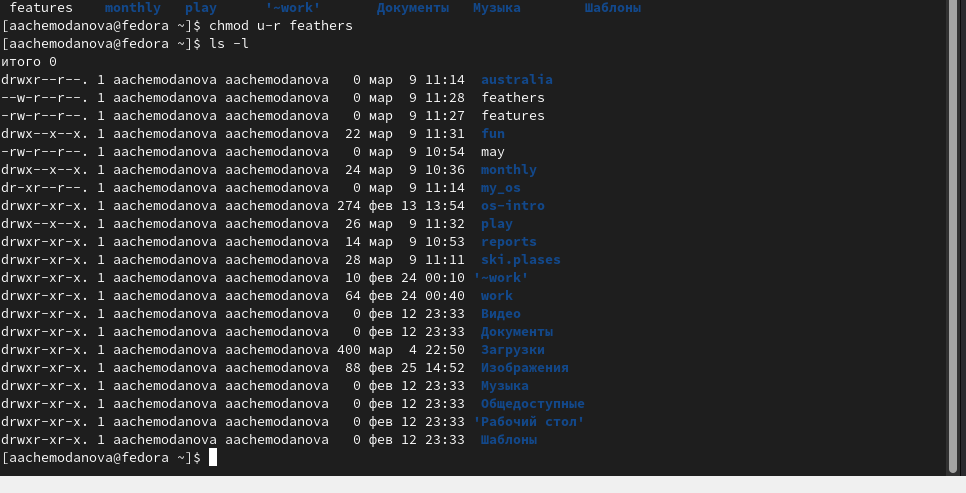{#fig:013 width=40%}

## Выполнение работы

Попытаемся просмотреть файл ~/feathers командой cat, но у нас не получится. Попытаемся скопировать файл ~/feathers при помощи ср. Дадим владельцу файла ~/feathers право на чтение. 

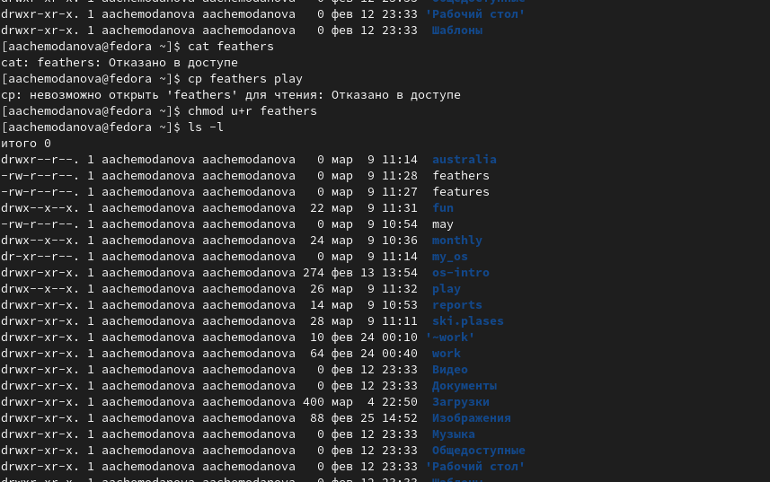{#fig:014 width=40%}

## Выполнение работы

Лишим владельца каталога ~/play права на выполнение. Попробуем перейти в каталог ~/play, у нас не получится. Дадим владельцу каталога ~/play право на выполнение.

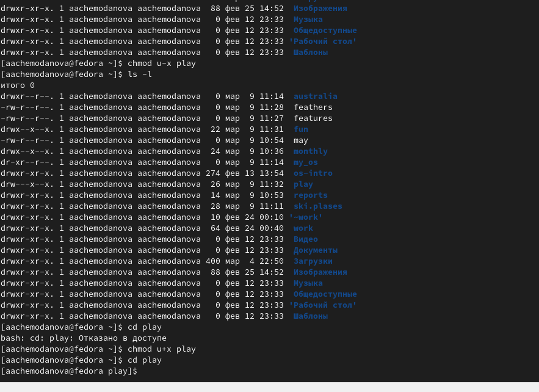{#fig:015 width=40%}

## Выполнение работы

Прочитаем man по командам mount, fsck, mkfs, kill.

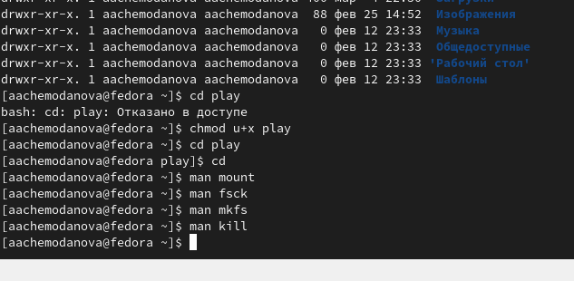{#fig:016 width=40%}

## Выводы

Мы ознакомились с файловой системой Linux, её структурой, именами и содержанием каталогов. Приобрели практические навыки по применению команд для работы с файлами и каталогами, по управлению процессами (и работами), по проверке использования диска и обслуживанию файловой системы.
