---
## Front matter
lang: ru-RU
title:  "Лабораторная работа №6"
subtitle: "Поиск файлов. Перенаправление ввода-вывода. Просмотр запущенных процессов"
author:
  - Чемоданова А.А.

## Formatting pdf
toc: false
toc-title: Содержание
slide_level: 2
aspectratio: 169
section-titles: true
theme: metropolis
header-includes:
 - \metroset{progressbar=frametitle,sectionpage=progressbar,numbering=fraction}
 - '\makeatletter'
 - '\beamer@ignorenonframefalse'
 - '\makeatother'
---

## Цель работы

Ознакомление с инструментами поиска файлов и фильтрации текстовых данных. Приобретение практических навыков: по управлению процессами (и заданиями), по проверке использования диска и обслуживанию файловых систем.

## Задачи

1. Осуществите вход в систему, используя соответствующее имя пользователя.
2. Запишите в файл file.txt названия файлов, содержащихся в каталоге /etc. Допишите в этот же файл названия файлов, содержащихся в вашем домашнем каталоге.
3. Выведите имена всех файлов из file.txt, имеющих расширение .conf, после чего запишите их в новый текстовой файл conf.txt.
4. Определите, какие файлы в вашем домашнем каталоге имеют имена, начинавшиеся с символа c? Предложите несколько вариантов, как это сделать.
5. Выведите на экран (по странично) имена файлов из каталога /etc, начинающиеся с символа h.
6. Запустите в фоновом режиме процесс, который будет записывать в файл ~/logfile файлы, имена которых начинаются с log.

## Задачи

7. Удалите файл ~/logfile.
8. Запустите из консоли в фоновом режиме редактор gedit.
9. Определите идентификатор процесса gedit, используя команду ps, конвейер и фильтр grep. Как ещё можно определить идентификатор процесса?
10. Прочтите справку (man) команды kill, после чего используйте её для завершения процесса gedit.
11. Выполните команды df и du, предварительно получив более подробную информацию об этих командах, с помощью команды man.
12. Воспользовавшись справкой команды find, выведите имена всех директорий, имеющихся в вашем домашнем каталоге.

## Выполнение лабораторной работы

Осуществим вход в систему, используя соответствующее имя пользователя.

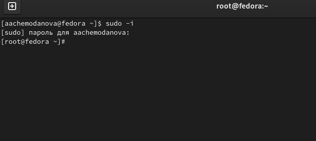{#fig:001 width=70%}

## Выполнение лабораторной работы

Запишем в файл file.txt названия файлов, содержащихся в каталоге /etc. Допишим в этот же файл названия файлов, содержащихся в вашем домашнем каталоге.

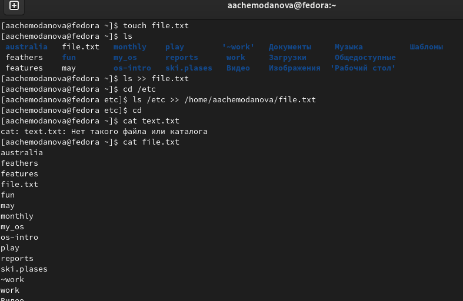{#fig:002 width=50%}

## Выполнение лабораторной работы

Выведем имена всех файлов из file.txt, имеющих расширение .conf.

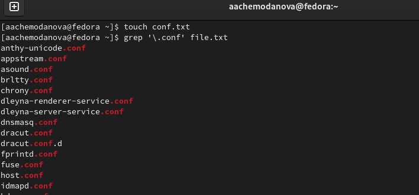{#fig:003 width=70%}

## Выполнение лабораторной работы

Запишем выведенные файлы в новый текстовой файл conf.txt.

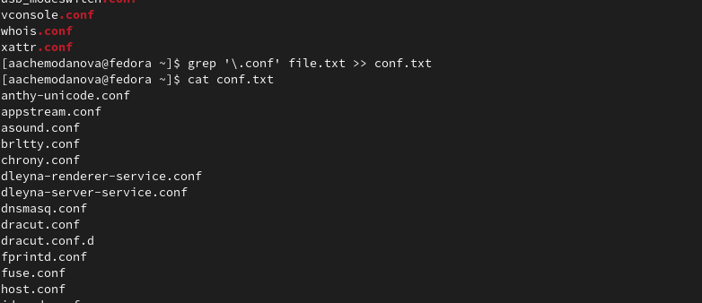{#fig:004 width=70%}

## Выполнение лабораторной работы

Определим, какие файлы в  домашнем каталоге имеют имена, начинавшиеся с символа c. 

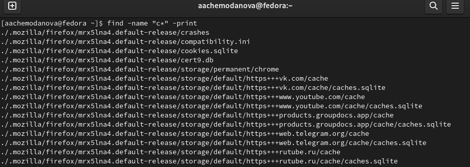{#fig:005 width=70%}

## Выполнение лабораторной работы

Еще способ. 

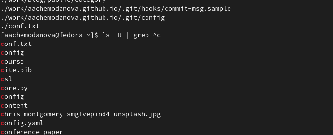{#fig:006 width=70%}

## Выполнение лабораторной работы

Выведем на экран (по странично) имена файлов из каталога /etc, начинающиеся с символа h.

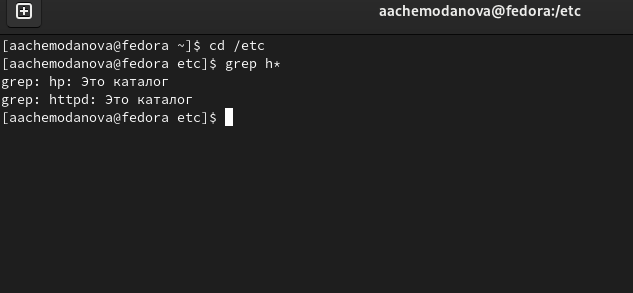{#fig:007 width=70%}

## Выполнение лабораторной работы

Запустим в фоновом режиме процесс, который будет записывать в файл ~/logfile файлы, имена которых начинаются с log. Удалим файл ~/logfile.

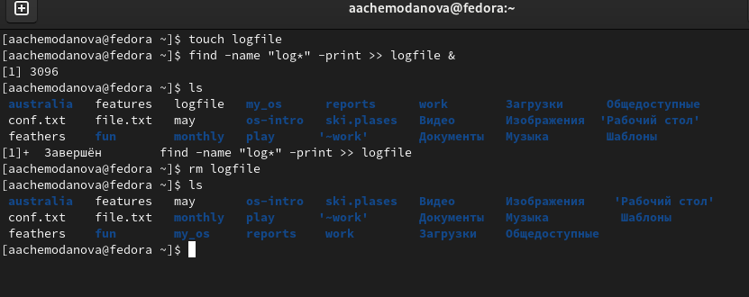{#fig:008 width=70%}

## Выполнение лабораторной работы

Запустим из консоли в фоновом режиме редактор gedit. Определим идентификатор процесса gedit, используя команду ps, конвейер и фильтр grep, и еще одним способом. 

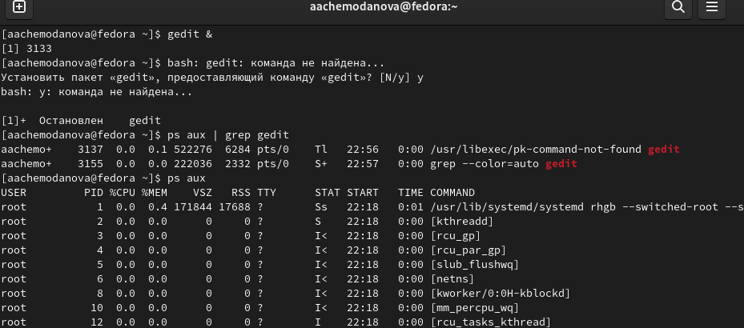{#fig:009 width=70%}

## Выполнение лабораторной работы

Прочитаем справку (man) команд kill, df, du после чего используем kill для завершения процесса gedit.

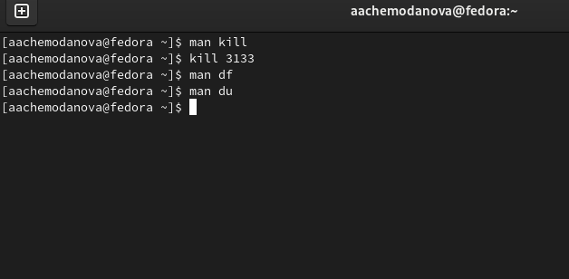{#fig:010 width=70%}

## Выполнение лабораторной работы

Выполним команды df и du, предварительно получив более подробную информацию об этих командах, с помощью команды man. 

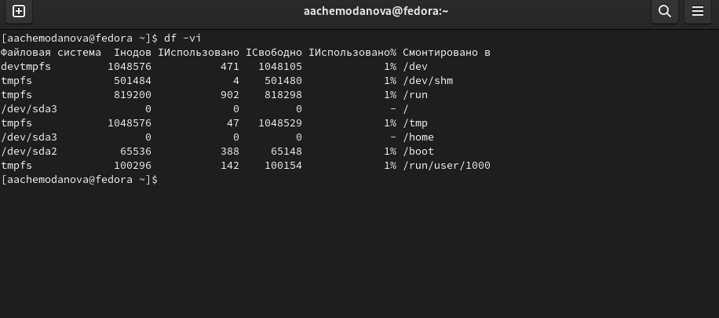{#fig:011 width=70%}

## Выполнение лабораторной работы

Воспользовавшись справкой команды find, выведем имена всех директорий, имеющихся в вашем домашнем каталоге. 

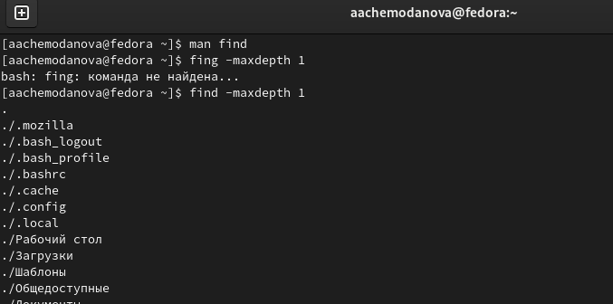{#fig:012 width=70%}

## Выводы

Мы ознакомились с инструментами поиска файлов и фильтрации текстовых данных. Приобрели практические навыки: по управлению процессами (и заданиями), по проверке использования диска и обслуживанию файловых систем.

