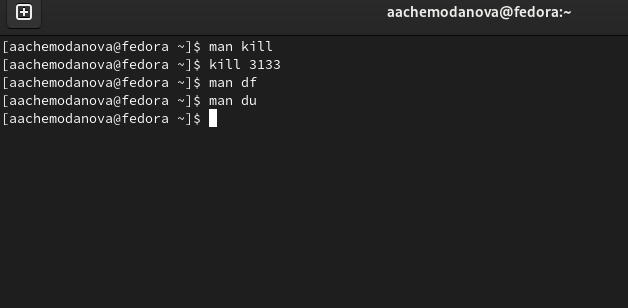

---
## Front matter
title: "Лабораторная работа №6"
subtitle: "Поиск файлов. Перенаправление ввода-вывода. Просмотр запущенных процессов"
author: "Чемоданова Ангелина Александровна"

## Generic otions
lang: ru-RU
toc-title: "Содержание"

## Bibliography
bibliography: bib/cite.bib
csl: pandoc/csl/gost-r-7-0-5-2008-numeric.csl

## Pdf output format
toc: true # Table of contents
toc-depth: 2
lof: true # List of figures
lot: false # List of tables
fontsize: 12pt
linestretch: 1.5
papersize: a4
documentclass: scrreprt
## I18n polyglossia
polyglossia-lang:
  name: russian
  options:
	- spelling=modern
	- babelshorthands=true
polyglossia-otherlangs:
  name: english
## I18n babel
babel-lang: russian
babel-otherlangs: english
## Fonts
mainfont: PT Serif
romanfont: PT Serif
sansfont: PT Sans
monofont: PT Mono
mainfontoptions: Ligatures=TeX
romanfontoptions: Ligatures=TeX
sansfontoptions: Ligatures=TeX,Scale=MatchLowercase
monofontoptions: Scale=MatchLowercase,Scale=0.9
## Biblatex
biblatex: true
biblio-style: "gost-numeric"
biblatexoptions:
  - parentracker=true
  - backend=biber
  - hyperref=auto
  - language=auto
  - autolang=other*
  - citestyle=gost-numeric
## Pandoc-crossref LaTeX customization
figureTitle: "Рис."
tableTitle: "Таблица"
listingTitle: "Листинг"
lofTitle: "Список иллюстраций"
lotTitle: "Список таблиц"
lolTitle: "Листинги"
## Misc options
indent: true
header-includes:
  - \usepackage{indentfirst}
  - \usepackage{float} # keep figures where there are in the text
  - \floatplacement{figure}{H} # keep figures where there are in the text
---

# Цель работы

Ознакомление с инструментами поиска файлов и фильтрации текстовых данных. Приобретение практических навыков: по управлению процессами (и заданиями), по проверке использования диска и обслуживанию файловых систем.

# Задание

1. Осуществите вход в систему, используя соответствующее имя пользователя.
2. Запишите в файл file.txt названия файлов, содержащихся в каталоге /etc. Допишите в этот же файл названия файлов, содержащихся в вашем домашнем каталоге.
3. Выведите имена всех файлов из file.txt, имеющих расширение .conf, после чего запишите их в новый текстовой файл conf.txt.
4. Определите, какие файлы в вашем домашнем каталоге имеют имена, начинавшиеся с символа c? Предложите несколько вариантов, как это сделать.
5. Выведите на экран (по странично) имена файлов из каталога /etc, начинающиеся с символа h.
6. Запустите в фоновом режиме процесс, который будет записывать в файл ~/logfile файлы, имена которых начинаются с log.
7. Удалите файл ~/logfile.
8. Запустите из консоли в фоновом режиме редактор gedit.
9. Определите идентификатор процесса gedit, используя команду ps, конвейер и фильтр grep. Как ещё можно определить идентификатор процесса?
10. Прочтите справку (man) команды kill, после чего используйте её для завершения процесса gedit.
11. Выполните команды df и du, предварительно получив более подробную информацию об этих командах, с помощью команды man.
12. Воспользовавшись справкой команды find, выведите имена всех директорий, имеющихся в вашем домашнем каталоге.

# Теоретическое введение

Команда find используется для поиска и отображения на экран имён файлов, соответствующих заданной строке символов. Путь определяет каталог, начиная с которого по всем подкаталогам будет вестись поиск.

В системе по умолчанию открыто три специальных потока:
– stdin — стандартный поток ввода (по умолчанию: клавиатура), файловый дескриптор 0;
– stdout — стандартный поток вывода (по умолчанию: консоль), файловый дескриптор 1;
– stderr — стандартный поток вывод сообщений об ошибках (по умолчанию: консоль), файловый дескриптор 2.
Большинство используемых в консоли команд и программ записывают результаты своей работы в стандартный поток вывода stdout. Например, команда ls выводит в стандартный поток вывода (консоль) список файлов в текущей директории. Потоки вывода и ввода можно перенаправлять на другие файлы или устройства. Проще всего это делается с помощью символов >, >>, <, <<.

# Выполнение лабораторной работы

Осуществим вход в систему, используя соответствующее имя пользователя.(рис. @fig:001).

{#fig:001 width=70%}

Запишем в файл file.txt названия файлов, содержащихся в каталоге /etc. Допишим в этот же файл названия файлов, содержащихся в вашем домашнем каталоге.(рис. @fig:002).

{#fig:002 width=70%}

Выведем имена всех файлов из file.txt, имеющих расширение .conf.(рис. @fig:003).

{#fig:003 width=70%}

Запишем выведенные файлы в новый текстовой файл conf.txt.(рис. @fig:004).

{#fig:004 width=70%}

Определим, какие файлы в  домашнем каталоге имеют имена, начинавшиеся с символа c. (рис. @fig:005).

{#fig:005 width=70%}

Еще способ. (рис. @fig:006).

{#fig:006 width=70%}

Выведем на экран (по странично) имена файлов из каталога /etc, начинающиеся с символа h.(рис. @fig:007).

{#fig:007 width=70%}

Запустим в фоновом режиме процесс, который будет записывать в файл ~/logfile файлы, имена которых начинаются с log. Удалим файл ~/logfile.(рис. @fig:008).

{#fig:008 width=70%}

Запустим из консоли в фоновом режиме редактор gedit. Определим идентификатор процесса gedit, используя команду ps, конвейер и фильтр grep, и еще одним способом. (рис. @fig:009).

{#fig:009 width=70%}

Прочитаем справку (man) команд kill, df, du после чего используем kill для завершения процесса gedit. (рис. @fig:010).

{#fig:010 width=70%}

Выполним команды df и du, предварительно получив более подробную информацию об этих командах, с помощью команды man. (рис. @fig:011).

{#fig:011 width=70%}

Воспользовавшись справкой команды find, выведем имена всех директорий, имеющихся в вашем домашнем каталоге. (рис. @fig:012).

{#fig:012 width=70%}

# Выводы

Мы ознакомились с инструментами поиска файлов и фильтрации текстовых данных. Приобрели практические навыки: по управлению процессами (и заданиями), по проверке использования диска и обслуживанию файловых систем.

# Контрольные вопросы

1. Какие потоки ввода вывода вы знаете?

В системе по умолчанию открыто три специальных потока:

– stdin — стандартный поток ввода (по умолчанию: клавиатура), файловый дескриптор 0;

– stdout — стандартный поток вывода (по умолчанию: консоль), файловый дескриптор 1;

– stderr — стандартный поток вывод сообщений об ошибках (по умолчанию: консоль), файловый дескриптор 2.

2. Объясните разницу между операцией > и >>.

Операция > перезаписывает существующие файлы или создает новые, если файла с указанным именем не существует.
Операция » добавляет существующий файл или создает новый, если файл с указанным именем отсутствует.

3. Что такое конвейер?

Конвейер - способ объединения простых команд или утилит в цепочки, в которых результат работы предыдущей команды передаётся последующей.

4. Что такое процесс? Чем это понятие отличается от программы?

Процесс - это программа, выполняющаяся в отдельном виртуальном адресном пространстве. По сути, каждый процесс - это экзепляр программы, выполняемой компьютером, а программа - набор инструкци для выполнения какой-то задачи. Процесс, в отличие от программы, живет меньше и требует определенные ресурсы компьютера (память, устройтсво ввода-вывода, процессор)

5. Что такое PID и GID?

PID (Process ID) - идентификтаор процесса.

GID (Group ID) -идентификатор группы.

6. Что такое задачи и какая команда позволяет ими управлять?

Задачи - запущенные в фоновом ржиме программы. Ими можно управлять с помощью команды jobs.

7. Найдите информацию об утилитах top и htop. Каковы их функции?

top - консольная команда, которая выводит список работающих в системе процессов и информацию о них. По умолчанию она в реальном времени сортирует их по нагрузке на процессор.

htop - аналог top. Она показывает динамический список системных процессов, список обычно выравнивается по использованию ЦПУ. В отличие от top, htop показывает все процессы в системе. Также показывает время непрерывной работы, использование процессоров и памяти.

8. Назовите и дайте характеристику команде поиска файлов. Приведите примеры использования этой команды.

Поиск файлов осущесвляется с помощью команды find. Она может вывести файлы, соответсвующи е заданной строке символов. Синтаксис: find путь [ -опции ]. Путь определяет каталог, начиная с которого по всем подкаталогам будет вестись поиск.

Примеры:

find -name "for*" -print

Данная команда в текущем каталоге найдет файлы, начинающиеся с for и выведет их на экран. Также примеры можно увидеть в выполнении лабораторной работы.

9. Можно ли по контексту (содержанию) найти файл? Если да, то как?

Можно, это делается с помощью команды grep. Данная команда позволяет найти в текстовом файле указанную строку символов.

10. Как определить объем свободной памяти на жёстком диске?

Объем свободной памяти на жёстком диске можно определить с помощью команды df

11. Как определить объем вашего домашнего каталога?

Объем домашнего каталога можно определить с помощью команды du

12. Как удалить зависший процесс?

Удалить завиший процесс можно командой kill, указав идентификтаор процесса или командой kilall
