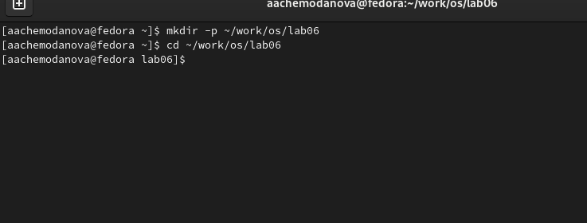
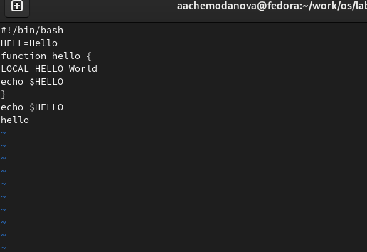
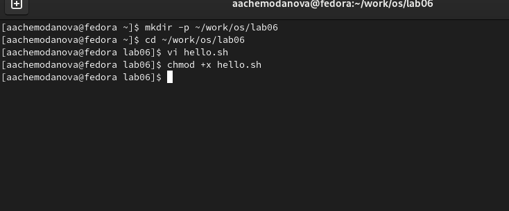
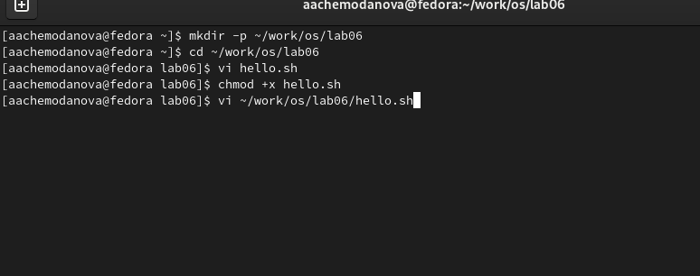
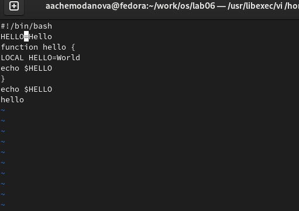
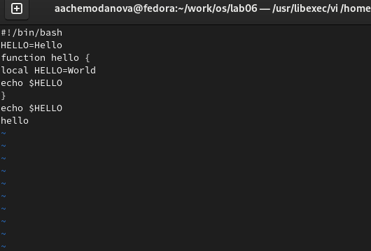
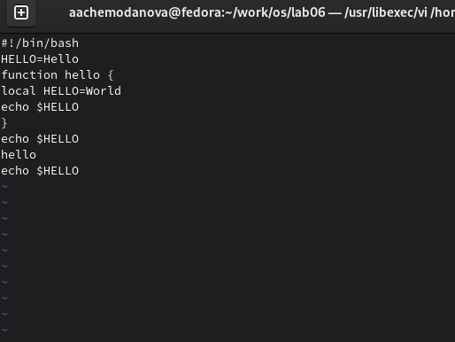
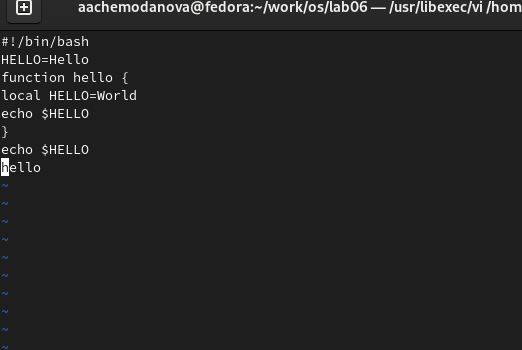
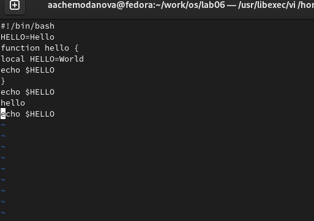
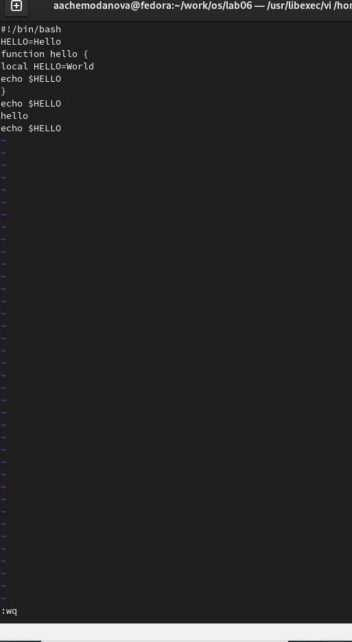

---
## Front matter
lang: ru-RU
title:  "Лабораторная работа №8"
subtitle: "Текстовой редактор vi"
author:
  - Чемоданова А.А.

## Formatting pdf
toc: false
toc-title: Содержание
slide_level: 2
aspectratio: 169
section-titles: true
theme: metropolis
header-includes:
 - \metroset{progressbar=frametitle,sectionpage=progressbar,numbering=fraction}
 - '\makeatletter'
 - '\beamer@ignorenonframefalse'
 - '\makeatother'
---

## Цель работы

Познакомиться с операционной системой Linux. Получить практические навыки работы с редактором vi, установленным по умолчанию практически во всех дистрибутивах.

## Задачи
1. Создайте каталог с именем ~/work/os/lab06.
2. Перейдите во вновь созданный каталог.
3. Вызовите vi и создайте файл hello.sh
4. Нажмите клавишу i и вводите следующий текст.
5. Нажмите клавишу Esc для перехода в командный режим после завершения ввода текста.
6. Нажмите : для перехода в режим последней строки и внизу вашего экрана появится приглашение в виде двоеточия.

## Задачи
7. Нажмите w (записать) и q (выйти), а затем нажмите клавишу Enter для сохранения
вашего текста и завершения работы.
8. Сделайте файл исполняемым. 
1. Вызовите vi на редактирование файла
2. Установите курсор в конец слова HELL второй строки.
3. Перейдите в режим вставки и замените на HELLO. Нажмите Esc для возврата в командный режим.
4. Установите курсор на четвертую строку и сотрите слово LOCAL.

## Задачи
5. Перейдите в режим вставки и наберите следующий текст: local, нажмите Esc для возврата в командный режим.
6. Установите курсор на последней строке файла. Вставьте после неё строку, содержащую следующий текст: echo $HELLO.
7. Нажмите Esc для перехода в командный режим.
8. Удалите последнюю строку.
9. Введите команду отмены изменений u для отмены последней команды.
10. Введите символ : для перехода в режим последней строки. Запишите произведённые изменения и выйдите из vi.

## Выполнение лабораторной работы

Создадим каталог с именем ~/work/os/lab06. Перейдем в созданный каталог. 

{#fig:001 width=70%}

## Выполнение лабораторной работы

Вызовем vi и создадим файл hello.sh Нажмем клавишу i и введем  текст. Нажмем клавишу Esc для перехода в командный режим после завершения ввода текста. Нажмем : для перехода в режим последней строки и внизу экрана появится
приглашение в виде двоеточия. Нажмем w (записать) и q (выйти), а затем нажмем клавишу Enter для сохранения текста и завершения работы.

{#fig:002 width=40%}

## Выполнение лабораторной работы

Сделаем файл исполняемым. 

{#fig:003 width=70%}

## Выполнение лабораторной работы

Вызовем vi на редактирование файла.

{#fig:004 width=40%}

## Выполнение лабораторной работы

Установите курсор в конец слова HELL второй строки. Перейдем в режим вставки и заменим на HELLO. Нажмем Esc для возврата в командный режим. 

{#fig:005 width=40%}

## Выполнение лабораторной работы

Установим курсор на четвертую строку и сотрем слово LOCAL.  Перейдем в режим вставки и наберем следующий текст: local, нажмем Esc для возврата в командный режим. 

{#fig:006 width=40%}

## Выполнение лабораторной работы

Установим курсор на последней строке файла. Вставим после неё строку, содержащую следующий текст: echo $HELLO.

{#fig:007 width=40%}

## Выполнение лабораторной работы

Нажмем Esc для перехода в командный режим. Удалим последнюю строку.

{#fig:008 width=40%}

## Выполнение лабораторной работы

Введем команду отмены изменений u для отмены последней команды.

{#fig:009 width=40%}

## Выполнение лабораторной работы

Введем символ : для перехода в режим последней строки. Запишем произведённые изменения и выйдем из vi.

{#fig:010 width=20%}

## Выводы

Мы познакомились с операционной системой Linux. Получили практические навыки работы с редактором vi, установленным по умолчанию практически во всех дистрибутивах.
