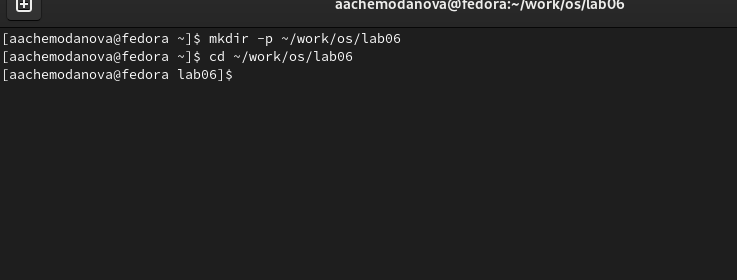
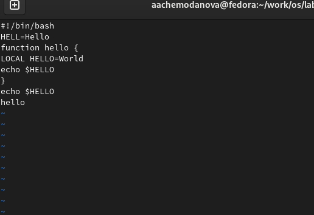
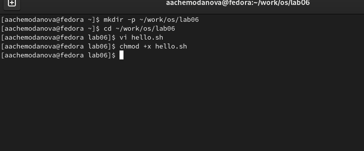

---
## Front matter
title: "Лабораторная работа №8"
subtitle: "Текстовой редактор vi"
author: "Чемоданова Ангелина Александровна"

## Generic otions
lang: ru-RU
toc-title: "Содержание"

## Bibliography
bibliography: bib/cite.bib
csl: pandoc/csl/gost-r-7-0-5-2008-numeric.csl

## Pdf output format
toc: true # Table of contents
toc-depth: 2
lof: true # List of figures
lot: false # List of tables
fontsize: 12pt
linestretch: 1.5
papersize: a4
documentclass: scrreprt
## I18n polyglossia
polyglossia-lang:
  name: russian
  options:
	- spelling=modern
	- babelshorthands=true
polyglossia-otherlangs:
  name: english
## I18n babel
babel-lang: russian
babel-otherlangs: english
## Fonts
mainfont: PT Serif
romanfont: PT Serif
sansfont: PT Sans
monofont: PT Mono
mainfontoptions: Ligatures=TeX
romanfontoptions: Ligatures=TeX
sansfontoptions: Ligatures=TeX,Scale=MatchLowercase
monofontoptions: Scale=MatchLowercase,Scale=0.9
## Biblatex
biblatex: true
biblio-style: "gost-numeric"
biblatexoptions:
  - parentracker=true
  - backend=biber
  - hyperref=auto
  - language=auto
  - autolang=other*
  - citestyle=gost-numeric
## Pandoc-crossref LaTeX customization
figureTitle: "Рис."
tableTitle: "Таблица"
listingTitle: "Листинг"
lofTitle: "Список иллюстраций"
lotTitle: "Список таблиц"
lolTitle: "Листинги"
## Misc options
indent: true
header-includes:
  - \usepackage{indentfirst}
  - \usepackage{float} # keep figures where there are in the text
  - \floatplacement{figure}{H} # keep figures where there are in the text
---

# Цель работы

Познакомиться с операционной системой Linux. Получить практические навыки работы с редактором vi, установленным по умолчанию практически во всех дистрибутивах.

# Задание

1. Создайте каталог с именем ~/work/os/lab06.
2. Перейдите во вновь созданный каталог.
3. Вызовите vi и создайте файл hello.sh
4. Нажмите клавишу i и вводите следующий текст.
5. Нажмите клавишу Esc для перехода в командный режим после завершения ввода текста.
6. Нажмите : для перехода в режим последней строки и внизу вашего экрана появится
приглашение в виде двоеточия.
7. Нажмите w (записать) и q (выйти), а затем нажмите клавишу Enter для сохранения
вашего текста и завершения работы.
8. Сделайте файл исполняемым

1. Вызовите vi на редактирование файла
2. Установите курсор в конец слова HELL второй строки.
3. Перейдите в режим вставки и замените на HELLO. Нажмите Esc для возврата в командный режим.
4. Установите курсор на четвертую строку и сотрите слово LOCAL.
5. Перейдите в режим вставки и наберите следующий текст: local, нажмите Esc для возврата в командный режим.
6. Установите курсор на последней строке файла. Вставьте после неё строку, содержащую следующий текст: echo $HELLO.
7. Нажмите Esc для перехода в командный режим.
8. Удалите последнюю строку.
9. Введите команду отмены изменений u для отмены последней команды.
10. Введите символ : для перехода в режим последней строки. Запишите произведённые изменения и выйдите из vi.

# Теоретическое введение

В большинстве дистрибутивов Linux в качестве текстового редактора по умолчанию устанавливается интерактивный экранный редактор vi (Visual display editor).
Редактор vi имеет три режима работы:
– командный режим — предназначен для ввода команд редактирования и навигации по редактируемому файлу;
– режим вставки — предназначен для ввода содержания редактируемого файла;
– режим последней (или командной) строки — используется для записи изменений в файл и выхода из редактора.
Для вызова редактора vi необходимо указать команду vi и имя редактируемого файла: vi <имя_файла>
При этом в случае отсутствия файла с указанным именем будет создан такой файл. Переход в командный режим осуществляется нажатием клавиши Esc . Для выхода из редактора vi необходимо перейти в режим последней строки: находясь в командном режиме, нажать Shift-; (по сути символ : — двоеточие), затем:
– набрать символы wq, если перед выходом из редактора требуется записать изменения в файл;
– набрать символ q (или q!), если требуется выйти из редактора без сохранения.

# Выполнение лабораторной работы

Создадим каталог с именем ~/work/os/lab06. Перейдем в созданный каталог. (рис. @fig:001).

{#fig:001 width=70%}

Вызовем vi и создадим файл hello.sh Нажмем клавишу i и введем  текст. Нажмем клавишу Esc для перехода в командный режим после завершения ввода текста. Нажмем : для перехода в режим последней строки и внизу экрана появится
приглашение в виде двоеточия. Нажмем w (записать) и q (выйти), а затем нажмем клавишу Enter для сохранения текста и завершения работы.(рис. @fig:002).

{#fig:002 width=70%}

Сделаем файл исполняемым. (рис. @fig:003).

{#fig:003 width=70%}

Вызовем vi на редактирование файла. (рис. @fig:004).

{#fig:004 width=70%}

Установите курсор в конец слова HELL второй строки. Перейдем в режим вставки и заменим на HELLO. Нажмем Esc для возврата в командный режим. (рис. @fig:005).

{#fig:005 width=70%}

Установим курсор на четвертую строку и сотрем слово LOCAL.  Перейдем в режим вставки и наберем следующий текст: local, нажмем Esc для возврата в командный режим. (рис. @fig:006).

{#fig:006 width=70%}

Установим курсор на последней строке файла. Вставим после неё строку, содержащую следующий текст: echo $HELLO.(рис. @fig:007).

{#fig:007 width=70%}

Нажмем Esc для перехода в командный режим. Удалим последнюю строку.(рис. @fig:008).

{#fig:008 width=70%}

Введем команду отмены изменений u для отмены последней команды.(рис. @fig:009).

{#fig:009 width=70%}

Введем символ : для перехода в режим последней строки. Запишем произведённые изменения и выйдем из vi. (рис. @fig:010).

{#fig:010 width=70%}

# Выводы

Мы познакомились с операционной системой Linux. Получили практические навыки работы с редактором vi, установленным по умолчанию практически во всех дистрибутивах.

# Контрольные вопросы

1. Дайте краткую характеристику режимам работы редактора vi.

Редактор vi имеет три режима работы:

– командный режим — предназначен для ввода команд редактирования и навигации по редактируемому файлу;

– режим вставки — предназначен для ввода содержания редактируемого файла;

– режим последней (или командной) строки — используется для записи изменений в файл и выхода из редактора.

2. Как выйти из редактора, не сохраняя произведённые изменения?

Нужно просто перейти в режим командной строки и нажать q (или q!), после Enter.

3. Назовите и дайте краткую характеристику командам позиционирования.

– 0 (ноль) — переход в начало строки;

– $ — переход в конец строки;

– G — переход в конец файла;

– n G — переход на строку с номером n

4. Что для редактора vi является словом?

Слово - строка символов, которая может состоять из букв, цифр и символов подчеркивания.

5. Каким образом из любого места редактируемого файла перейти в начало (конец) файла?

В начало файла можно перйти комбинацией 1 G, а в конец клавишей G.

6. Назовите и дайте краткую характеристику основным группам команд редактирования.

Вставка текста:

– а — вставить текст после курсора;

– А — вставить текст в конец строки;

– i — вставить текст перед курсором;

– I — вставить текст в начало строки.
Вставка строки:

– о — вставить строку под курсором;

– О — вставить строку над курсором.
Удаление текста:

– x — удалить один символ в буфер;

– d w — удалить одно слово в буфер;

– d $ — удалить в буфер текст от курсора до конца строки;

– d 0 — удалить в буфер текст от начала строки до позиции курсора;

– d d — удалить в буфер одну строку;

– n d d — удалить в буфер n строк.
Отмена и повтор произведённых изменений:

– u — отменить последнее изменение;

– . — повторить последнее изменение.
Копирование текста в буфер:

– Y — скопировать строку в буфер;

– y w — скопировать слово в буфер.
Вставка текста из буфера:

– p — вставить текст из буфера после курсора;

– P — вставить текст из буфера перед курсором.
Замена текста:

– c w — заменить слово;

– c $ — заменить текст от курсора до конца строки;

– r — заменить слово;

– R — заменить текст.
Поиск текста:

– / текст — произвести поиск вперёд по тексту указанной строки символов текст;

– ? текст — произвести поиск назад по тексту указанной строки символов текст.

7. Необходимо заполнить строку символами $. Каковы ваши действия?

Вначале переходим в режим вставки (a), а после заполняем строку нужными символами.

8. Как отменить некорректное действие, связанное с процессом редактирования?

Клавиша u отменяет последнее сделанное действие.

9. Назовите и дайте характеристику основным группам команд режима последней строки.

Копирование и перемещение текста:

– : n,m d — удалить строки с n по m;

– : i,j m k — переместить строки с i по j, начиная со строки k;

– : i,j t k — копировать строки с i по j в строку k;

– : i,j w имя-файла — записать строки с i по j в файл с именем имя-файла.
Запись в файл и выход из редактора:

– : w — записать изменённый текст в файл, не выходя из vi;

– : w имя-файла — записать изменённый текст в новый файл с именем имя-файла;

– : w ! имя-файла — записать изменённый текст в файл с именем имя-файла;

– : w q — записать изменения в файл и выйти из vi;

– : q — выйти из редактора vi;

– : q ! — выйти из редактора без записи;

– : e ! — вернуться в командный режим, отменив все изменения, произведённые со времени последней записи.

10. Как определить, не перемещая курсора, позицию, в которой заканчивается строка?

Знак $ перемещает курсор в конец строки.

11. Выполните анализ опций редактора vi (сколько их, как узнать их назначение и т.д.).

Опции редактора vi позволяют настроить рабочую среду. Для задания опций используется команда set (в режиме последней строки):

– : set all — вывести полный список опций;

– : set nu — вывести номера строк;

– : set list — вывести невидимые символы;

– : set ic — не учитывать при поиске, является ли символ прописным или строчным.
Если вы хотите отказаться от использования опции, то в команде set перед именем опции надо поставить no.

12. Как определить режим работы редактора vi?

Нажатие клавиши Esc всегда переводит редактор в режим командной строки. Если вы уже находитесь в этом режиме, то компьютер напомнит вам об этом. Этот режим универслаен и удобен, если вы не помните, в каком режиме находились.

13. Постройте граф взаимосвязи режимов работы редактора vi.

Командный режим -> Режим вставки -> Режим командной строки
