---
## Front matter
lang: ru-RU
title:  "Лабораторная работа №9"
subtitle: "Текстовой редактор emacs"
author:
  - Чемоданова А.А.

## Formatting pdf
toc: false
toc-title: Содержание
slide_level: 2
aspectratio: 169
section-titles: true
theme: metropolis
header-includes:
 - \metroset{progressbar=frametitle,sectionpage=progressbar,numbering=fraction}
 - '\makeatletter'
 - '\beamer@ignorenonframefalse'
 - '\makeatother'
---

## Цель работы

Познакомиться с операционной системой Linux. Получить практические навыки работы с редактором Emacs.

## Задание

1. Открыть emacs.
2. Создать файл lab07.sh с помощью комбинации Ctrl-x Ctrl-f (C-x C-f).
3. Набрать текст.
4. Сохранить файл с помощью комбинации Ctrl-x Ctrl-s (C-x C-s).
5. Проделать с текстом стандартные процедуры редактирования, каждое действие должно осуществляться комбинацией клавиш.
5.1. Вырезать одной командой целую строку (С-k).
5.2. Вставить эту строку в конец файла (C-y).
5.3. Выделить область текста (C-space).

## Задание
5.4. Скопировать область в буфер обмена (M-w).
5.5. Вставить область в конец файла.
5.6. Вновь выделить эту область и на этот раз вырезать её (C-w).
5.7. Отмените последнее действие (C-/).
6. Научитесь использовать команды по перемещению курсора.
6.1. Переместите курсор в начало строки (C-a).
6.2. Переместите курсор в конец строки (C-e).
6.3. Переместите курсор в начало буфера (M-<).
6.4. Переместите курсор в конец буфера (M->).

## Задание
7. Управление буферами.
7.1. Вывести список активных буферов на экран (C-x C-b).
7.2. Переместитесь во вновь открытое окно (C-x) o со списком открытых буферов и переключитесь на другой буфер.
7.3. Закройте это окно (C-x 0).
7.4. Теперь вновь переключайтесь между буферами, но уже без вывода их списка на экран (C-x b).
8. Управление окнами.
8.1. Поделите фрейм на 4 части: разделите фрейм на два окна по вертикали (C-x 3), а затем каждое из этих окон на две части по горизонтали (C-x 2) 
8.2. В каждом из четырёх созданных окон откройте новый буфер (файл) и введите несколько строк текста.

## Задание
9. Режим поиска
9.1. Переключитесь в режим поиска (C-s) и найдите несколько слов, присутствующих в тексте.
9.2. Переключайтесь между результатами поиска, нажимая C-s.
9.3. Выйдите из режима поиска, нажав C-g.
9.4. Перейдите в режим поиска и замены (M-%), введите текст, который следует найти и заменить, нажмите Enter , затем введите текст для замены. После того как будут подсвечены результаты поиска, нажмите ! для подтверждения замены.
9.5. Испробуйте другой режим поиска, нажав M-s o. Объясните, чем он отличается от обычного режима?

## Выполнение лабораторной работы

Откроем emacs. Создадим файл lab07.sh с помощью комбинации Ctrl-x Ctrl-f (C-x C-f). Наберем текст. Сохраним файл с помощью комбинации Ctrl-x Ctrl-s (C-x C-s).

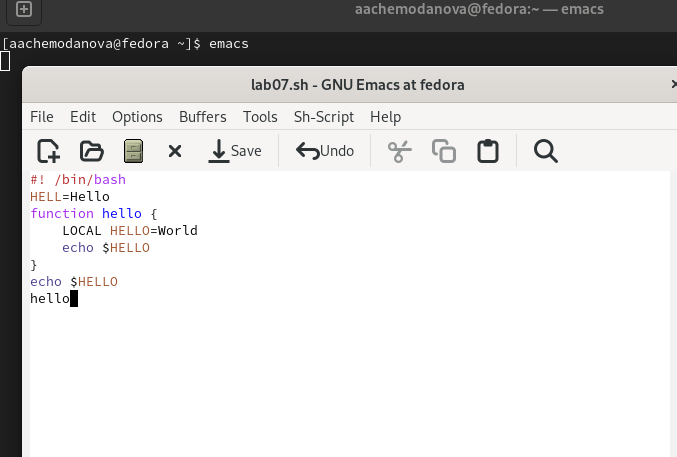{#fig:001 width=40%}

## Выполнение лабораторной работы

Проделаем с текстом стандартные процедуры редактирования. Вырежем одной командой целую строку (С-k).

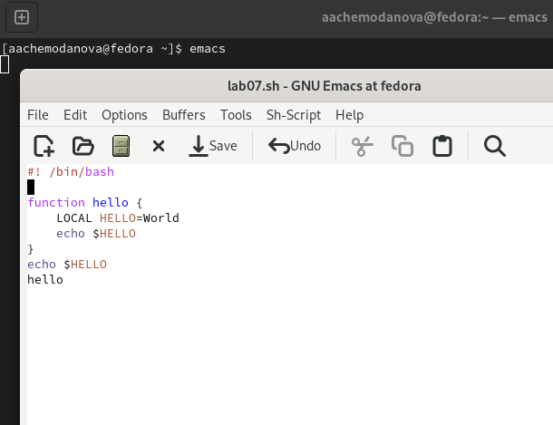{#fig:002 width=40%}

## Выполнение лабораторной работы

Вставим эту строку в конец файла (C-y). 

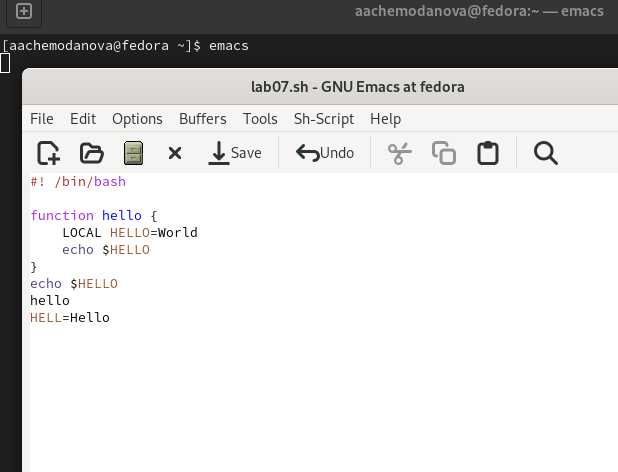{#fig:003 width=40%}

## Выполнение лабораторной работы

Выделим область текста (C-space). 

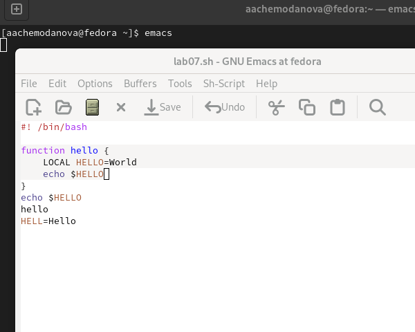{#fig:004 width=40%}

## Выполнение лабораторной работы

Скопируем область в буфер обмена (M-w). Вставим область в конец файла. 

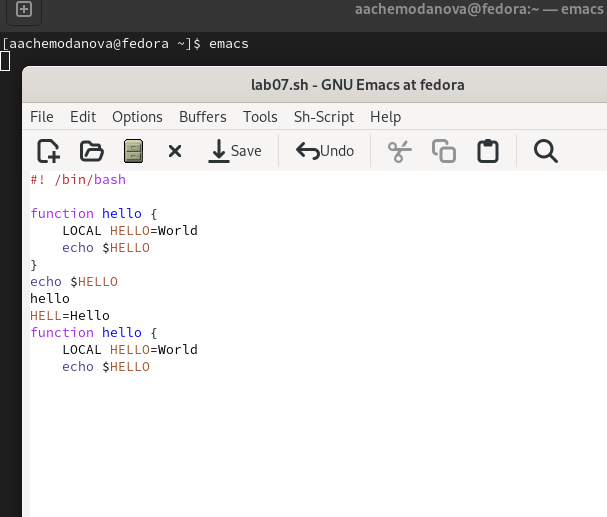{#fig:005 width=40%}

## Выполнение лабораторной работы

Вновь выделим эту область и на этот раз вырежем её (C-w).

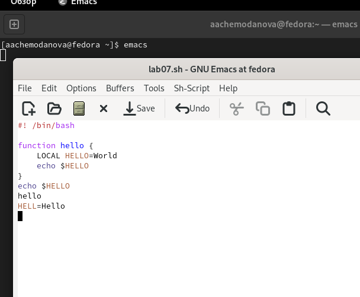{#fig:006 width=40%}

## Выполнение лабораторной работы

Отменим последнее действие (C-/). 

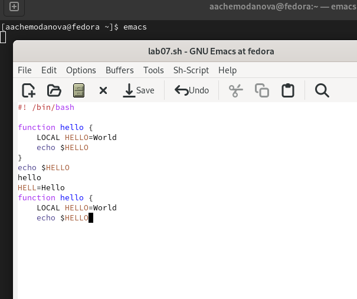{#fig:007 width=40%}

## Выполнение лабораторной работы

Научимся использовать команды по перемещению курсора.  Переместите курсор в начало строки (C-a). 

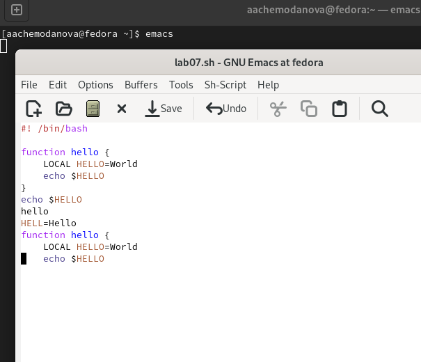{#fig:008 width=40%}

## Выполнение лабораторной работы

Переместим курсор в конец строки (C-e).

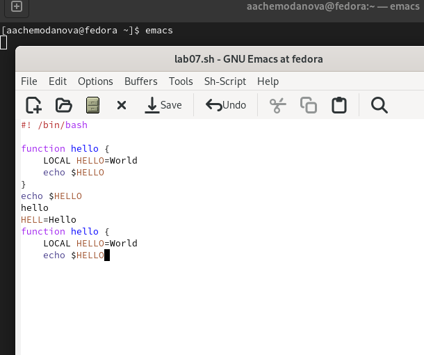{#fig:009 width=40%}

## Выполнение лабораторной работы

Переместим курсор в начало буфера (M-<). 

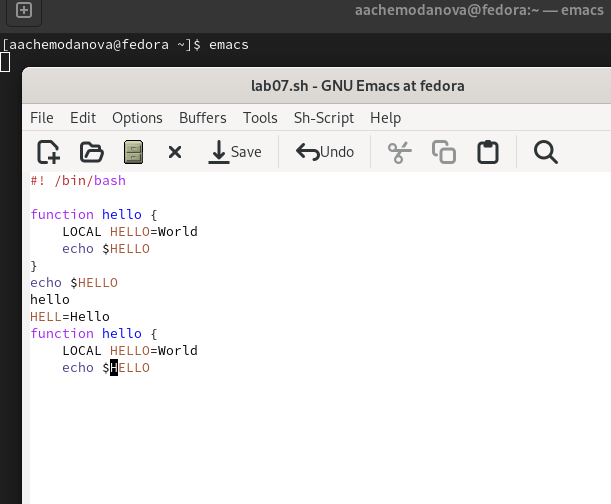{#fig:010 width=40%}

## Выполнение лабораторной работы

Переместим курсор в конец буфера (M->). 

{#fig:011 width=30%}

## Выполнение лабораторной работы

Выведем список активных буферов на экран (C-x C-b).  

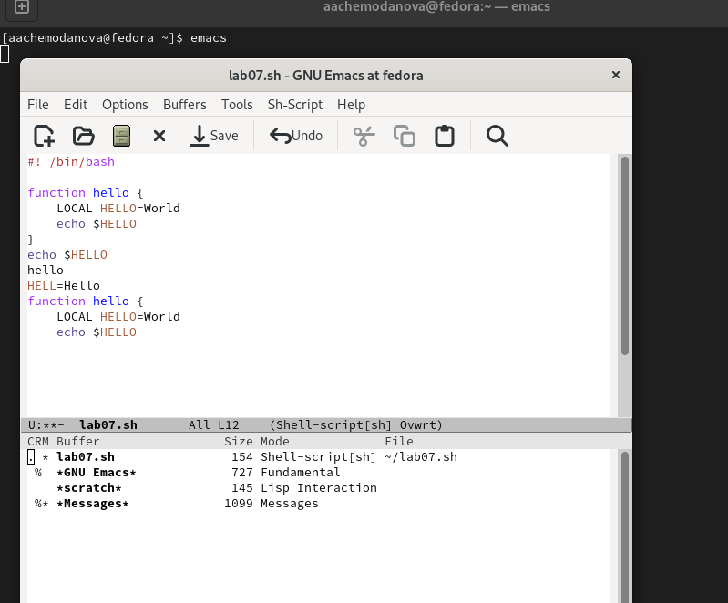{#fig:012 width=30%}

## Выполнение лабораторной работы

Переместимся во вновь открытое окно (C-x) o со списком открытых буферов и переключимся на другой буфер. 

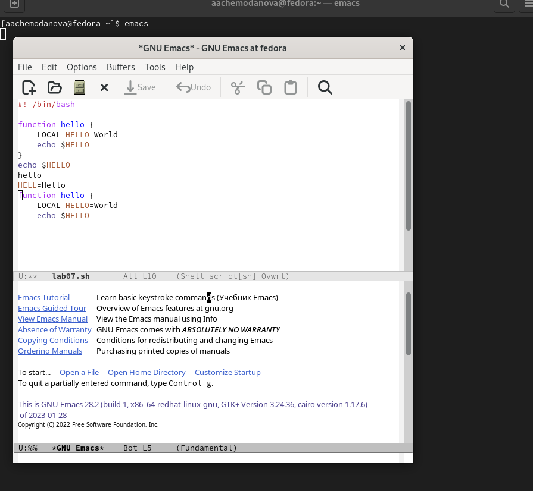{#fig:013 width=30%}

## Выполнение лабораторной работы

Закроем это окно (C-x 0). Теперь вновь переключимся между буферами, но уже без вывода их списка на экран (C-x b). 

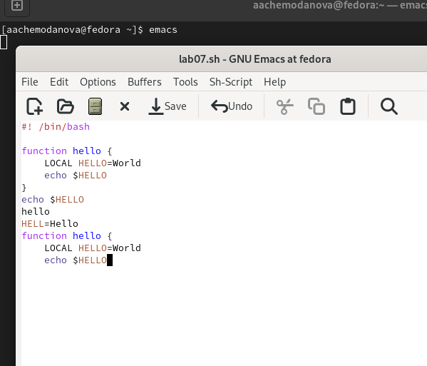{#fig:014 width=30%}

## Выполнение лабораторной работы

Поделим фрейм на 4 части: разделим фрейм на два окна по вертикали (C-x 3), а затем каждое из этих окон на две части по горизонтали (C-x 2). В каждом из четырёх созданных окон откроем новый буфер (файл) и введем несколько строк текста.

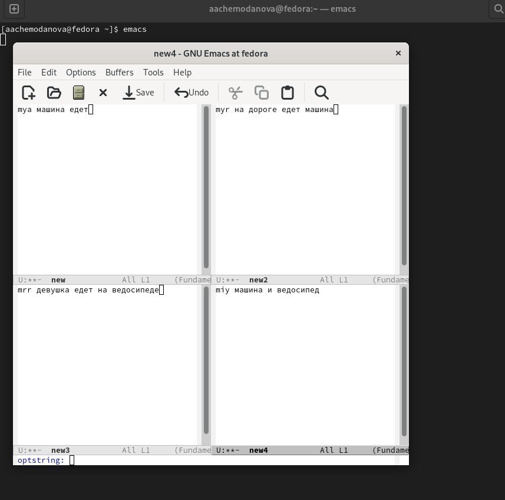{#fig:015 width=30%}

## Выполнение лабораторной работы

Переключимся в режим поиска (C-s) и найдем несколько слов, присутствующих в тексте.  Переключимся между результатами поиска, нажимая C-s.  Выйдем из режима поиска, нажав C-g.

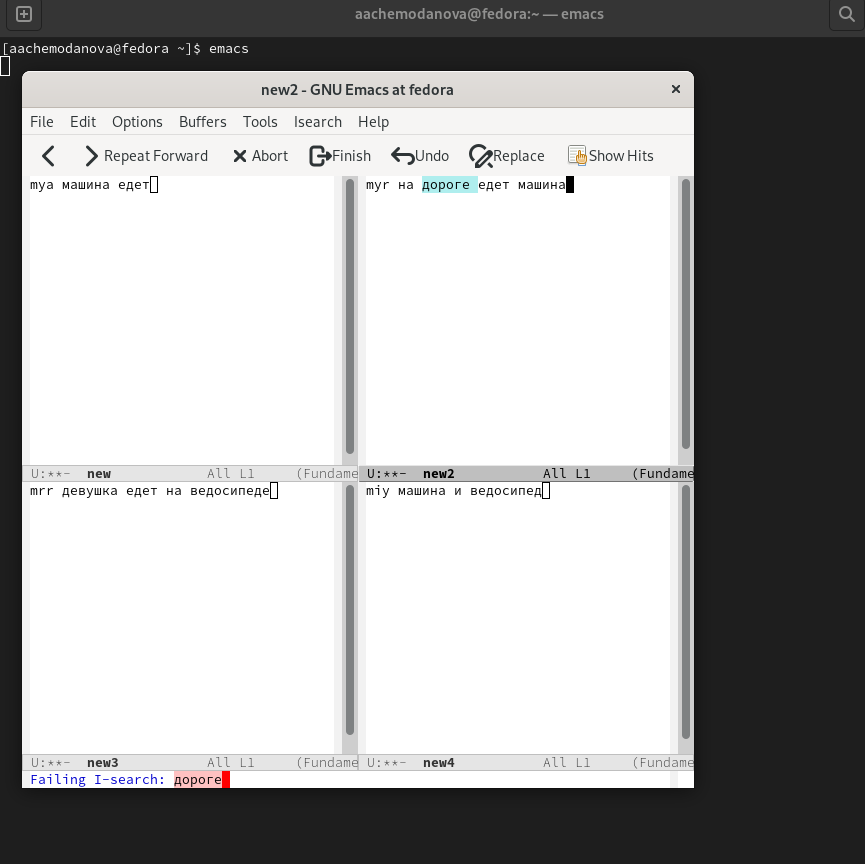{#fig:016 width=30%}

## Выполнение лабораторной работы

Перейдем в режим поиска и замены (M-%), введите текст, который следует найти и заменить, нажмите Enter , затем введем текст для замены. После того как будут подсвечены результаты поиска, нажмите ! для подтверждения замены.

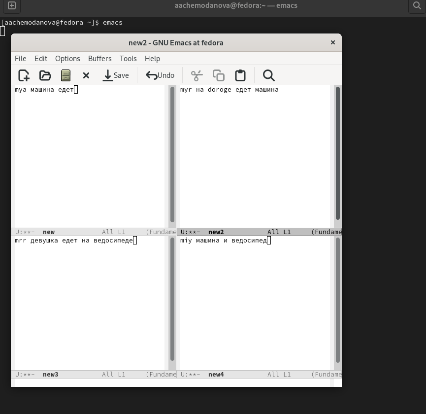{#fig:017 width=30%}

## Выполнение лабораторной работы

Испробуем другой режим поиска, нажав M-s o. Он выводит более подробную информацию, в соседнем буфере он пишет строчку и буфер расположения. 

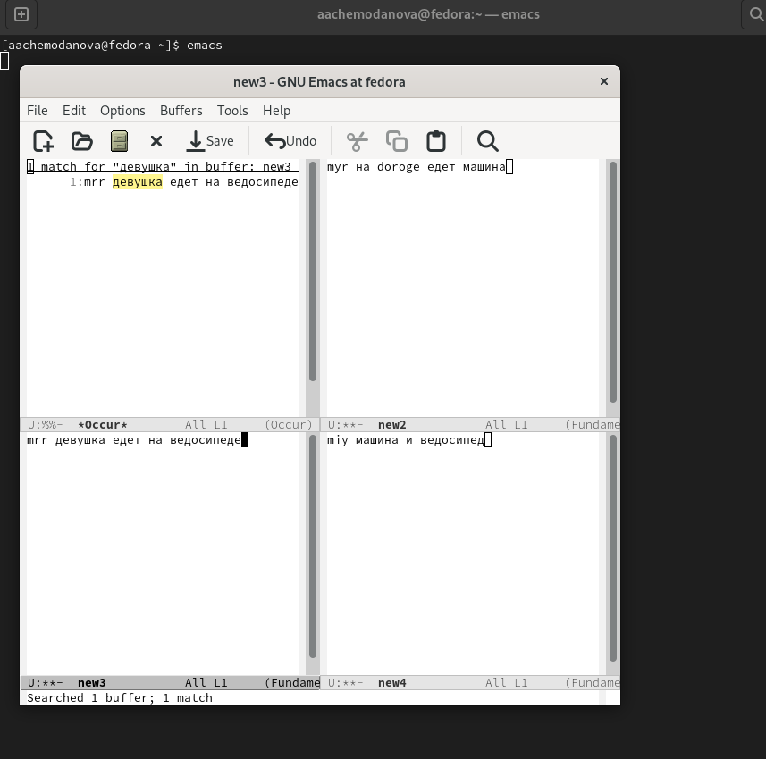{#fig:018 width=30%}

## Выводы

Мы познакомились с операционной системой Linux. Получили практические навыки работы с редактором Emacs.
