---
## Front matter
title: "Лабораторная работа №9"
subtitle: "Текстовой редактор emacs"
author: "Чемоданова Ангелина Александровна"

## Generic otions
lang: ru-RU
toc-title: "Содержание"

## Bibliography
bibliography: bib/cite.bib
csl: pandoc/csl/gost-r-7-0-5-2008-numeric.csl

## Pdf output format
toc: true # Table of contents
toc-depth: 2
lof: true # List of figures
lot: false # List of tables
fontsize: 12pt
linestretch: 1.5
papersize: a4
documentclass: scrreprt
## I18n polyglossia
polyglossia-lang:
  name: russian
  options:
	- spelling=modern
	- babelshorthands=true
polyglossia-otherlangs:
  name: english
## I18n babel
babel-lang: russian
babel-otherlangs: english
## Fonts
mainfont: PT Serif
romanfont: PT Serif
sansfont: PT Sans
monofont: PT Mono
mainfontoptions: Ligatures=TeX
romanfontoptions: Ligatures=TeX
sansfontoptions: Ligatures=TeX,Scale=MatchLowercase
monofontoptions: Scale=MatchLowercase,Scale=0.9
## Biblatex
biblatex: true
biblio-style: "gost-numeric"
biblatexoptions:
  - parentracker=true
  - backend=biber
  - hyperref=auto
  - language=auto
  - autolang=other*
  - citestyle=gost-numeric
## Pandoc-crossref LaTeX customization
figureTitle: "Рис."
tableTitle: "Таблица"
listingTitle: "Листинг"
lofTitle: "Список иллюстраций"
lotTitle: "Список таблиц"
lolTitle: "Листинги"
## Misc options
indent: true
header-includes:
  - \usepackage{indentfirst}
  - \usepackage{float} # keep figures where there are in the text
  - \floatplacement{figure}{H} # keep figures where there are in the text
---

# Цель работы

Познакомиться с операционной системой Linux. Получить практические навыки работы с редактором Emacs.

# Задание

1. Открыть emacs.
2. Создать файл lab07.sh с помощью комбинации Ctrl-x Ctrl-f (C-x C-f).
3. Набрать текст.
4. Сохранить файл с помощью комбинации Ctrl-x Ctrl-s (C-x C-s).
5. Проделать с текстом стандартные процедуры редактирования, каждое действие должно осуществляться комбинацией клавиш.
5.1. Вырезать одной командой целую строку (С-k).
5.2. Вставить эту строку в конец файла (C-y).
5.3. Выделить область текста (C-space).
5.4. Скопировать область в буфер обмена (M-w).
5.5. Вставить область в конец файла.
5.6. Вновь выделить эту область и на этот раз вырезать её (C-w).
5.7. Отмените последнее действие (C-/).
6. Научитесь использовать команды по перемещению курсора.
6.1. Переместите курсор в начало строки (C-a).
6.2. Переместите курсор в конец строки (C-e).
6.3. Переместите курсор в начало буфера (M-<).
6.4. Переместите курсор в конец буфера (M->).
7. Управление буферами.
7.1. Вывести список активных буферов на экран (C-x C-b).
7.2. Переместитесь во вновь открытое окно (C-x) o со списком открытых буферов и переключитесь на другой буфер.
7.3. Закройте это окно (C-x 0).
7.4. Теперь вновь переключайтесь между буферами, но уже без вывода их списка на экран (C-x b).
8. Управление окнами.
8.1. Поделите фрейм на 4 части: разделите фрейм на два окна по вертикали (C-x 3), а затем каждое из этих окон на две части по горизонтали (C-x 2) 
8.2. В каждом из четырёх созданных окон откройте новый буфер (файл) и введите несколько строк текста.
9. Режим поиска
9.1. Переключитесь в режим поиска (C-s) и найдите несколько слов, присутствующих в тексте.
9.2. Переключайтесь между результатами поиска, нажимая C-s.
9.3. Выйдите из режима поиска, нажав C-g.
9.4. Перейдите в режим поиска и замены (M-%), введите текст, который следует найти и заменить, нажмите Enter , затем введите текст для замены. После того как будут подсвечены результаты поиска, нажмите ! для подтверждения замены.
9.5. Испробуйте другой режим поиска, нажав M-s o. Объясните, чем он отличается от обычного режима?

# Теоретическое введение

Emacs представляет собой мощный экранный редактор текста, написанный на языке высокого уровня Elisp.
Для запуска Emacs необходимо в командной строке набрать emacs (или emacs & для работы в фоновом режиме относительно консоли).

# Выполнение лабораторной работы

Откроем emacs. Создадим файл lab07.sh с помощью комбинации Ctrl-x Ctrl-f (C-x C-f). Наберем текст. Сохраним файл с помощью комбинации Ctrl-x Ctrl-s (C-x C-s).  (рис. @fig:001).

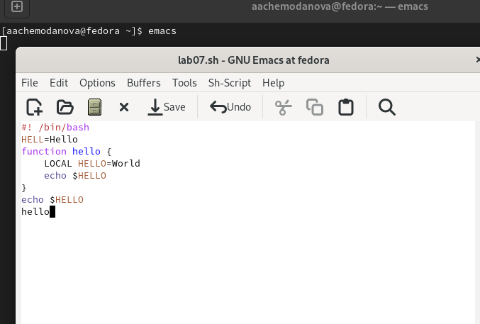{#fig:001 width=70%}

Проделаем с текстом стандартные процедуры редактирования. Вырежем одной командой целую строку (С-k). (рис. @fig:002).

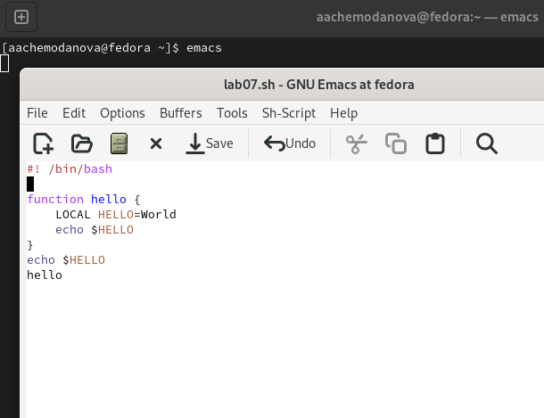{#fig:002 width=70%}

Вставим эту строку в конец файла (C-y). (рис. @fig:003).

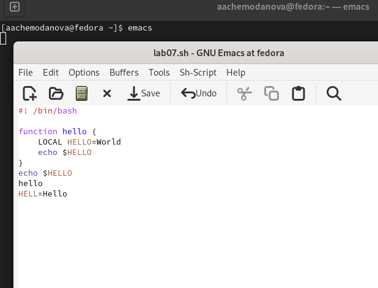{#fig:003 width=70%}

Выделим область текста (C-space).  (рис. @fig:004).

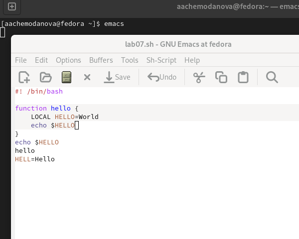{#fig:004 width=70%}

Скопируем область в буфер обмена (M-w). Вставим область в конец файла. (рис. @fig:005).

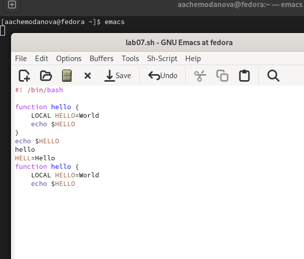{#fig:005 width=70%}

Вновь выделим эту область и на этот раз вырежем её (C-w). (рис. @fig:006).

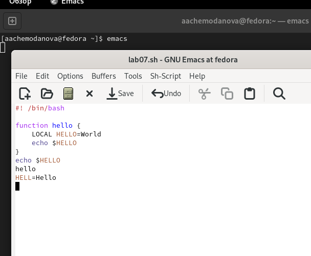{#fig:006 width=70%}

Отменим последнее действие (C-/).  (рис. @fig:007).

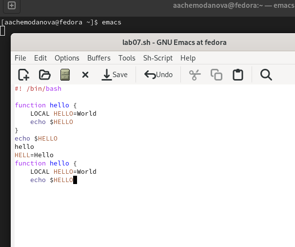{#fig:007 width=70%}

Научимся использовать команды по перемещению курсора.  Переместите курсор в начало строки (C-a). (рис. @fig:008).

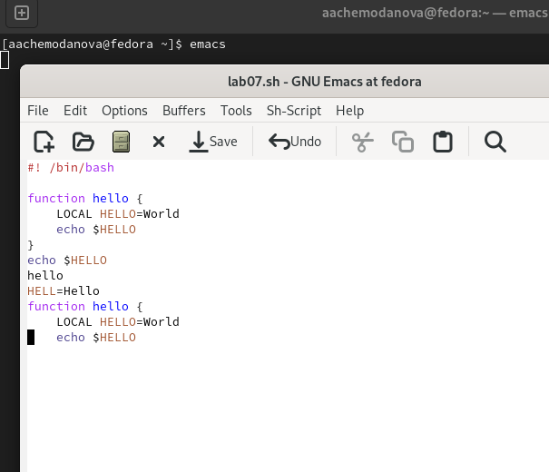{#fig:008 width=70%}

Переместим курсор в конец строки (C-e). (рис. @fig:009).

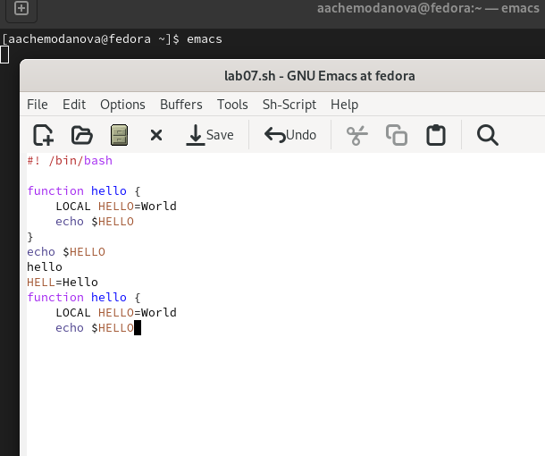{#fig:009 width=70%}

Переместим курсор в начало буфера (M-<). (рис. @fig:010).

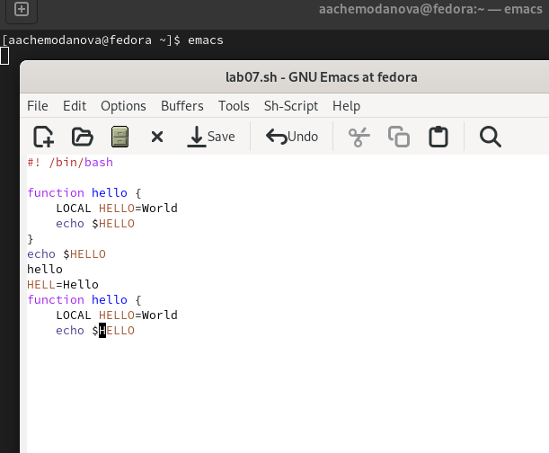{#fig:010 width=70%}

Переместим курсор в конец буфера (M->). (рис. @fig:011).

{#fig:011 width=70%}

Выведем список активных буферов на экран (C-x C-b).  (рис. @fig:012).

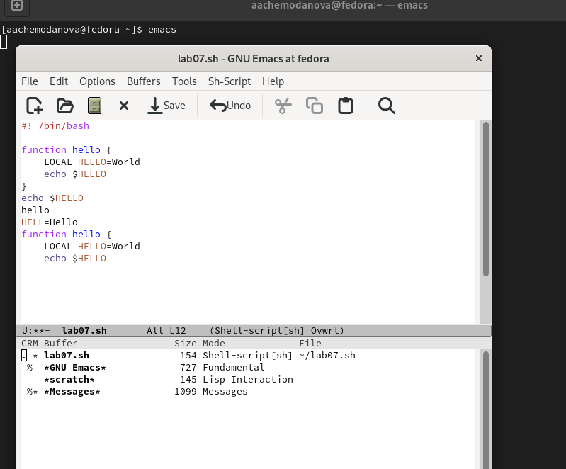{#fig:012 width=70%}

Переместимся во вновь открытое окно (C-x) o со списком открытых буферов и переключимся на другой буфер.(рис. @fig:013).

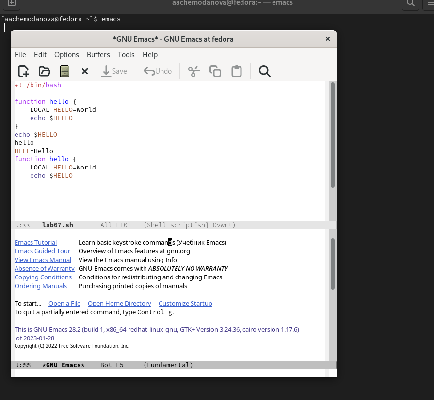{#fig:013 width=70%}

Закроем это окно (C-x 0). Теперь вновь переключимся между буферами, но уже без вывода их списка на экран (C-x b). (рис. @fig:014).

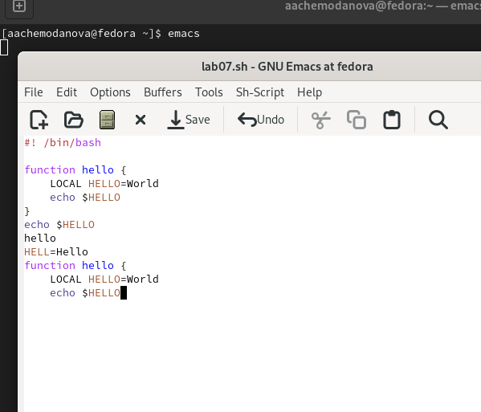{#fig:014 width=70%}

Поделим фрейм на 4 части: разделим фрейм на два окна по вертикали (C-x 3), а затем каждое из этих окон на две части по горизонтали (C-x 2). В каждом из четырёх созданных окон откроем новый буфер (файл) и введем несколько строк текста.(рис. @fig:015).

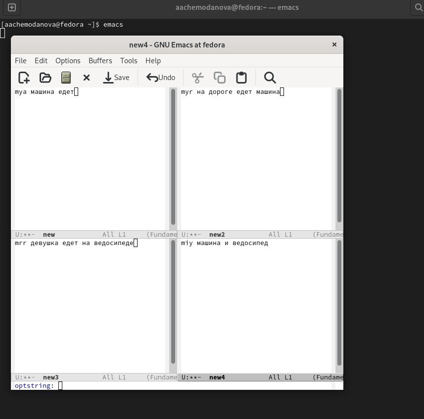{#fig:015 width=70%}

Переключимся в режим поиска (C-s) и найдем несколько слов, присутствующих в тексте.  Переключимся между результатами поиска, нажимая C-s.  Выйдем из режима поиска, нажав C-g.(рис. @fig:016).

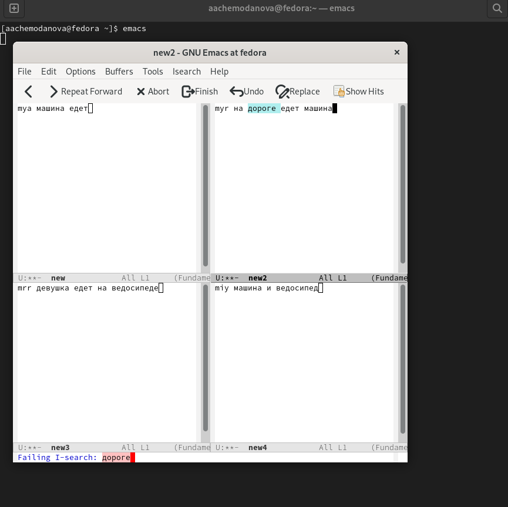{#fig:016 width=70%}

Перейдем в режим поиска и замены (M-%), введите текст, который следует найти и заменить, нажмите Enter , затем введем текст для замены. После того как будут подсвечены результаты поиска, нажмите ! для подтверждения замены.(рис. @fig:017).

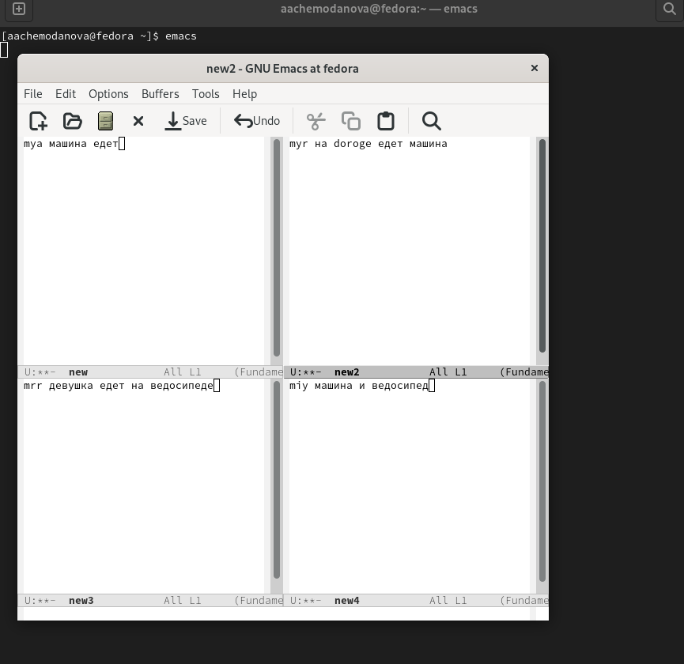{#fig:017 width=70%}

Испробуем другой режим поиска, нажав M-s o. Он выводит более подробную информацию, в соседнем буфере он пишет строчку и буфер расположения. (рис. @fig:018).

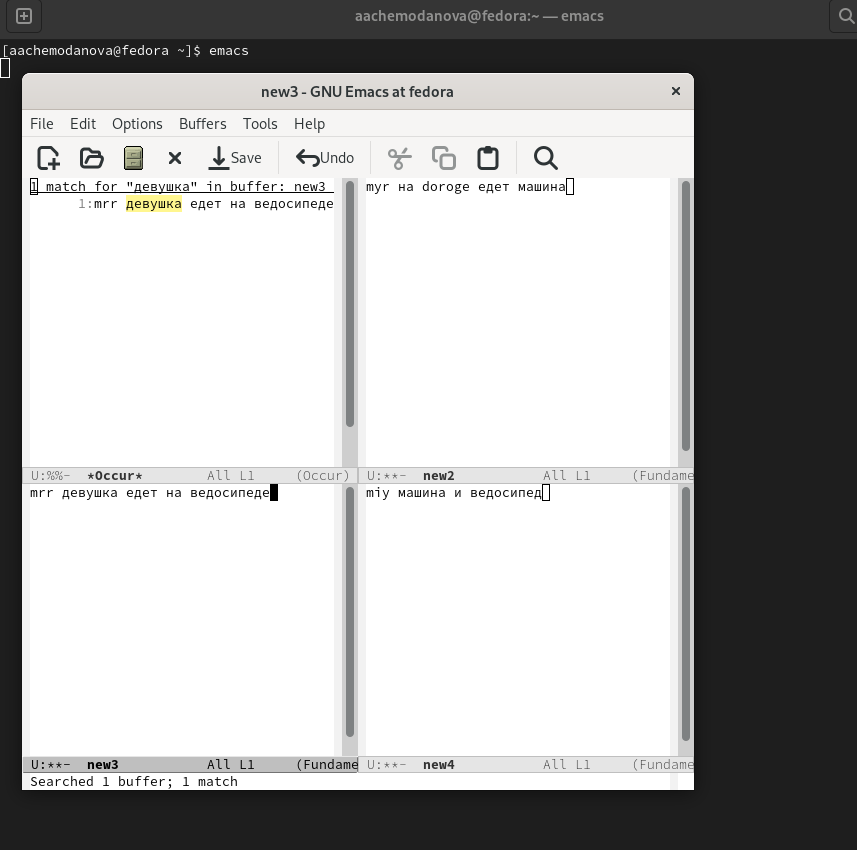{#fig:018 width=70%}

# Выводы

Мы познакомиться с операционной системой Linux. Получили практические навыки работы с редактором Emacs.

# Контрольные вопросы

1. Кратко охарактеризуйте редактор emacs.

Emacs представляет собой мощный экранный редактор текста, написанный на языке высокого уровня Elisp.

2. Какие особенности данного редактора могут сделать его сложным для освоения новичком?

Для работы с emacs требуется знать много о его функциях и о том, какими комбинациями клавиш они могут быть вызваны. Этих функций, как и комбинаций соответсвенно, достаточно много. Также сложность могут вызвать несовместимость кнопок вашего ПК и кнопок, заложенных в функциях редактора.

3. Своими словами опишите, что такое буфер и окно в терминологии emacs’а.

Буфер - это область, где пользователь набирает текст или как-то с ней работает, а окно - это область фрейма, в которой отображается этот буфер, либо же объединение буферов.

4. Можно ли открыть больше 10 буферов в одном окне?

Да, можно.

5. Какие буферы создаются по умолчанию при запуске emacs?

'* GNU Emacs *, * Message , scratch *'

6. Какие клавиши вы нажмёте, чтобы ввести следующую комбинацию C-c | и C-c C-|?

Ctrl+c Shift+\ и Ctrl+c Ctrl + Shift+\

7. Как поделить текущее окно на две части?

По вертикали - Ctrl+x 3, по горизонтали - Ctrl+x 2

8. В каком файле хранятся настройки редактора emacs?

Файл Emacs

9. Какую функцию выполняет клавиша и можно ли её переназначить?

Клавиша Backspace выполняет функцию клавиш Ctrl+k и ее можно переназначить.

10. Какой редактор вам показался удобнее в работе vi или emacs? Поясните почему. 

Несмотря на то, что vi проще в использовании, мне больше понравился Emacs благодаря богатому интерфейсу и множеству разнообразных функций. Текст в нем редактируеся лучше и интерeсней.
