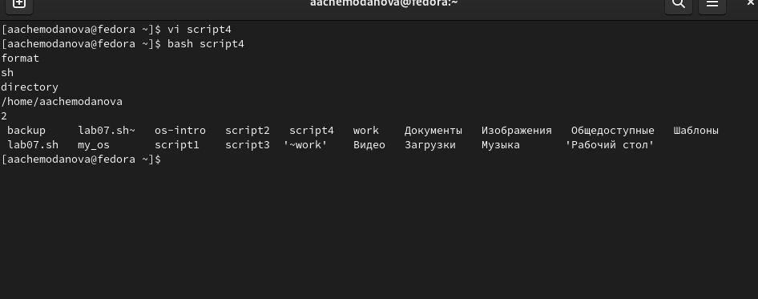

---
## Front matter
lang: ru-RU
title:  "Лабораторная работа №10"
subtitle: "Программирование в командном процессоре ОС UNIX. Командные файлы"
author:
  - Чемоданова А.А.

## Formatting pdf
toc: false
toc-title: Содержание
slide_level: 2
aspectratio: 169
section-titles: true
theme: metropolis
header-includes:
 - \metroset{progressbar=frametitle,sectionpage=progressbar,numbering=fraction}
 - '\makeatletter'
 - '\beamer@ignorenonframefalse'
 - '\makeatother'
---

## Цель работы

Изучить основы программирования в оболочке ОС UNIX/Linux. Научиться писать небольшие командные файлы.

## Задание

1. Написать скрипт, который при запуске будет делать резервную копию самого себя (то есть файла, в котором содержится его исходный код) в другую директорию backup в вашем домашнем каталоге. При этом файл должен архивироваться одним из архиваторов на выбор zip, bzip2 или tar. Способ использования команд архивации необходимо узнать, изучив справку.
2. Написать пример командного файла, обрабатывающего любое произвольное число аргументов командной строки, в том числе превышающее десять. Например, скрипт может последовательно распечатывать значения всех переданных аргументов.

## Задание

3. Написать командный файл — аналог команды ls (без использования самой этой команды и команды dir). Требуется, чтобы он выдавал информацию о нужном каталоге и выводил информацию о возможностях доступа к файлам этого каталога.
4. Написать командный файл, который получает в качестве аргумента командной строки формат файла (.txt, .doc, .jpg, .pdf и т.д.) и вычисляет количество таких файлов в указанной директории. Путь к директории также передаётся в виде аргумента командной строки.

## Выполнение лабораторной работы

Справка по zip, создание каталога

{#fig:001 width=70%}

## Выполнение лабораторной работы

Первый скрипт

{#fig:002 width=70%}

## Выполнение лабораторной работы

Работа первого скрипта

{#fig:003 width=30%}

## Выполнение лабораторной работы

Сам скрипт.

{#fig:004 width=30%}

## Выполнение лабораторной работы

Работа второго скрипта 

{#fig:005 width=30%}

## Выполнение лабораторной работы

Третий скрипт. 

{#fig:006 width=30%}

## Выполнение лабораторной работы

Работа третьего скрипта 

{#fig:007 width=30%}

## Выполнение лабораторной работы

Четвертый скрипт.

{#fig:008 width=30%}

## Выполнение лабораторной работы

Работа четвертого скрипта 

{#fig:009 width=30%}

## Выводы

Мы изучили основы программирования в оболочке ОС UNIX/Linux. Научились писать небольшие командные файлы.
