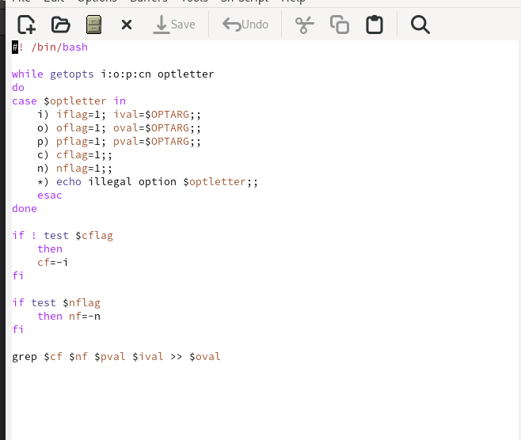
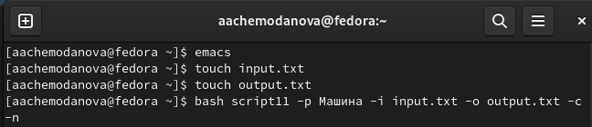
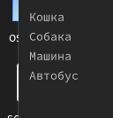
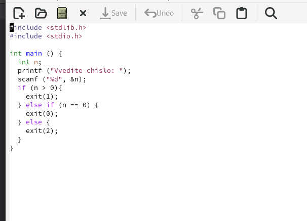
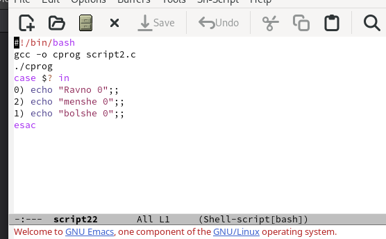
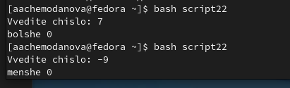
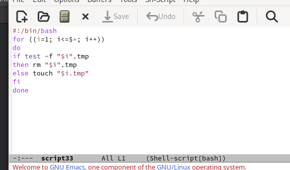
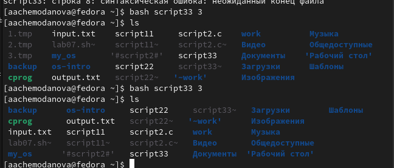
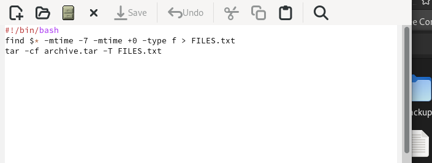
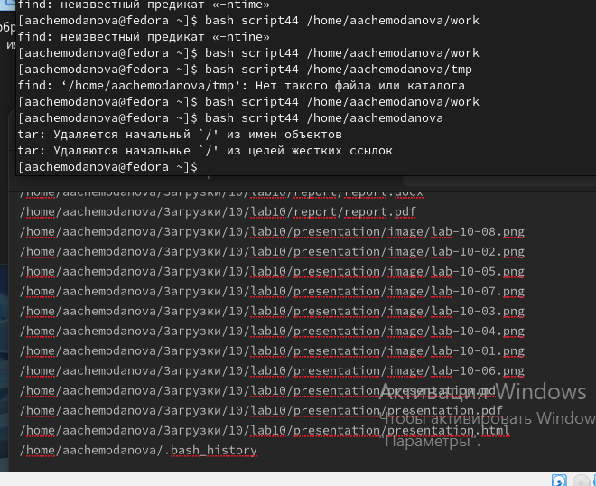

---
## Front matter
lang: ru-RU
title:  "Лабораторная работа №11"
subtitle: "Программирование в командном процессоре ОС UNIX. Ветвления и циклы"
author:
  - Чемоданова А.А.
  
## Formatting pdf
toc: false
toc-title: Содержание
slide_level: 2
aspectratio: 169
section-titles: true
theme: metropolis
header-includes:
 - \metroset{progressbar=frametitle,sectionpage=progressbar,numbering=fraction}
 - '\makeatletter'
 - '\beamer@ignorenonframefalse'
 - '\makeatother'
---

## Цель работы

Изучить основы программирования в оболочке ОС UNIX. Научится писать более сложные командные файлы с использованием логических управляющих конструкций и циклов.

## Задание

1. Используя команды getopts grep, написать командный файл, который анализирует командную строку с ключами:
– -iinputfile — прочитать данные из указанного файла;
– -ooutputfile — вывести данные в указанный файл;
– -pшаблон — указать шаблон для поиска;
– -C — различать большие и малые буквы;
– -n — выдавать номера строк.
а затем ищет в указанном файле нужные строки, определяемые ключом -p.

## Задание
2. Написать на языке Си программу, которая вводит число и определяет, является ли оно больше нуля, меньше нуля или равно нулю. Затем программа завершается с помощью функции exit(n), передавая информацию в о коде завершения в оболочку. Командный файл должен вызывать эту программу и, проанализировав с помощью команды $?, выдать сообщение о том, какое число было введено.
3. Написать командный файл, создающий указанное число файлов, пронумерованных последовательно от 1 до N (например 1.tmp, 2.tmp, 3.tmp,4.tmp и т.д.). Число файлов, которые необходимо создать, передаётся в аргументы командной строки. Этот же командный файл должен уметь удалять все созданные им файлы (если они существуют).
4. Написать командный файл, который с помощью команды tar запаковывает в архив все файлы в указанной директории. Модифицировать его так, чтобы запаковывались только те файлы, которые были изменены менее недели тому назад (использовать команду find).

## Выполнение лабораторной работы

Скрипт 1

{#fig:001 width=50%}

## Выполнение лабораторной работы

Выполнение скрипта 1

{#fig:002 width=70%}

## Выполнение лабораторной работы

Вводимый файл.

{#fig:003 width=50%}

## Выполнение лабораторной работы

Выводимый файл. 

{#fig:004 width=70%}

## Выполнение лабораторной работы

Скрипт 2 си.

{#fig:005 width=50%}

## Выполнение лабораторной работы

Скрипт 2 

{#fig:006 width=70%}

## Выполнение лабораторной работы

Выполнение скрипта 2

{#fig:007 width=70%}

## Выполнение лабораторной работы

Скрипт 3 

{#fig:008 width=70%}

## Выполнение лабораторной работы

Выполнение скрипта 3

{#fig:009 width=70%}

## Выполнение лабораторной работы

Скрипт 4 

{#fig:010 width=70%}

## Выполнение лабораторной работы

Выполнение скрипта 4

{#fig:011 width=50%}

## Выводы

Мы изучили основы программирования в оболочке ОС UNIX. Научились писать более сложные командные файлы с использованием логических управляющих конструкций и циклов.

