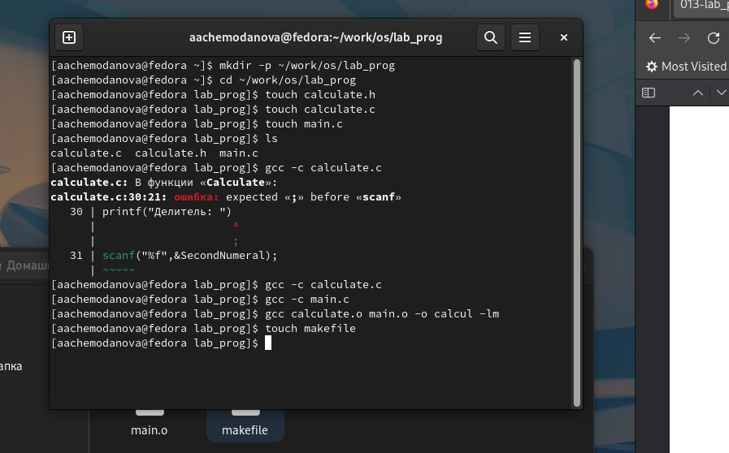
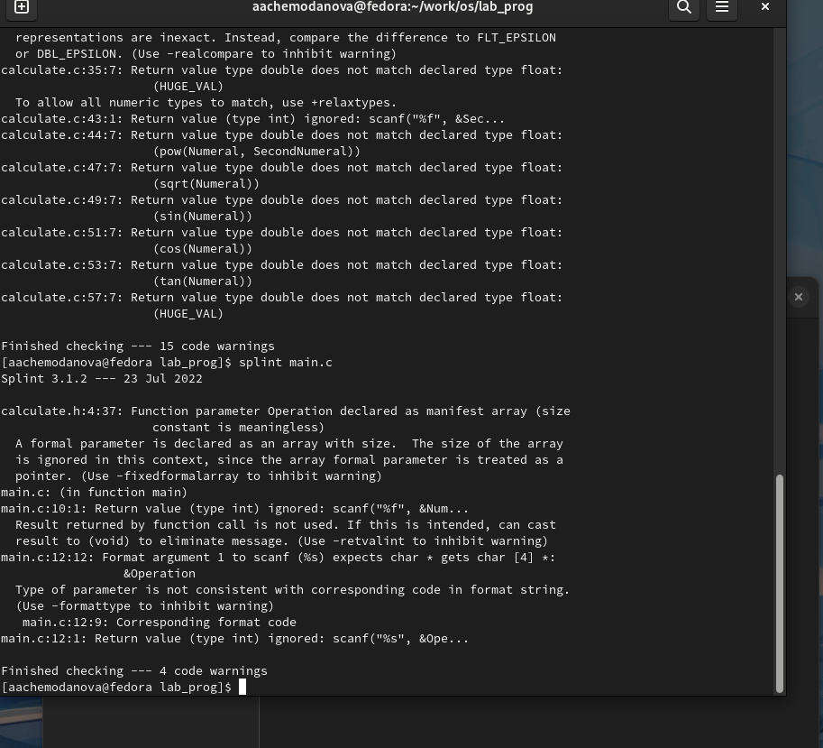

---
## Front matter
lang: ru-RU
title:  "Лабораторная работа №13"
subtitle: "Средства, применяемые при разработке программного обеспечения в ОС Типа UNIX/Linux"
author:
  - Чемоданова А.А.

## i18n babel
babel-lang: russian
babel-otherlangs: english

## Formatting pdf
toc: false
toc-title: Содержание
slide_level: 2
aspectratio: 169
section-titles: true
theme: metropolis
header-includes:
 - \metroset{progressbar=frametitle,sectionpage=progressbar,numbering=fraction}
 - '\makeatletter'
 - '\beamer@ignorenonframefalse'
 - '\makeatother'
---

## Цель работы

Приобрести простейшие навыки разработки, анализа, тестирования и отладки приложений в ОС типа UNIX/Linux на примере создания на языке программирования С калькулятора с простейшими функциями.

## Задание

1. В домашнем каталоге создайте подкаталог ~/work/os/lab_prog.
2. Создайте в нём файлы: calculate.h, calculate.c, main.c. Это будет примитивнейший калькулятор, способный складывать, вычитать, умножать и делить, возводить число в степень, брать квадратный корень, вычислять sin, cos, tan. При запуске он будет запрашивать первое число, операцию, второе число. После этого программа выведет результат и остановится.
3. Выполните компиляцию программы посредством gcc.
4. При необходимости исправьте синтаксические ошибки.
5. Создайте Makefile.

## Задание

6. С помощью gdb выполните отладку программы calcul (перед использованием gdb исправьте Makefile):
Запустите отладчик GDB, загрузив в него программу для отладки: gdb ./calcul
Для запуска программы внутри отладчика введите команду run: run
Для постраничного (по 9 строк) просмотра исходного код используйте команду list: 1 list
Для просмотра строк с 12 по 15 основного файла используйте list с параметрами: list 12,15
Для просмотра определённых строк не основного файла используйте list с параметрами: list calculate.c:20,29
Установите точку останова в файле calculate.c на строке номер 21: list calculate.c:20,27 break 21
Выведите информацию об имеющихся в проекте точка останова: info breakpoints – Запустите программу внутри отладчика и убедитесь, что программа остановится в момент прохождения точки останова.
Отладчик выдаст следующую информацию: #0 Calculate (Numeral=5, Operation=0x7fffffffd280 "-") at calculate.c:21 #1 0x0000000000400b2b in main () at main.c:17 а команда backtrace покажет весь стек вызываемых функций от начала программы до текущего места.

## Задание

Посмотрите, чему равно на этом этапе значение переменной Numeral, введя: print Numeral На экран должно быть выведено число 5.
Сравните с результатом вывода на экран после использования команды: display Numeral
Уберите точки останова
7. С помощью утилиты splint попробуйте проанализировать коды файлов calculate.c и main.c.

## Выполнение лабораторной работы

{#fig:001 width=70%}

## Выполнение лабораторной работы

{#fig:002 width=50%}

## Выполнение лабораторной работы

{#fig:003 width=50%}

## Выполнение лабораторной работы

{#fig:004 width=50%}

## Выводы

Мы приобрели простейшие навыки разработки, анализа, тестирования и отладки приложений в ОС типа UNIX/Linux на примере создания на языке программирования С калькулятора с простейшими функциями.
