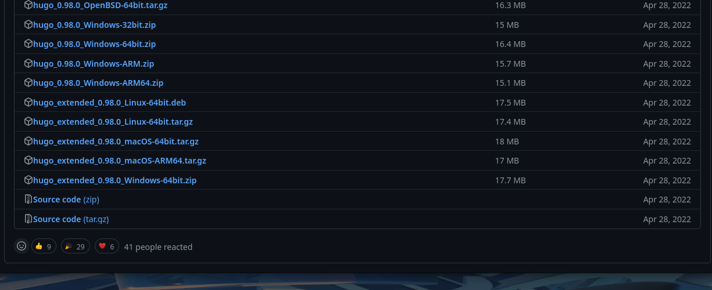
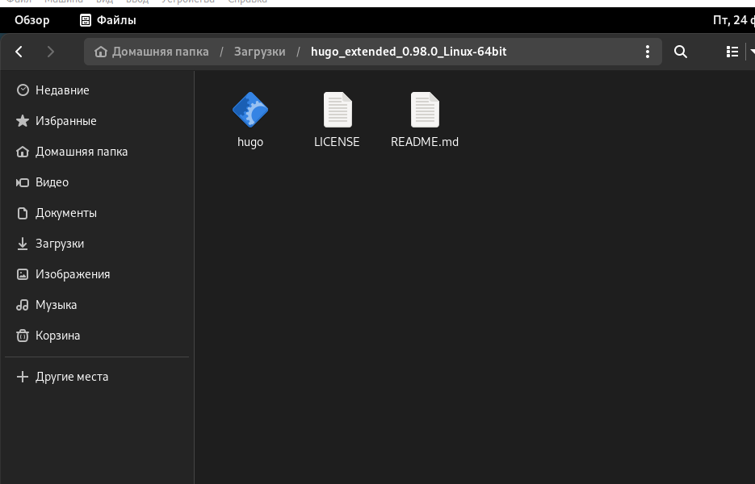
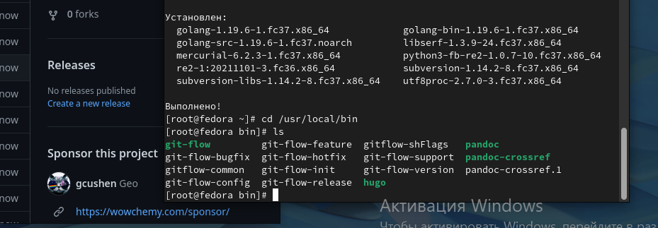
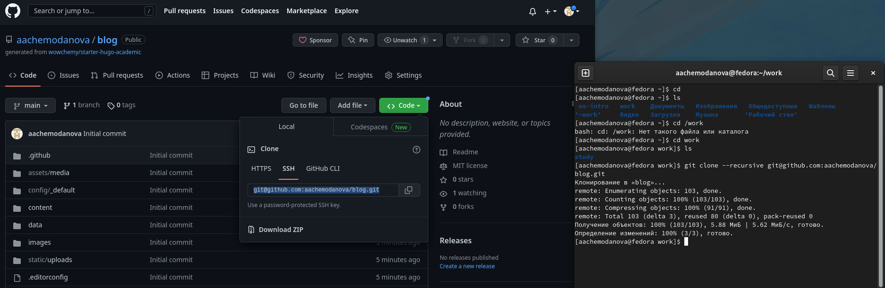
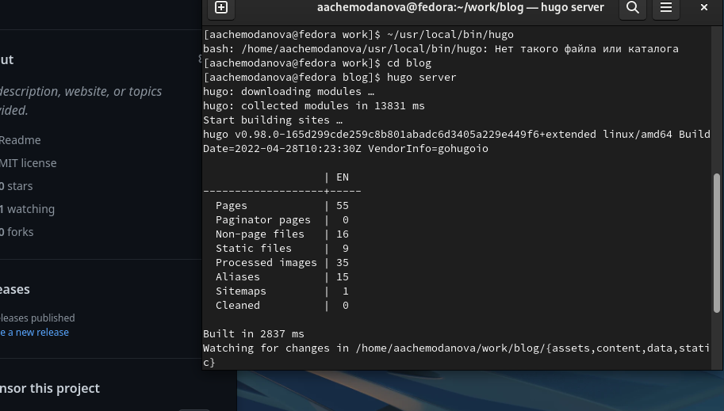
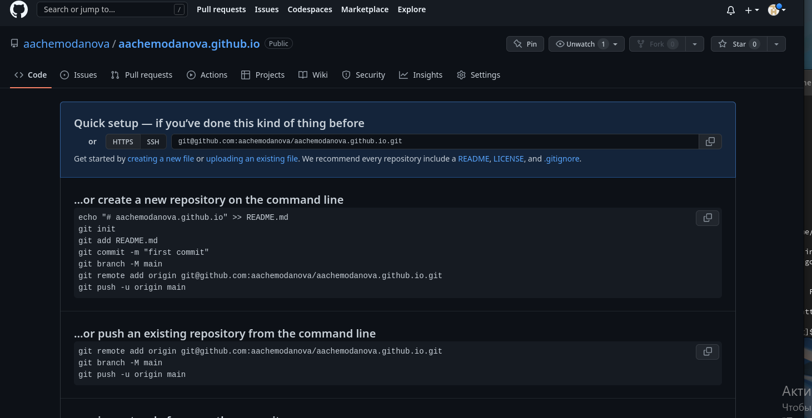
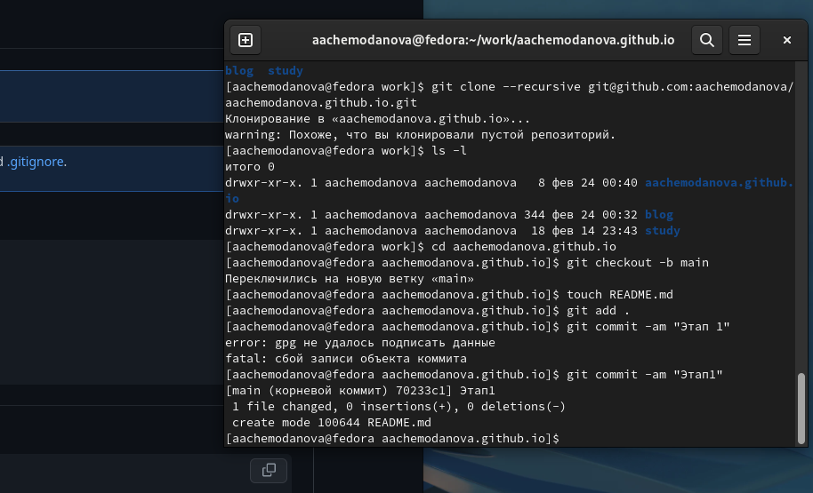
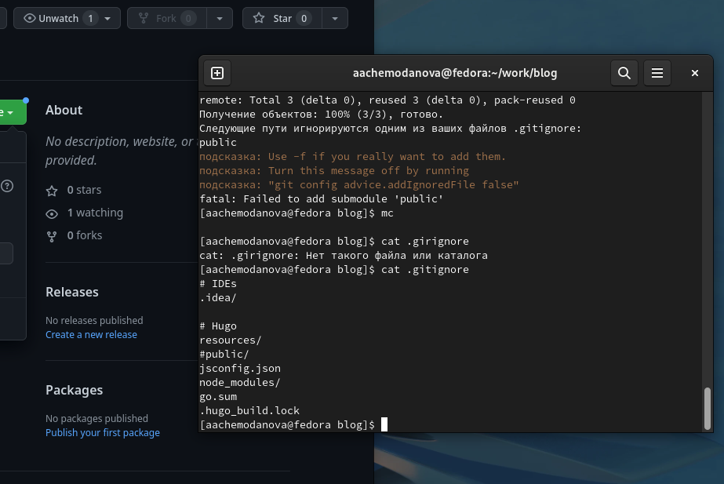
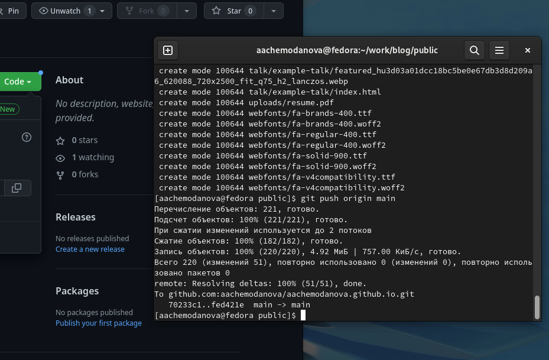

---
## Front matter
lang: ru-RU
title: "Индивидуальный проект. Первый этап"
subtitle: "Размещение на Github pages заготовки для персонального сайта"
author:
  - Чемоданова А.А.

## Formatting pdf
toc: false
toc-title: Содержание
slide_level: 2
aspectratio: 169
section-titles: true
theme: metropolis
header-includes:
 - \metroset{progressbar=frametitle,sectionpage=progressbar,numbering=fraction}
 - '\makeatletter'
 - '\beamer@ignorenonframefalse'
 - '\makeatother'
---

## Цель работы

Размещение на Github pages заготовки для персонального сайта.

## Задачи

1. Установить необходимое программное обеспечение.
2. Скачать шаблон темы сайта.
3. Разместить его на хостинге git.
4. Установить параметр для URLs сайта.
5. Разместить заготовку сайта на Github pages.

## Выполнение работы

Для начала нам необходимо скачать hugo_extended_0.98.0_Linux-64bit.tar.gz.

{#fig:001 width=60%}

## Выполнение работы

Теперь разархивируем скаченный архив.

{#fig:002 width=60%}

## Выполнение работы

Перемещение файла hugo в /usr/local/bin. 

{#fig:003 width=70%}

## Выполнение работы

Создаем новый репозиторий blog и клонируем его.

{#fig:004 width=70%}

## Выполнение работы

Выполним команду hugo server, по завершению которой мы получим ссылку на наш сайт(на данный момент он виден лишь с моего компьютера). 

{#fig:005 width=60%}

## Выполнение работы

Создадим новый репозиторий, для того чтобы наш сайт был виден всем.

{#fig:006 width=60%}

## Выполнение работы

Клонируем наш новый репозиторий. Создаем ветку main. Создаем файл README.md. Добавляем в наш репозиторий.

{#fig:007 width=60%}

## Выполнение работы

Подключим наш репозиторий к папке public, перед этим исправим ошибку.

{#fig:008 width=60%}

## Выполнение работы

Добавляем файлы в репозиторий. 

{#fig:009 width=60%}

## Вывод

Мы разместили на Github pages заготовки для персонального сайта.

