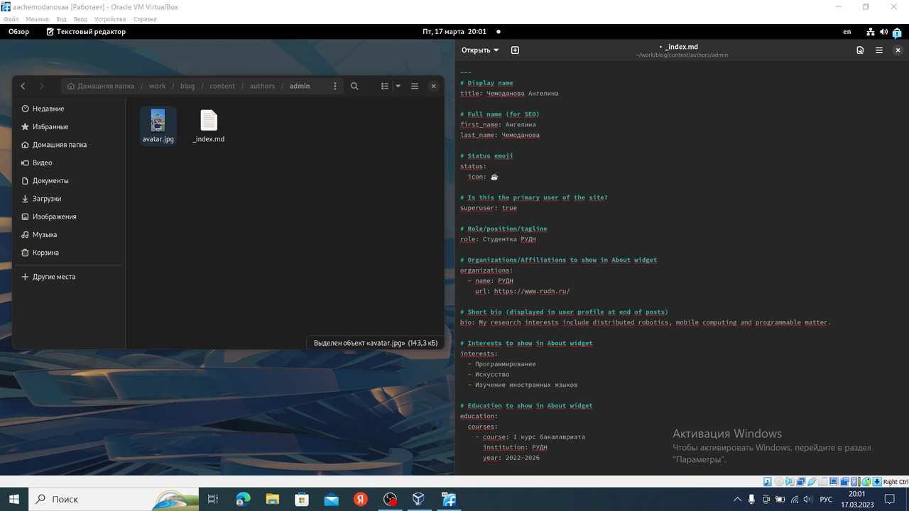
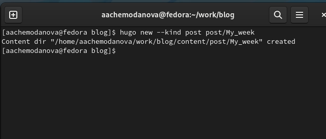
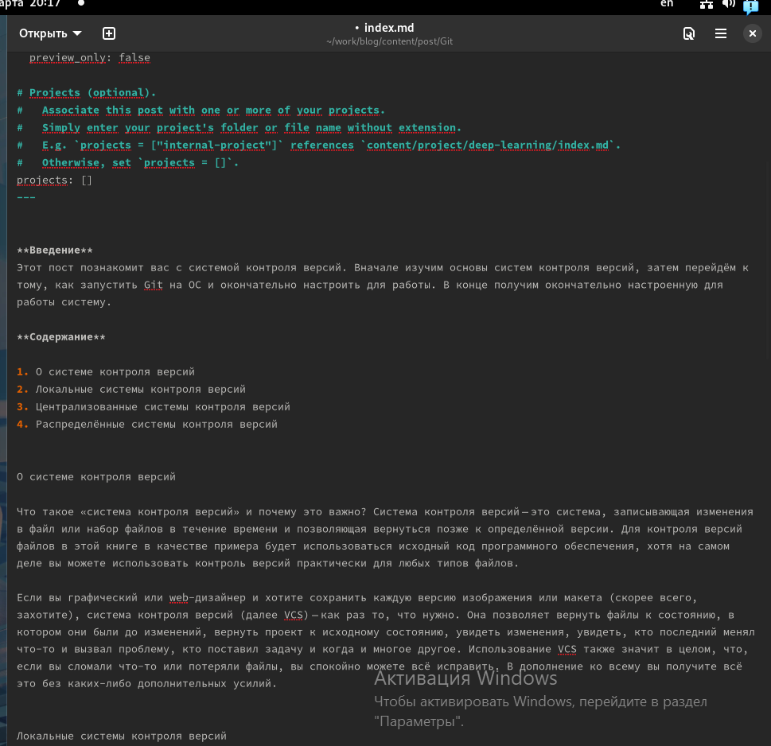
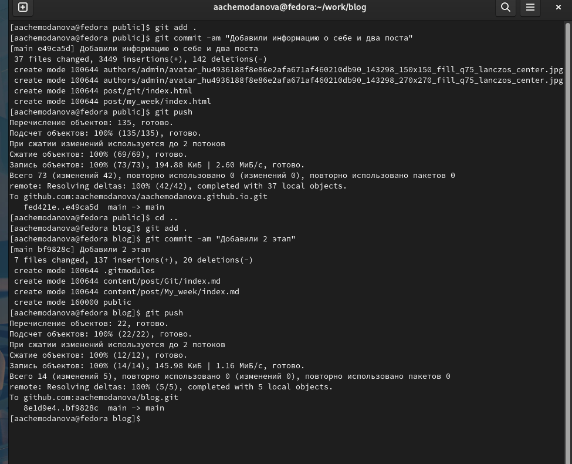
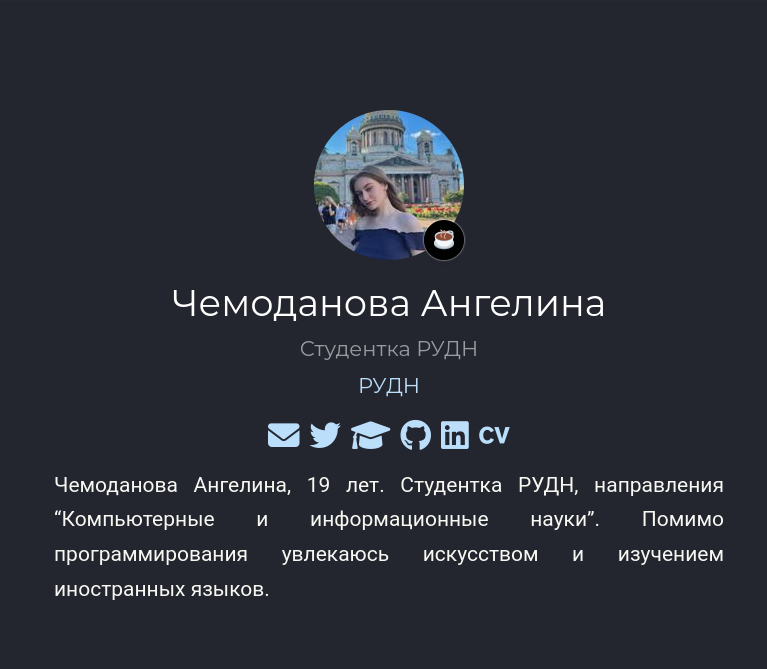

---
## Front matter
lang: ru-RU
title: "Индивидуальный проект. Второй этап"
author:
  - Чемоданова А.А.

## i18n babel
babel-lang: russian
babel-otherlangs: english

## Formatting pdf
toc: false
toc-title: Содержание
slide_level: 2
aspectratio: 169
section-titles: true
theme: metropolis
header-includes:
 - \metroset{progressbar=frametitle,sectionpage=progressbar,numbering=fraction}
 - '\makeatletter'
 - '\beamer@ignorenonframefalse'
 - '\makeatother'
---

## Цель работы

Добавить к сайту данные о себе.

## Задание

Список добавляемых данных:
- Разместить фотографию владельца сайта.

- Разместить краткое описание владельца сайта (Biography).

- Добавить информацию об интересах (Interests).

- Добавить информацию от образовании (Education).

- Сделать пост по прошедшей неделе.

- Пост "Управление версиями. Git".

## Выполнение лабораторной работы

Для начала мы загрузим свою фотографию в папку /blog/content/authors/admin и в этой же папке откроем файл и заполним информацию о себе. 

{#fig:001 width=70%}

## Выполнение лабораторной работы

Теперь при помощи hugo new --kind post post/My_week создадим папку для поста о своей недели. 

{#fig:002 width=70%}

## Выполнение лабораторной работы

Написанный пост о моей неделe. 

{#fig:003 width=50%}

## Выполнение лабораторной работы

Аналогично создадим пост о системах контроля версий.  

{#fig:004 width=40%}

## Выполнение лабораторной работы

Теперь выгрузим все.  

{#fig:005 width=50%}

## Выполнение лабораторной работы

Обновленный сайт.  

{#fig:006 width=50%}

## Вывод

Мы добавили к сайту данные о себе.
