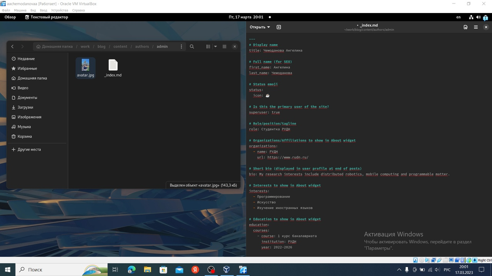

---
## Front matter
title: "Индивидуальный проект. Второй этап"
author: "Чемоданова А.А."

## Generic otions
lang: ru-RU
toc-title: "Содержание"

## Bibliography
bibliography: bib/cite.bib
csl: pandoc/csl/gost-r-7-0-5-2008-numeric.csl

## Pdf output format
toc: true # Table of contents
toc-depth: 2
lof: true # List of figures
lot: true # List of tables
fontsize: 12pt
linestretch: 1.5
papersize: a4
documentclass: scrreprt
## I18n polyglossia
polyglossia-lang:
  name: russian
  options:
	- spelling=modern
	- babelshorthands=true
polyglossia-otherlangs:
  name: english
## I18n babel
babel-lang: russian
babel-otherlangs: english
## Fonts
mainfont: PT Serif
romanfont: PT Serif
sansfont: PT Sans
monofont: PT Mono
mainfontoptions: Ligatures=TeX
romanfontoptions: Ligatures=TeX
sansfontoptions: Ligatures=TeX,Scale=MatchLowercase
monofontoptions: Scale=MatchLowercase,Scale=0.9
## Biblatex
biblatex: true
biblio-style: "gost-numeric"
biblatexoptions:
  - parentracker=true
  - backend=biber
  - hyperref=auto
  - language=auto
  - autolang=other*
  - citestyle=gost-numeric
## Pandoc-crossref LaTeX customization
figureTitle: "Рис."
tableTitle: "Таблица"
listingTitle: "Листинг"
lofTitle: "Список иллюстраций"
lotTitle: "Список таблиц"
lolTitle: "Листинги"
## Misc options
indent: true
header-includes:
  - \usepackage{indentfirst}
  - \usepackage{float} # keep figures where there are in the text
  - \floatplacement{figure}{H} # keep figures where there are in the text
---

# Цель работы

Добавить к сайту данные о себе.

# Задание

Список добавляемых данных:
- Разместить фотографию владельца сайта.
- Разместить краткое описание владельца сайта (Biography).
- Добавить информацию об интересах (Interests).
- Добавить информацию от образовании (Education).
- Сделать пост по прошедшей неделе.
- Пост "Управление версиями. Git".

# Теоретическое введение

Hugo - это генератор статичных сайтов, популярность которого быстро растет. Основанный на языке Go, Hugo создает сайт значительно быстрее, чем большинство других генераторов статических сайтов, включая Jekyll.

Мы продолжаем оформлять свой сайт.

# Выполнение лабораторной работы

Для начала мы загрузим свою фотографию в папку /blog/content/authors/admin и в этой же папке откроем файл и заполним информацию о себе. (рис. @fig:001).

{#fig:001 width=70%}

Теперь при помощи hugo new --kind post post/My_week создадим папку для поста о своей неделe. (рис. @fig:002).

{#fig:002 width=70%}

Написанный пост о моей неделe. (рис. @fig:003).

{#fig:003 width=70%}

Аналогично создадим пост о системах контроля версий.  (рис. @fig:004).

{#fig:004 width=70%}

Теперь выгрузим все.  (рис. @fig:005).

{#fig:005 width=70%}

Обновленный сайт.  (рис. @fig:006).

{#fig:006 width=70%}

# Выводы

Мы добавилт к сайту данные о себе.
