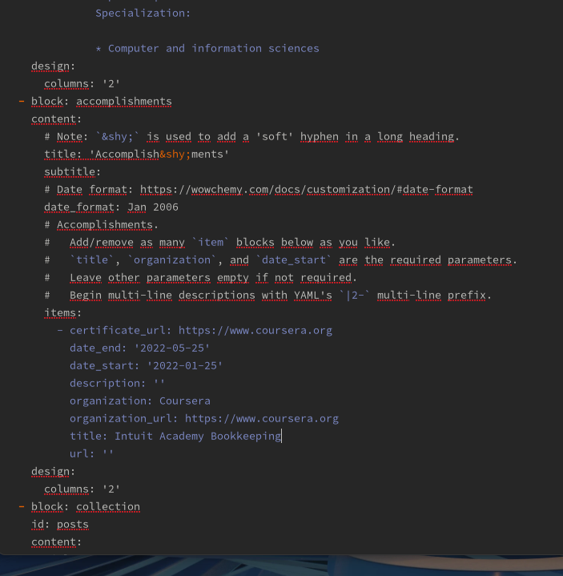

---
## Front matter
lang: ru-RU
title: "Индивидуальный проект. Третий этап"
author:
  - Чемоданова А.А.

## i18n babel
babel-lang: russian
babel-otherlangs: english

## Formatting pdf
toc: false
toc-title: Содержание
slide_level: 2
aspectratio: 169
section-titles: true
theme: metropolis
header-includes:
 - \metroset{progressbar=frametitle,sectionpage=progressbar,numbering=fraction}
 - '\makeatletter'
 - '\beamer@ignorenonframefalse'
 - '\makeatother'
---

## Цель работы

Добавить к сайту данные о себе.

## Задание

Список добавляемых данных:
Список достижений.
Добавить информацию о навыках (Skills).
Добавить информацию об опыте (Experience).
Добавить информацию о достижениях (Accomplishments).
Сделать пост по прошедшей неделе.
Добавить пост на тему: Язык разметки Markdown.

## Выполнение лабораторной работы

Для начала добавим информацию о своих навыках.

{#fig:001 width=30%}

## Выполнение лабораторной работы

Теперь изменим информацию о опыте. 

{#fig:002 width=30%}

## Выполнение лабораторной работы

И добавим информацию о достижениях.  

{#fig:003 width=30%}

## Выполнение лабораторной работы

Добавим пост на тему: Язык разметки Markdown. 

{#fig:004 width=30%}

## Выполнение лабораторной работы

Добавим пост по прошедшей неделе.  

{#fig:005 width=30%}

## Выполнение лабораторной работы

Измененный сайт. 

{#fig:006 width=30%}

## Выводы

Мы добавили к сайту данные о себе.
