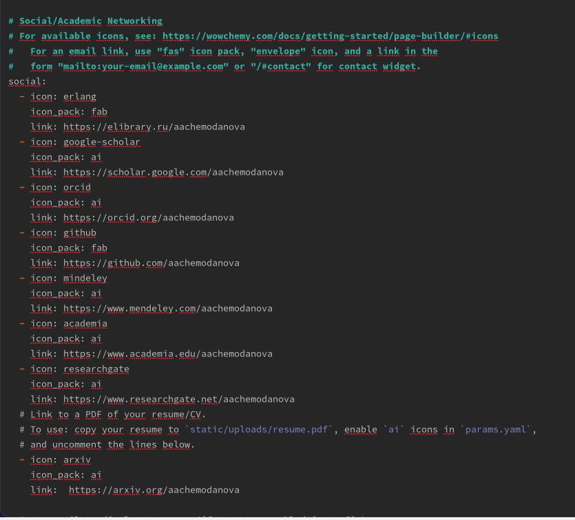
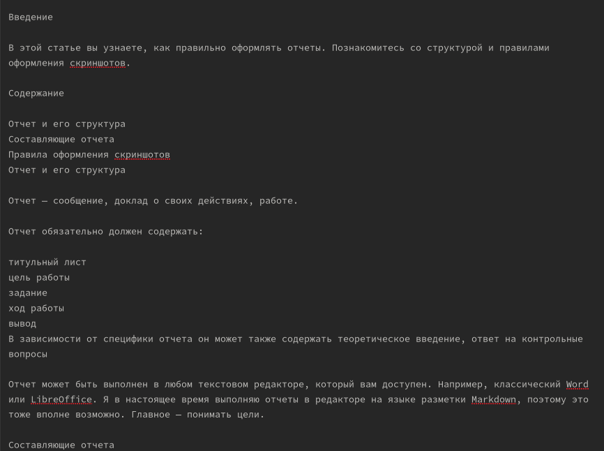
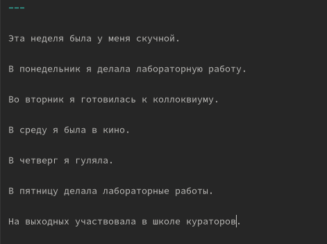
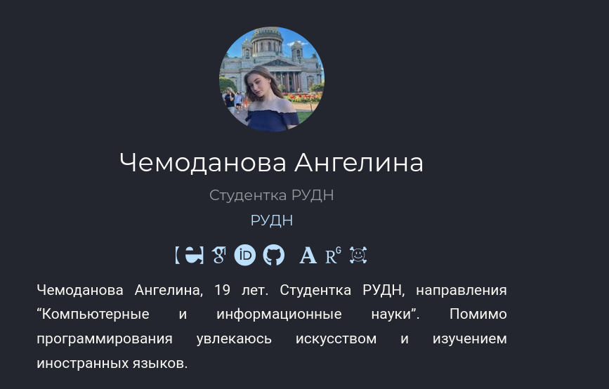

---
## Front matter
lang: ru-RU
title: "Индивидуальный проект. Четвертый этап"
author:
  - Чемоданова А.А.

## i18n babel
babel-lang: russian
babel-otherlangs: english

## Formatting pdf
toc: false
toc-title: Содержание
slide_level: 2
aspectratio: 169
section-titles: true
theme: metropolis
header-includes:
 - \metroset{progressbar=frametitle,sectionpage=progressbar,numbering=fraction}
 - '\makeatletter'
 - '\beamer@ignorenonframefalse'
 - '\makeatother'
---

## Цель работы

Добавить к сайту данные о себе и два поста.

## Задание

Зарегистрироваться на соответствующих ресурсах и разместить на них ссылки на сайте:
        eLibrary : https://elibrary.ru/;
        Google Scholar : https://scholar.google.com/;
        ORCID : https://orcid.org/;
        Mendeley : https://www.mendeley.com/;
        ResearchGate : https://www.researchgate.net/;
        Academia.edu : https://www.academia.edu/;
        arXiv : https://arxiv.org/;
        github : https://github.com/.
      
## Задание      
Сделать пост по прошедшей неделе.
Добавить пост на тему по выбору:
        Оформление отчёта.
        Создание презентаций.
        Работа с библиографией.

## Выполнение лабораторной работы

Мы разместили ссылки на все необходимые ресурсы. 

{#fig:001 width=40%}

## Выполнение лабораторной работы

Пост на тему по выбору. 

{#fig:002 width=50%}

## Выполнение лабораторной работы

Недельный пост. 

{#fig:003 width=50%}

## Выполнение лабораторной работы

Измененный сайт. 

{#fig:004 width=50%}

## Выводы

Добавили к сайту данные о себе и два поста.
