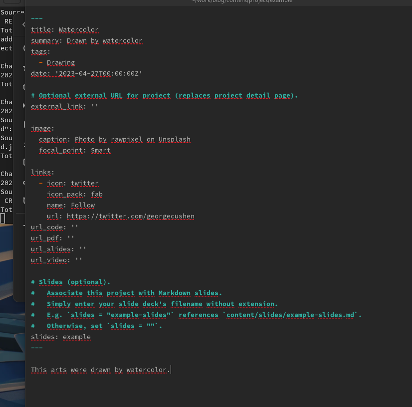
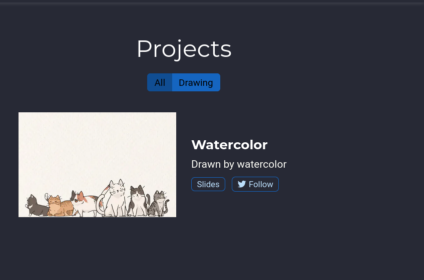
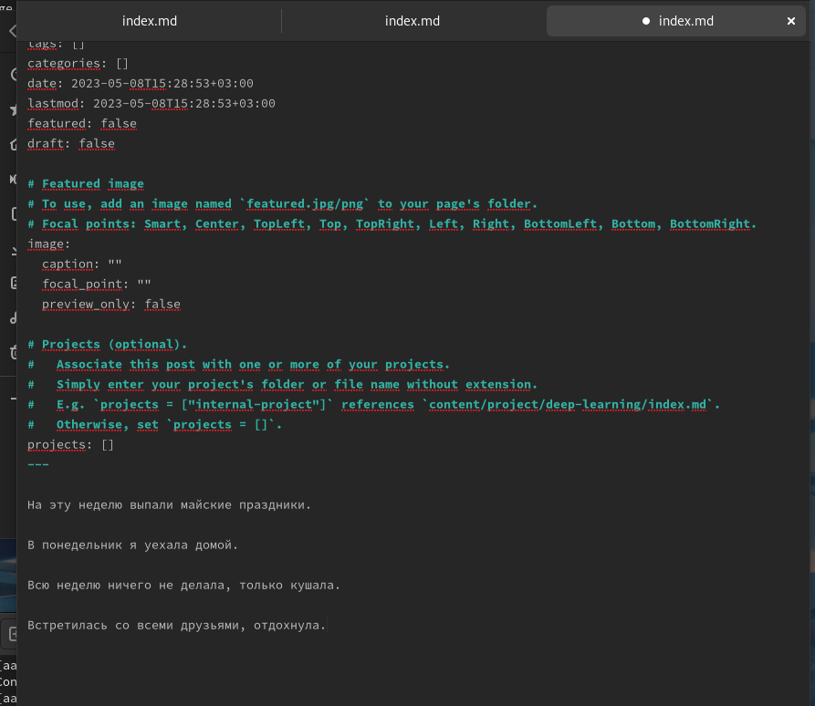
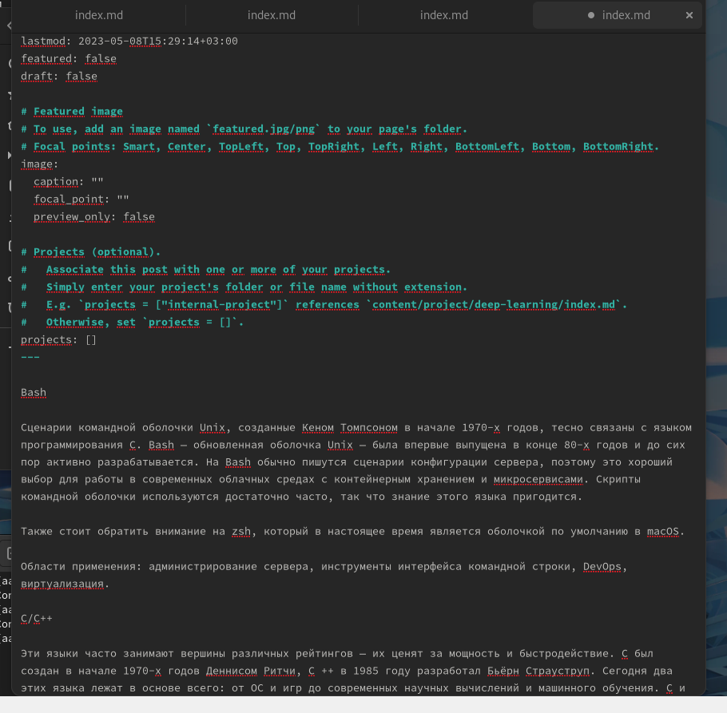
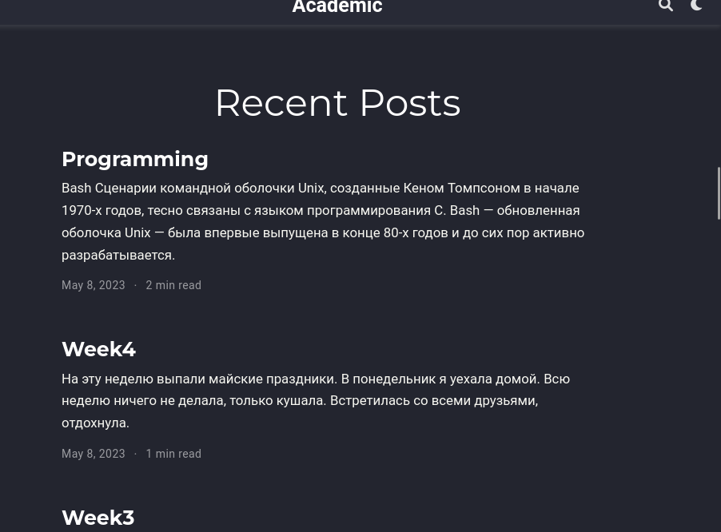

---
## Front matter
lang: ru-RU
title: "Индивидуальный проект. Пятый этап"
author:
  - Чемоданова А.А.

## i18n babel
babel-lang: russian
babel-otherlangs: english

## Formatting pdf
toc: false
toc-title: Содержание
slide_level: 2
aspectratio: 169
section-titles: true
theme: metropolis
header-includes:
 - \metroset{progressbar=frametitle,sectionpage=progressbar,numbering=fraction}
 - '\makeatletter'
 - '\beamer@ignorenonframefalse'
 - '\makeatother'
---

## Цель работы

Добавить к сайту данные и два поста.

## Задание

Сделать записи для персональных проектов.
Сделать пост по прошедшей неделе.
Добавить пост на тему: Языки научного программирования.

## Выполнение лабораторной работы

Сделать записи для персональных проектов.

{#fig:001 width=40%}

## Выполнение лабораторной работы

Результат. 

{#fig:002 width=40%}

## Выполнение лабораторной работы

Сделать пост по прошедшей неделе.  

{#fig:003 width=40%}

## Выполнение лабораторной работы

Добавить пост на тему: Языки научного программирования.

{#fig:004 width=40%}

## Выполнение лабораторной работы

Результат. 

{#fig:005 width=40%}

## Выводы

Добавили к сайту данные и два поста.
